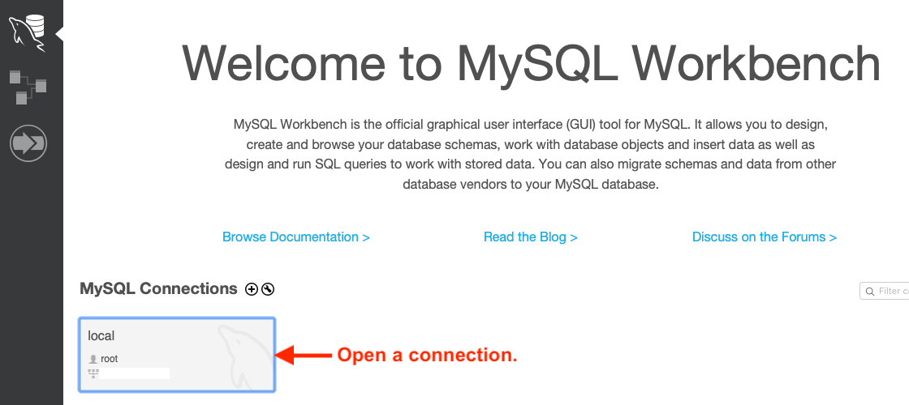
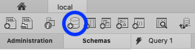
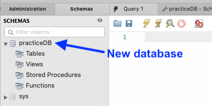
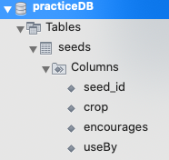

# Exercises: SQL, Part 1 {#mysql-part1-exercises}

In order to practice SQL commands, you must first set up a new database
(model) in MySQL Workbench. In the program, each new model is called a
*schema*.

1.  Open MySQL Workbench and open a connection. You may be prompted once
    or twice for passwords, depending on how you set up your root.

    

2.  Click on the *Create New Schema* button and give the database a
    distinctive name.

    

3.  Click *Apply*, and accept all of the default options when prompted.
    You should see the new database when you click the *Schemas* tab.

    

4.  Your new database is *almost* ready to use. The last step is to set
    the model as the default option for SQL commands. Do this by
    double-clicking its name in the file tree.

Good. You are set up for this lesson\'s practice. Complete the following
exercises in the *Query* tab of MySQL Workbench. If no query tab is
currently open in the editor, select *File \--\> New Query Tab*.

::: admonition
Tip

If you have questions about how to use MySQL Workbench, do not hesitate
to reference [the
documentation](https://dev.mysql.com/doc/workbench/en/wb-home.html).
:::

## Table Setup

Imagine that you want to apply your new SQL skills to bring some order
to your garden. For these exercises, you will use a `seeds` table to
store some information. The table will have 4 columns:

1.  `seed_id`: This is a unique number assigned to each row in the
    `seeds` table.
2.  `crop`: Identifies what the seeds grow (e.g. yellow bell peppers).
3.  `encourages`: Identifies the benefits of planting the crop (e.g.
    nitrogen fixation, attracts bees, etc.)
4.  `use_by`: The year the seeds expire.

The `crop` and `encourages` columns will hold `VARCHAR` data types, and
each must include a parameter that specifies the maximum number of
characters. `seed_id` and `use_by` will be integers.

Put the following script into the query tab.

::: {#primary-key}
``` {.SQL linenos=""}
CREATE TABLE seeds (
   seed_id INTEGER PRIMARY KEY AUTO_INCREMENT,
   crop VARCHAR(40),
   encourages VARCHAR(80),
   use_by INTEGER
);
```
:::

Line 2 establishes `seed_id` as the unique identifier\-\--the
`PRIMARY KEY`\-\--for each record in the table. `AUTO_INCREMENT` assigns
every new entry a different integer value.

MySQL Workbench allows you to run one SQL command, a set of commands, or
all of the commands listed in the editor pane. Hover over each lightning
bolt icon in the panel to see these options.


Execute the `CREATE_TABLE` command using the simple lightning icon.
Next, verify that the table was created by inspecting your schema:


Or, you may also see the `seeds` table listed under the schema in the
file tree.



::: admonition
Tip

Some users may need to refresh the Schemas tab to update the file tree
view.
:::

## Create

Open up a new query tab for the SQL commands you code in this section.

1.  Use the following SQL command to add a new entry to the `seeds`
    table.

    ``` {.SQL linenos=""}
    INSERT INTO seeds (crop, encourages, use_by)
    VALUES ("Agastache", "bees & hummingbirds", 2020);
    ```

    Notice that you do NOT need to provide a value for `seed_id`, since
    it is set up to auto-increment every time a new record is created.

    ::: admonition
    Tip

    At any time, you can confirm that a table contains data by clicking
    on the table icon next to its name.

    
    :::

2.  Add another new entry to the `seeds` table, choosing your own values
    for the columns.

3.  To add values to only *some* of the columns of the table, simply
    omit those column names and values from the SQL command.

    ``` {.SQL linenos=""}
    INSERT INTO seeds (crop, use_by)
    VALUES ("Sun Gold Tomato", 2022);
    ```

4.  Add 3 - 5 more records to the `seeds` table. At least one of these
    entries should include values for all of the columns.

Note that `null` gets stored in a column whenever a value for that field
is not supplied.

`Check your solution <mysql-part1-exercise-solutions-create>`{.interpreted-text
role="ref"}

## Read

Open up a new query tab for the SQL commands you code in this section.

1.  Use `SELECT ... FROM ...` to list all of the data for all of the
    columns in the `seeds` table.

    `Check your solution <mysql-part1-exercise-solutions-read1>`{.interpreted-text
    role="ref"}

2.  List ONLY the `crop` data from the table.

3.  List the `crop` and `use_by` data, and use `ORDER BY` to organize
    the information in *DECREASING* order by year.

    a.  *Bonus*: For entries with matching `use_by` values, order first
        by year and then alphabetically by crop name.

    `Check your solution <mysql-part1-exercise-solutions-read3>`{.interpreted-text
    role="ref"}

4.  List a single entry based on its `seed_id` value. You will need to
    include a `WHERE` in your SQL command.

## Update

Open up a new query tab for the SQL commands you code in this section.

::: admonition
Warning

The general syntax for a SQL update is:

``` bash
UPDATE table_name
SET column1 = newValue1, column2 = newValue2, ...
WHERE condition;
```

If you leave out the `WHERE` clause, then *ALL* records in the table
will be updated!
:::

1.  Update a single record based on its `seed_id`.

    a.  The first entry we added in the Create section has `seed_id`
        = 1. Use `UPDATE ... SET ... WHERE` to change the `use_by` date
        for this entry to 2024.
    b.  Use a single `UPDATE` statement to change two columns for the
        entry with `seed_id` = 4.

    `Check your solution <mysql-part1-exercise-solutions-update1>`{.interpreted-text
    role="ref"}

2.  Use `ALTER TABLE` to add a new column, called `expired`, to the
    table. Set the data type to `boolean`.

3.  With a single `UPDATE` command, set the `expired` value to `true`
    for all entries that have a `use_by` of this year or earlier.

    `Check your solution <mysql-part1-exercise-solutions-update3>`{.interpreted-text
    role="ref"}

Be sure to list the `seeds` table to confirm your changes.

## Delete

Open up a new query tab for the SQL commands you code in this section.

::: admonition
Warning

If you leave out the `WHERE` clause in the `DELETE FROM` command, then
*ALL* records in the table will be lost!

There is no undo option after running `DELETE`.
:::

1.  Delete a single record from the table. Be sure to use its `seed_id`
    rather than any other column value in the `WHERE` clause.

    `Check your solution <mysql-part1-exercise-solutions-delete>`{.interpreted-text
    role="ref"}

2.  Use a single `DELETE` command to remove any seeds from the table
    that have expired.

## Bonus Exercises

Whew! You made it through all the exercises. Nice work!

Take a quick break and, if you wish, try these additional tasks that go
above and beyond the basic SQL commands.

1.  Use logical operators (`AND`, `OR`, `NOT`) in `WHERE` statements.
2.  List the complete records for the seeds, but only if the
    `encourages` column `IS NOT null`.
3.  Do you have several entries with the same `crop` value? If so, you
    can display a list that avoids repeats by using the [SELECT
    DISTINCT](https://www.w3schools.com/sql/sql_distinct.asp) keywords.
4.  Experiment with [changing the data
    type](https://www.w3schools.com/sql/sql_alter.asp) of a column.
5.  Research the difference between `DROP DATABASE table_name` vs.
    `DELETE FROM table_name`.
