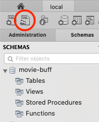
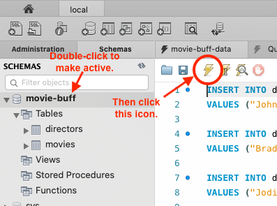

# Studio: Movie SQLs {#movie-sqls}

In this studio, you will use space in *MySQL Workbench* to practice
writing SQL queries to retrieve or modify information stored in an
established database. You will also explore the parallels between
objects and database tables.

## Walkthrough

Let\'s relate what you\'ve learned about SQL to interact with a database
called `movie-buff` that contains two tables\-\--`movies` and
`directors`.

Just as you did in the
`exercises <mysql-part1-exercises>`{.interpreted-text role="ref"} create
the new `movie-buff` schema.

Before we create the `movies` and `directors` tables, let\'s think about
what kind of columns we want in each one.

### Movies Table

For the `movies` table, it makes sense to have columns for the `title`
of the movie, the `year_released`, and the `director`. We\'re also going
to want to have a unique `movie_id` column as the primary key, since
there can be more than one movie with the same title.

Take the time now to think about what data types you might use for these
columns (`INTEGER`, `VARCHAR`, `DATE`, etc.), then go ahead and write
(or type) the SQL statement to create this table.

As you consider which data types to use for your `movies` columns, you
might find yourself thinking, *If this were a property of an object,
what data type would I use?*

For example, if the `Movie` object has a `Title` and a `Director`
property, you would expect both of these data types to be `String`.
Similarly, the year the movie was released would be stored as an
integer. This conceptual overlap between databases and objects is very
useful, and we will explore this further in the class on
*Object-Relational Mapping* (ORM).

Here\'s how our `movies` table could be created:

``` {.sql linenos=""}
CREATE TABLE movies (
   movie_id INTEGER PRIMARY KEY AUTO_INCREMENT,
   title VARCHAR(120),
   year_released INTEGER,
   director VARCHAR(80)
);
```

Take a moment to discuss with a partner:

1.  Why the two `VARCHAR` parameters differ in lines 3 and 5.
2.  The purpose behind `PRIMARY KEY AUTO_INCREMENT` in line 2. If
    necessary, review the table setup for the
    `chapter exercises <primary-key>`{.interpreted-text role="ref"}.

### Directors Table

Next, let\'s consider the properties we\'d want for a `Director` object.
These could include a `FirstName`, a `LastName`, and maybe the `Country`
where the director was born.

Once we identify the data types for these properties, we can write the
SQL command to create the `directors` table. Also, we should include a
`director_id` column in order to create a valid primary key.

::: {#directors-table}
``` {.sql linenos=""}
CREATE TABLE directors (
   director_id INTEGER PRIMARY KEY AUTO_INCREMENT,
   first_name VARCHAR(40),
   last_name VARCHAR(40),
   country VARCHAR(80)
);
```
:::

### Relating the Tables

Before we go further, let\'s take a moment to think about how these two
tables relate to each other, and whether we may want to modify the
column `director` in the `movies` table. A director can work on multiple
movies, but each movie may only have one director. Rather than store
multiple copies of the same name in the `director` column, we can
instead *reference* a single value stored elsewhere.

Our goal is to keep our table design *clean*. This means putting data
specific to directors in the `directors` table, and placing data
specific to each movie in the `movies` table. To follow this structure,
we should NOT store the director\'s name in the `movies` table.

Similarly, the director\'s country is NOT an attribute of a movie, so
there is no need to clutter a `movie` object or the `movies` table with
that information. Instead, a name and country are attributes of the
director, which means the data must be stored in the `directors` table.

However, we might want to know that information for a given movie (e.g.
we may want to find all the movies since 2010 that have French
directors). So we need a way to filter the movies based on attributes
from `directors`. Solving this challenge is why relational databases
exist.

In order to link the two tables to each other, let\'s modify the
`director` column in `movies` to become `director_id`. It should
therefore be an `INTEGER` instead of the `VARCHAR` we used earlier when
we thought the `director` column would hold the name of a person.

Note that with the new format, both tables contain a `director_id`
column, and we will use this match to relate `movies` with `directors`.
The tool to establish the link is called a *foreign key*.

1.  Go ahead and use SQL to delete the old `movies` table:

    ``` SQL
    DROP TABLE movies;
    ```

2.  Now you need to create a new `movies` table that relates to data
    stored in the `directors` table. The code sample below shows how to
    define the `director_id` column in `movies` as a `Foreign Key`.
    Doing this links that column in `movies` to the `director_id` column
    in the `directors` table.

3.  Use this SQL command to create a new `movies` table.

    ``` {.sql linenos=""}
    CREATE TABLE movies (
       movie_id INTEGER PRIMARY KEY AUTO_INCREMENT,
       title VARCHAR(120),
       year_released INTEGER,
       director_id INTEGER,
       FOREIGN KEY (director_id) REFERENCES directors(director_id)
    );
    ```

Line 6 matches every entry in the `movies` table to the ONE entry in the
`directors` table that has the same value for `director_id`. Thus,
multiple rows in `movies` can reference the same row in `directors`, and
a single director can connect to many movies.

::: admonition
Note

If needed, here is a set of helpful articles:

1.  [SQL Create
    Table](https://www.w3schools.com/sql/sql_create_table.asp),
2.  [SQL Drop Table](https://www.w3schools.com/sql/sql_drop_table.asp),
3.  [SQL Foreign Key](https://www.w3schools.com/sql/sql_foreignkey.asp).

Follow the MySQL syntax instructions when there is a syntax variation
between the major databases.
:::

### `INSERT` Data From File

Rather than adding entries line by line, you will use a prepared SQL
file to speed up the process.

1.  Follow this link to the [movie-buff
    data](https://gist.github.com/jimflores5/5276e5cf15e19ae0923f809ee2367c7f)
    repository.

2.  Click the *Download Zip* button to save a copy of the file to your
    machine.

3.  Double-click the zip file icon to extract the `movie-buff-data.sql`
    file (it will be inside a folder).

4.  In MySQL Workbench, click the *Open SQL* button, and select the
    `movie-buff-data.sql` file.

    

5.  Double-click the `movie-buff` schema, then click the leftmost
    lightning bolt icon to run the SQL script. This will populate the
    `directors` and `movies` tables.

    

6.  Confirm that the tables contain data by clicking on the table icon
    next to each name.

    

OK! Your model is ready to accept queries.

## Your Assignment

For this studio, you\'ll practice writing SQL queries to perform various
data retrieval and manipulation tasks. You will be using the `movies`
and `directors` tables described
`above <directors-table>`{.interpreted-text role="ref"}, so if you still
need to `CREATE` them, please do so now.

### Task List

Open up a new *Query* tab in MySQL Workbench. In that tab, write the SQL
commands to carry out each of the queries described below. As you
complete each step, compare your SQL code and the output with a partner.

1.  List just the titles of all the movies in the database.

2.  List the title and year of each movie in the database in
    *DESCENDING* order of the year released. (*Hint*: Combine the
    `SELECT` command with the [ORDER
    BY](https://www.w3schools.com/sql/sql_orderby.asp) keywords).

3.  List all columns for all records of the `directors` table in
    *ASCENDING* alphabetical order based on the director\'s country of
    origin.

4.  `ORDER BY` can also consider multiple columns. List all columns for
    all records of the `directors` table in *ASCENDING* alphabetical
    order first by the director\'s country of origin and then by the
    director\'s last name.

5.  Insert a new record into the `directors` table for Rob Reiner, an
    American film director.

    ::: admonition
    Note

    Recall that the column for `director_id` is auto incremented, so you
    don\'t need to put in a value for that column.
    :::

6.  Combine the `SELECT` and `WHERE` keywords to list the `last_name`
    and `director_id` for Rob Reiner.

7.  Insert a new record into the `movies` table for *The Princess
    Bride*, which was released in 1987 and directed by Rob Reiner.

    ::: admonition
    Note

    `movie_id` is also auto incremented, so you don\'t need to put in a
    value for that column. However, you *will* need to provide a value
    for the foreign key, `director_id`, to link the movie to the proper
    director.
    :::

8.  If you list all of the data from the `movies` table
    (`SELECT * FROM movies;`), you will see a column of director ID
    numbers. This data is not particularly helpful to a user, since they
    probably want to see the director names instead. Use an `INNER JOIN`
    in your SQL command to display a list of movie titles, years
    released, and director last names.

9.  List all the movies in the database along with the first and last
    name of the director. Order the list alphabetically by the
    director\'s last name.

10. List the first and last name for the director of *The Incredibles*.
    You can do this with either a join or a `WHERE` command, but for
    this step please use `WHERE`.

11. List the last name and country of origin for the director of *Roma*.
    You can do this with either a join or a `WHERE` command, but for
    this step please use a join.

    ::: admonition
    Tip

    For more join practice, take advantage of these resources at W3
    Schools:

    1.  [Inner joins](https://www.w3schools.com/sql/sql_join_inner.asp),
    2.  [Joins](https://www.w3schools.com/sql/sql_join.asp).
    :::

12. Delete a row from the `movies` table. What consequence does this
    have on `directors`? List the contents of both tables to find out.

13. Try to delete one person from the `directors` table. What error
    results from trying to remove a director?

## Bonus Missions

1.  Note that SQL *aliases* give a table or column a temporary name.
    Assign aliases in at least 3 of the items above to make the columns
    names different and/or more readable in the output.
2.  List all of the movies in the database directed by Peter Jackson.
3.  a\. [Add another
    column](https://www.w3schools.com/sql/sql_alter.asp) to the `movies`
    table that holds the amount of money earned by each film.
    b.  Use `UPDATE` to enter these values for each movie in the
        database.
    c.  Generate a list that ranks the movie titles based on earnings.
    d.  Generate a list that only shows films that earned above (or
        below) a certain amount.
