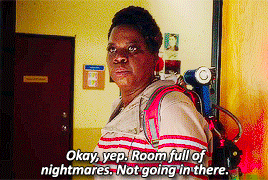
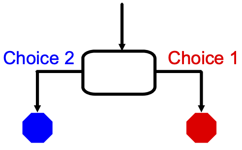
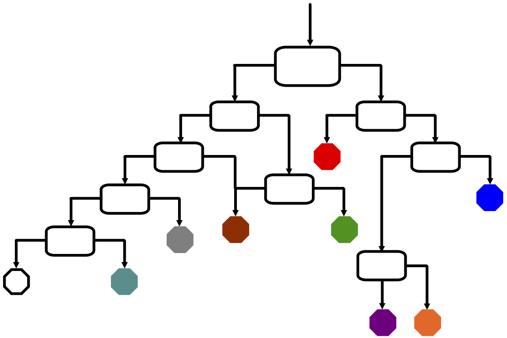

Activity #2: Adventure Time!
============================

.. admonition:: Tip

   For best results, complete the :ref:`Conditionals chapter <conditionals>`
   before starting this activity.

While playing a game or reading a story, you may have needed to make a choice.
Your decision affects how the rest of the story unfolds. What should you do?
This is an example of the *Choose Your Own Adventure* (CYOA) idea.

At a certain point in the text, you must make a choice about what a character
does next - such as opening a door or walking down a hallway. The story then
follows a different path based on your choice.

   Choices have consequences!

The more choices the story contains, the more events and endings become
possible. For example:

#. *You are standing in an open field west of a white house, with a boarded
   front door. There is a small mailbox here.*

   - Do you open the mailbox, walk around the house, try the front door, or
     just walk away? (4 choices, 4 paths to follow)

#. *You are standing outside of an open closet full of life-size puppets.*

   - Do you close the closet door, dance with the puppets, or run screaming
     down the hall? (3 choices, 3 possible outcomes)

**Decisions, Decisions**:

In this activity, you and your team will build a short CYOA story. When run,
your program offers the user a series of choices, and their responses to the
questions produce different results.

Choice Trees
------------

A simple **binary choice** is a decision that leads to two separate results.

What if we add a second choice in place of each end point? Doing so increases
the number of possible endings. Here is a diagram for asking two questions:

.. figure:: figures/nested-choices.png
   :alt: Showing 4 possible endings from 2 sequential choices.
   :width: 30%

.. index:: ! choice tree

Adding more questions increases the detail and complexity of the story. To help
keep track of all the options, draw a **choice tree**, which is a diagram
showing the paths that lead to each ending.

Project Requirements
--------------------

#. The adventure you design must be school appropriate, and it should ask the
   user to make *at least* 2 decisions, which lead to *at least* 4 endings.
#. Your team can add more choices, but the maximum limit is 8 endings.
#. Begin your CYOA with a short backstory or introduction, and then ask the
   users to make their decisions.
#. Each ending should be distinct from the others! Having ALL choices lead to
   the same result is weak and boring.

Make a Plan
-----------

#. Discuss with your team different ideas and/or themes for your story.
#. Decide on your favorite idea, then write down some possible choices and
   consequences that a character in the story could face. If you think of too
   many, select the ones that work best as *binary* decisions.
#. Draw a *choice tree* to map out the questions, paths, and endings for your
   story.
#. Write the text for the backstory/introduction.
#. In a code editor, use comments to map out your CYOA program.

   a. Now is NOT the time to actually code anything. # Comments ONLY.
   b. Use your choice tree to help organize the comments for your story.
   c. For 2 questions and 4 endings, your program should need 10 - 15 comments.
   
.. admonition:: Example

   .. sourcecode:: Python
      :linenos:

      # Intro text...

      # First choice: Upstairs or Downstairs?

      # User chooses Upstairs
      
         # Upstairs description...

         # Second choice: Hide or Open Secret Door?

            # ...

      # User chooses Downstairs

         # etc.

Now Code
--------

``if/else`` statements are the perfect tool to set up binary decisions, and
*nesting* the conditionals creates the backbone for your CYOA story. Refer to
your comments and choice tree as you code your adventure.

#. Use a ``print`` statement to display the introduction/backstory. Follow this
   with an ``input`` statement to prompt the user to make their first choice.
#. Add an ``if/else`` statement to analyze the user's answer and move on to the
   selected part of the story.
#. Now what?

Test Your Code
--------------

Run your CYOA program and follow ALL of the different paths to make sure your
code behaves as expected. Use your choice tree as a checklist to keep track of
which choices still need to be tested or which ones need to be fixed.

Tip
---

It can be hard to predict what the user will enter, so you may want to check
only the first letter of their response. Also, converting that letter to
UPPERCASE or lowercase helps analyze their choice.

.. admonition:: Example

   .. sourcecode:: Python
      :lineno-start: 3

      choice = input('Do you want to head to the [A]ttic or to the [B]asement?')

      if choice[0].lower() == 'a':
         # Attic code here...

   ``choice[0]`` looks at the first character in the ``choice`` string, and
   ``.lower()`` casts it into lowercase.

Bonus Tasks
-----------

#. Expand your story to include more than 2 questions and 4 endings.
#. Include one ``if/elif/else`` statement to give the user three possible
   options (e.g. go upstairs, go downstairs, or walk down the hall).
#. Update your code to deal with invalid entries. For example, the user enters
   something unexpected like "run" instead of "open door" or "turn on the
   lights".
