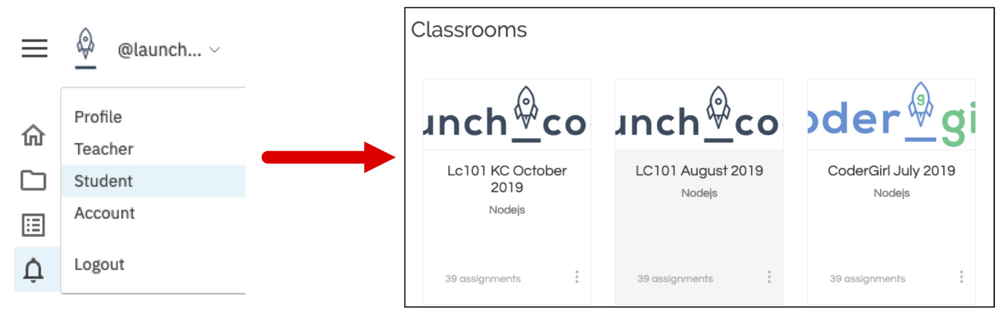
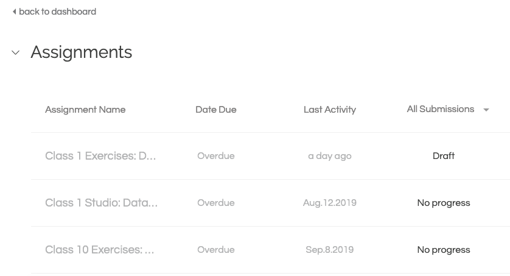
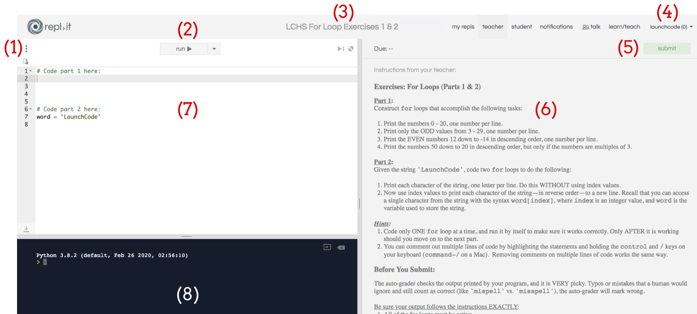

Repl.it Classrooms
==================

A repl.it *classroom* provides students with the ability to create code and
then submit it to their teachers. It also allows teachers to post instructions
and set up automatic code checking.

Assignments in a classroom can only be accessed by people enrolled in the
course, and student work can only be seen by the instructors.

A repl.it classroom is used for:

#. Organizing coding tasks,
#. Completing and submitting practice tasks and assignments,
#. Providing feedback for working or non-working code.

.. admonition:: Tip

   You NEVER have to click *Save* in repl.it. The site automatically stores
   your code on their servers.

   However, you DO have to click *Submit* to turn in your work from a
   classroom.

.. _replit-classroom-assignments:

Classroom Dashboard and Homepage
--------------------------------

To access a classroom you have joined, login to your account and select the
*Student* option from the username menu. This brings up a dashboard of all the
courses available to you.

   Classroom dashboard.

Clicking on a class box brings up a list of assignments and projects that your
teacher has prepared for you.

   A list of assignments waiting for your attention!

Clicking an assignment title opens up the classroom workspace, which consists
of three main panels and several menu functions.

Repl.it Classroom Workspace
----------------------------

   The repl.it classroom workspace.

Features to note:

#. **Settings menu**: Allows you to change editor settings like theme and font
   size.
#. **Run button**: Runs any code in the editor panel (7).
#. **Name of assignment**
#. **Repl.it user menu**: Allows you to access account details and change
   your password.
#. **Submit button**:

   a. Submits your work.
   b. If the assignment has been set up for automatic checking, you will
      receive instant feedback.
   c. If the assignment is NOT set up for automatic checking, your teacher will
      review it and provide feedback.

#. **Instructions**: This describes what you need to code. READ CAREFULLY!
#. **Editor panel**: Type your code here.
#. **Console output**: After clicking the run button (2), your program's output
   and any error messages show up here.

.. admonition:: Note

   Work done in a classroom will NOT appear in the *My Repls* area of your main
   account.
