.. _terminal-commands-tutorial:

Terminal Commands Tutorial
==========================

As mentioned in the Terminal chapter, a *command line interface* (CLI) just
uses text. This is quite different from how we usually use our computers and
phones. This tutorial is meant to help you picture how your machine responds
when you enter some common commands.

.. admonition:: Note

   For the purposes of this tutorial, we will use ``current_directory$`` as the
   terminal prompt.

   We will also use this file tree for the examples:

   .. figure:: ../../chapters/terminal/figures/laptop-file-tree.png
      :alt: File tree for terminal tutorial exercises.
      :width: 80%

.. _terminal_cd:

``cd`` Command
--------------

``cd directory_path`` moves us to the location described by ``directory_path``.

Let's start inside the ``LCHS`` directory.

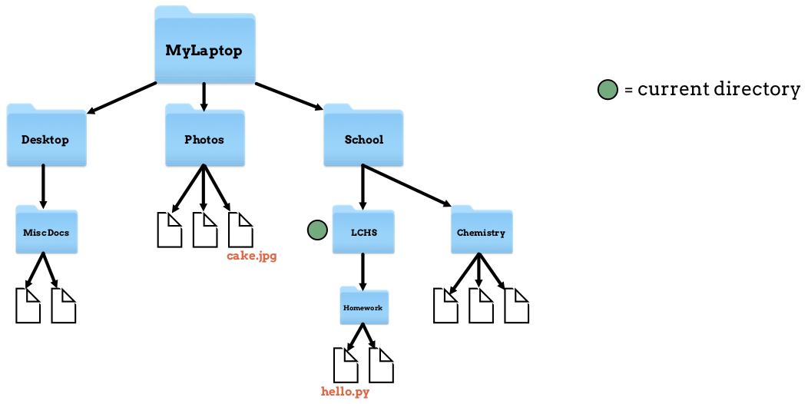

   Our current position is in the ``LCHS`` folder.

To move up one level into the *parent directory*, run the following commands in
the terminal:

.. sourcecode:: bash
   :linenos:

   LCHS$ pwd
   /MyLaptop/School/LCHS
   LCHS$ cd ..
   School$ pwd
   /MyLaptop/School

Great! Now we're inside the ``School`` folder.

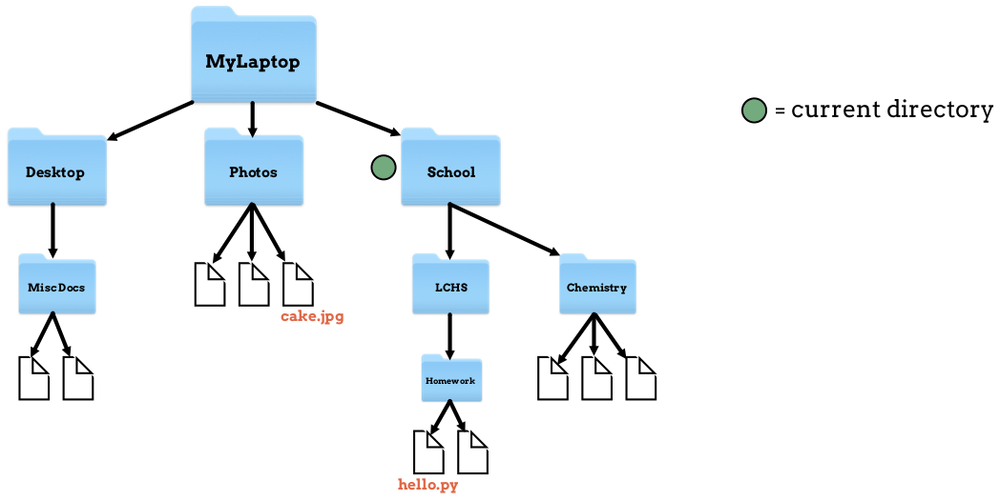

   Our current position is now in the ``School`` folder.

.. admonition:: Note

   The terminal does not display anything after a successful ``cd`` command. In
   the example above, we used the :ref:`pwd <terminal_pwd>` command in lines 1
   and 4 to check our location.

   To make the actual move, only the ``cd`` command on line 3 is necessary.

To go back down into ``LCHS``, we run ``cd ./LCHS``:

.. sourcecode:: bash
   :linenos:

   School$ pwd
   /MyLaptop/School
   School$ cd ./LCHS
   LCHS$ pwd
   /MyLaptop/School/LCHS

OK, we've returned to where we started.

What if we want move to ``Chemistry`` from where we are now, in ``LCHS``?
Looking at the file tree again, we can trace the path we need to follow.

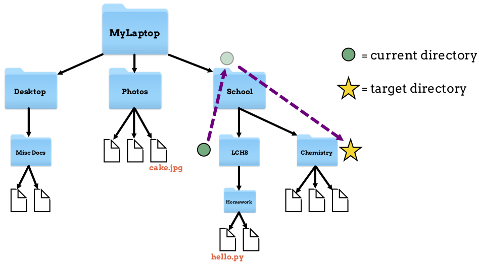

   Path to move from ``LCHS`` into the ``Chemistry`` directory.

To make this move, first we need to go up one level into the parent directory,
``School``. Next, we must move down into the ``Chemistry`` folder.

One way to do this is with two separate commands:

.. sourcecode:: bash
   :linenos:

   LCHS$ pwd
   /MyLaptop/School/LCHS
   LCHS$ cd ..
   School$ cd ./Chemistry
   Chemistry$ pwd
   /MyLaptop/School/Chemistry

Line 3 moves us up one level into the ``School`` folder. Line 4 moves us from
there down one level into ``Chemistry``.

.. admonition:: Tip

   We can combine more than one navigation step into a single command. In the
   code above, we could replace lines 3 and 4 with ``cd ../Chemistry``.

For more practice, let's go from our current spot in ``Chemistry`` into the
``Homework`` folder. Looking back at the file tree, we need to move up one
level (into ``School``) and then down two levels into ``Homework``.

Let's start with a 3 step process:

.. sourcecode:: bash
   :linenos:

   Chemistry$ pwd
   /MyLaptop/School/Chemistry
   Chemistry$ cd ..
   School$ cd LCHS
   LCHS$ cd Homework
   Homework$ pwd
   /MyLaptop/School/LCHS/Homework

Notice that we used ``pwd`` again in lines 1 and 6 to check our location. We
made the actual move in lines 3 - 5.

If we're really confident, we can complete the move in a single
command:

.. sourcecode:: bash
   :linenos:

   Chemistry$ pwd
   /MyLaptop/School/Chemistry
   Chemistry $ cd ../LCHS/Homework
   Homework$ pwd
   /MyLaptop/School/LCHS/Homework

Are you starting to see how terminal navigation can get you places quickly?

Let's do one more quick move for fun. To go back to ``Chemistry``, all we need
to do is:

.. sourcecode:: bash
   :linenos:

   Homework$ pwd
   /MyLaptop/School/LCHS/Homework
   Homework$ cd ../../Chemistry
   Chemistry$ pwd
   /MyLaptop/School/Chemistry

``cd ../../Chemistry`` tells the terminal, *Move up one level, then move up
another level, then move down into the Chemistry directory*.

(Click here to return to the :ref:`Terminal chapter <basic-terminal-commands>`).

.. _terminal_clear:

``clear`` Command
-----------------

``clear`` wipes the terminal window of all text. It gives us a clean screen
whenever we need a fresh start.

``clear`` doesn't change our location in the file tree.

We usually don't *need* to clear our terminal, but it's a nice command to know
for those who like to avoid clutter. As soon as we hit *Enter* after the
command, the window looks as good as new!

.. sourcecode:: bash
   :linenos:

   LCHS$

(Return to the :ref:`Terminal chapter <basic-terminal-commands>`).

.. _terminal_cp:

``cp`` Command
--------------

``cp source_path target_path`` copies the item at the source and places a new
version at the target path. The item can be a file or whole directory.

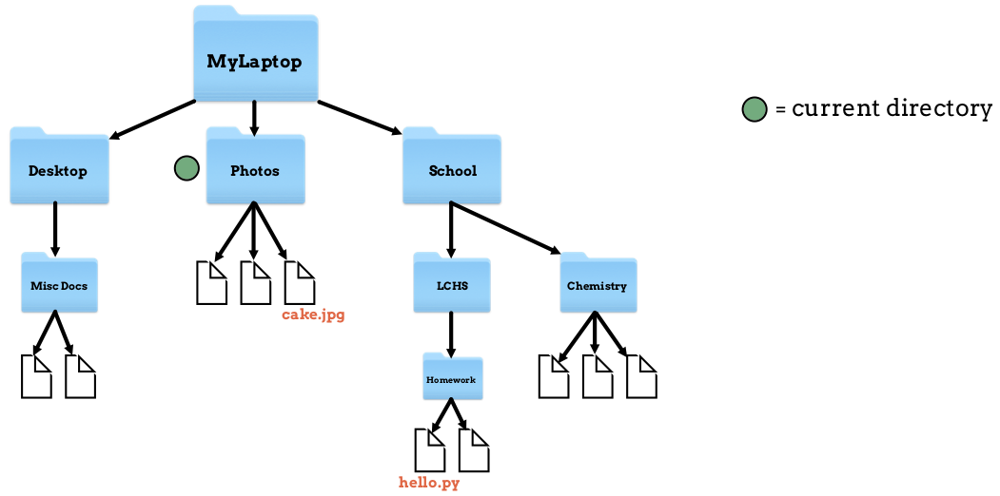

   Our location is inside the ``Photos`` directory.

Let's say we want to copy our ``cake.jpg`` file and place that copy inside the
``Desktop`` directory.

.. sourcecode:: bash
   :linenos:

   Photos$ ls
   cake.jpg    puppy.jpg   bff.jpg
   Photos$ cp /MyLaptop/Photos/cake.jpg /MyLaptop/Desktop
   Photos$ ls
   cake.jpg    puppy.jpg   bff.jpg
   Photos$ ls ../Desktop
   cake.jpg

#. Line 1 checks the contents of our current directory.
#. Line 3 makes a copy of the ``cake.jpg`` file (found at
   ``MyLaptop/Photos/cake.jpg``) and places it into the ``/MyLaptop/Desktop``
   location.
#. Lines 4 and 6 use the :ref:`ls command <terminal_ls>` to verify that
   ``cake.jpg`` now exists in two places on our device.

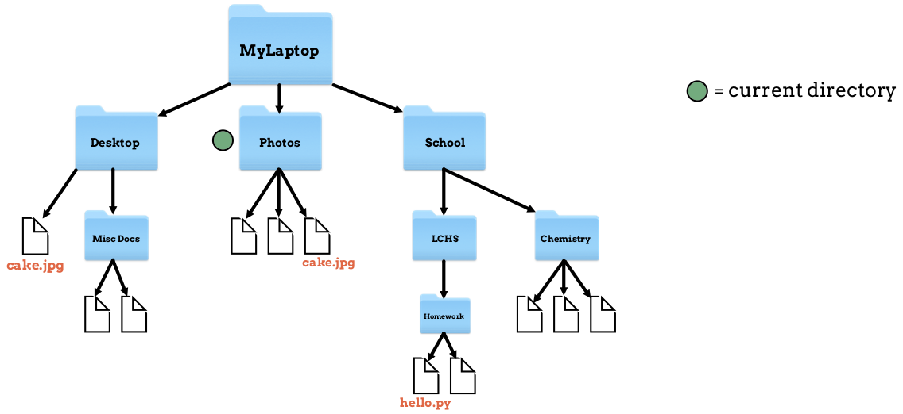

   ``cake.jpg`` double take

We don't actually need to be in the ``Photos`` directory to copy the
``cake.jpg`` file. We can run the ``cp`` command from any location. However,
starting at the ``source_path`` helps us think through the process.

We can think of ``cp`` as basically copy *and* paste, since the target path is
included in the command.

(Return to the :ref:`Terminal chapter <basic-terminal-commands>`).

.. _terminal_ls:

``ls`` Command
--------------

Entering the ``ls`` command in the terminal returns the contents of the current
directory.

For example, let's assume we are in the ``Photos`` directory.

   Our location is inside the ``Photos`` directory.

Now let's display a list of the contents of the folder:

.. sourcecode:: bash
   :linenos:

   Photos$ ls
   cake.jpg    puppy.jpg   bff.jpg

Line 1 is the command, and line 2 displays the returned message. All of that
looks to be in order. Let's move up one level into ``MyLaptop`` and run ``ls``
from there.

.. sourcecode:: bash
   :linenos:

   Photos$ pwd
   /MyLaptop/Photos
   Photos$ cd ..
   MyLaptop $ pwd
   /MyLaptop
   MyLaptop $ ls
   Desktop  Photos   School

Notice that ``ls`` only gives us a view one level deep. The command shows us
that ``MyLaptop`` holds 3 other directories, but we do not see the contents of
those folders.

(Return to the :ref:`Terminal chapter <basic-terminal-commands>`).

.. _terminal_man:

``man`` Command
---------------

``man`` is a very good friend. Running ``man command`` gives you a summary of
what that command does, what options it takes, and more documentation than we
could ever need. It's so thorough, it makes this short tutorial blush.

Anytime we have questions about how to use a command, we can access the manual
to get more info!

.. admonition:: Try It!

   Look up some of the commands you know. Maybe you'll learn a new option or
   two!

Some other terminal stuff we should know when using the manual:

#. *Scrolling*: Some entries are very long! You'll know there's more to read if
   you see ``:`` at the bottom of the terminal window. You can use your
   keyboard's arrow keys to scroll through the text. Once you reach the bottom
   of the entry, you'll see a line that reads ``END``.
#. *Exiting*: Once you're finished reading, exit the manual page by typing the
   letter ``q``.

(Return to the :ref:`Terminal chapter <basic-terminal-commands>`).

.. _terminal_mkdir:

``mkdir`` Command
-----------------

``mkdir folder_name`` creates a new directory *inside* your current location.

We will use the ``Photos`` directory for this example.

   Our location is inside the ``Photos`` directory.

Let's create a directory for pet photos:

.. sourcecode:: bash
   :linenos:

   Photos$ pwd
   /MyLaptop/Photos
   Photos$ ls
   cake.jpg    puppy.jpg   bff.jpg
   Photos$ mkdir fur_babies
   Photos$ ls
   cake.jpg    fur_babies  puppy.jpg   bff.jpg

Again, the computer does not return anything after the ``mkdir`` command on
line 5. It just responds with another prompt. However, by using the helpful
:ref:`ls command <terminal_ls>`, we see that a new directory was created.

Our file tree now looks like this:

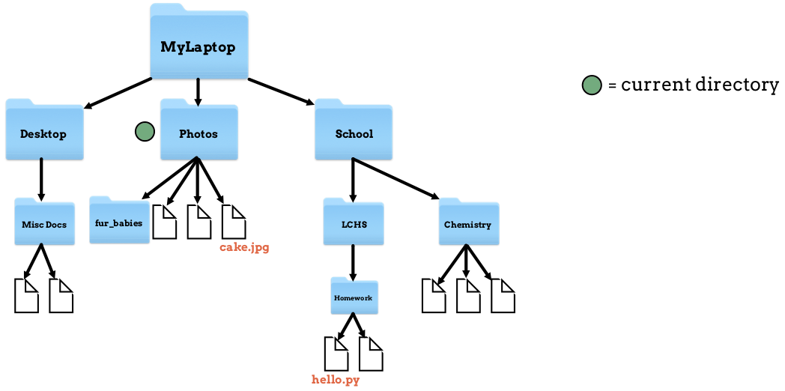

   ``mkdir`` creates a new directory.

.. admonition:: Note

   While ``mkdir`` creates a new directory, it does not move us into that
   location. Also, we don't need to be in the parent of the newly created
   folder.

   We can run ``mkdir`` from anywhere within the file system, as long as we use
   the correct file path.

(Return to the :ref:`Terminal chapter <basic-terminal-commands>`).

.. _terminal_mv:

``mv`` Command
--------------

``mv source_path target_path`` moves a file or directory from its old location
in the file tree to a new one.

   Our location is inside the ``Photos`` directory.

Let's start in the ``Photos`` directory like we did with the
:ref:`cp command <terminal_cp>` example. This time, instead of copying the
``cake.jpg`` file, we will *move* it into the ``Desktop`` folder.

.. sourcecode:: bash
   :linenos:

   Photos$ ls
   cake.jpg    puppy.jpg   bff.jpg
   Photos$ mv ./cake.jpg ../Desktop
   Photos$ ls
   puppy.jpg   bff.jpg
   Photos$ cd ../Desktop
   Desktop$ ls
   cake.jpg    MiscDocs

Note the following:

#. In line 3, we used relative paths instead of absolute paths. ``./cake.jpg``
   means, *Look in the current directory for the file called cake.jpg*. The
   path ``../Desktop`` means, *Move up into the parent directory, then down
   into the Desktop folder*.
#. On lines 1, 4, and 7, we use ``ls`` to verify our results.

Now our file tree looks like this:

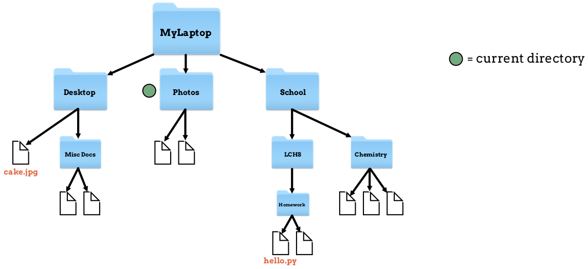

   ``mv`` moves ``cake.jpg`` from ``Photos`` into ``Desktop``.

(Return to the :ref:`Terminal chapter <basic-terminal-commands>`).

.. _terminal_pwd:

``pwd`` Command
---------------

Entering the ``pwd`` command in the terminal returns our current location in
the file tree. This is called our **working directory**.

.. sourcecode:: bash
   :linenos:

   LCHS $ pwd
   /MyLaptop/School/LCHS

The working directory is another term for the current directory. Think of this
command like the *You Are Here* dot on our file tree.

   Our working directory is ``LCHS``.

We are basically just asking the computer to give us our current location. This
may seem basic, but the information is critical.

   You need to know your current location when working in the terminal.

A lot of beginners enter commands into the terminal without paying attention to
where they are. This often leads to mistakes and confusion. ``pwd`` is like a
sanity check - a quick way to know where we are and what we are doing.

(Return to the :ref:`Terminal chapter <basic-terminal-commands>`).

.. _terminal_rm:

``rm`` Command
--------------

``rm file_name`` removes a given item from the file tree. This item can be a
single file or an entire directory.

Removing a Single File
^^^^^^^^^^^^^^^^^^^^^^

Let's say we no longer want our ``cake.jpg`` photo. We can remove it!

Like many of the other terminal commands, we do NOT need to be in the same
directory as the file we want to delete. For fun - and practice! - let's remove
``cake.jpg`` while we're located in the ``Homework`` directory.

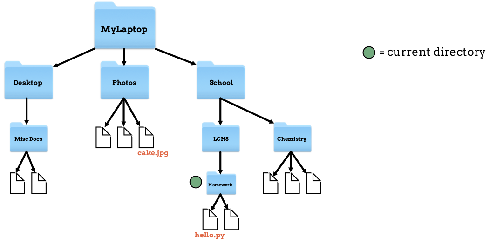

   Our current directory is ``Homework``.

.. sourcecode:: bash
   :linenos:

   Homework$ pwd
   /MyLaptop/School/LCHS/Homework
   Homework$ rm /MyLaptop/Photos/cake.jpg
   Homework$ cd /MyLaptop/Photos
   Photos$ ls
   puppy.jpg   bff.jpg

See what we did in line 3? Instead of moving into the parent directory of
``cake.jpg`` before removing it, we stayed in the ``Homework`` folder and used
the full path to the file.

To check that our ``rm`` command did what we expected, we used the
:ref:`cd command <terminal_cd>` in line 4. This moved us to the ``Photos``
directory. Then, a simple :ref:`ls command <terminal_ls>` returned the contents
of that folder.

Here's the map of what we've done:

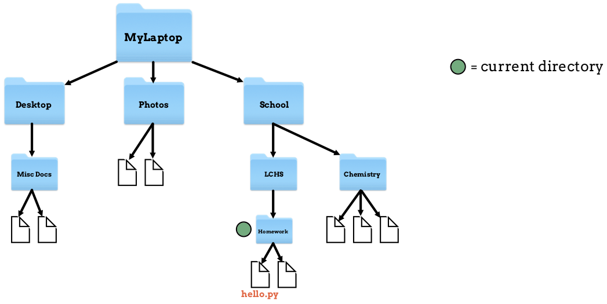

   ``cake.jpg`` is gone!

Removing a Directory
^^^^^^^^^^^^^^^^^^^^

.. admonition:: Warning

   Removing a directory also deletes all of its contents.

.. index:: ! command option

To remove a directory, we need to include an **option** on the command. An
option is an additional character, or set of characters, added on the end of a
command. These characters give the computer more instructions about what you
want it to do. Options are usually indicated with a ``-``.

A common method to remove a directory is to use the ``-r`` option, although
there are other choices. (Feel free to use the :ref:`man rm <terminal_man>`
command to read about these).

Let's say we no longer want our ``Photos`` directory. Assume we are in the
``MyLaptop`` directory. Let's see what happens when we try to use ``rm`` by
itself:

.. sourcecode:: bash
   :linenos:

   MyLaptop$ ls
   Desktop   Photos  School
   MyLaptop$ rm Photos
   rm: Photos: is a directory
   MyLaptop $ ls
   Desktop   Photos  School

Notice that simply using ``rm`` in line 3 returns a message telling us that
``Photos`` is a directory. The command does NOT delete the folder. This feature
of ``rm`` helps prevent us from accidentally deleting a directory and all of
its contents. Imagine what would happen if we entered ``rm /MyLaptop`` without
this safety net!

Let's try again, but this time we will add the ``-r`` option:

.. sourcecode:: bash
   :linenos:

   MyLaptop$ ls
   Desktop   Photos  School
   MyLaptop$ rm -r Photos
   MyLaptop $ ls
   Desktop   School

The ``rm`` command does not tell us when it successfully runs. The ``ls`` check
on line 4 shows us that we've removed the ``Photos`` folder and everything
inside of it.

Back in our map:

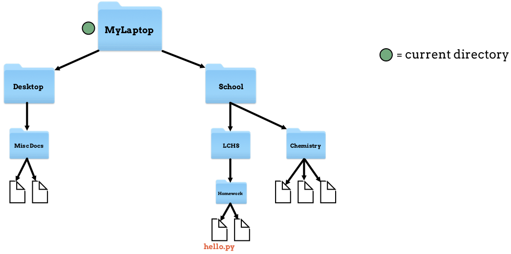

   ``Photos`` is gone without a trace!

(Return to the :ref:`Terminal chapter <basic-terminal-commands>`).

.. _terminal_touch:

``touch`` Command
-----------------

``touch new_filename`` creates a new file.

   Our current directory is ``Homework``.

In the ``Homework`` directory, lets add a new file called ``loop_practice.py``.

.. sourcecode:: bash
   :linenos:

   Homework$ ls
   hello.py   user_input.py
   Homework$ touch loop_practice.py
   Homework$ ls
   hello.py   loop_practice.py   user_input.py

Here's what the command on line 3 gives us:

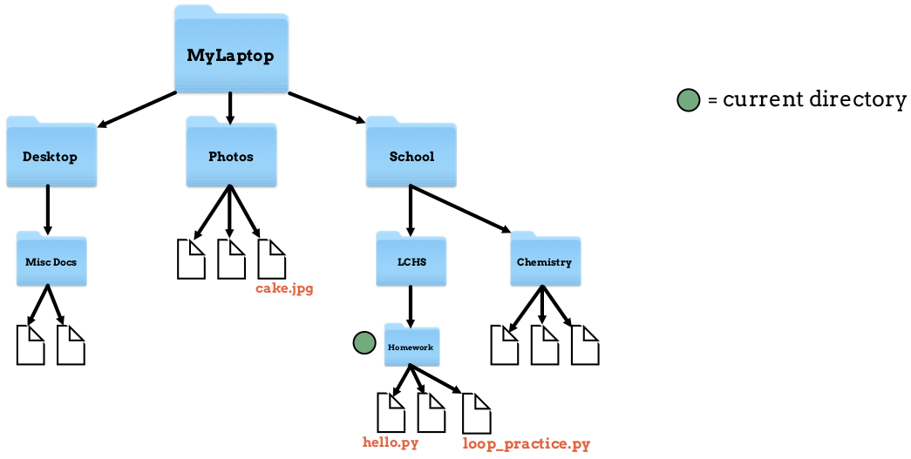

   ``touch`` adds a file.

(Return to the :ref:`Terminal chapter <basic-terminal-commands>`).
