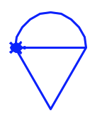

Moving Turtles
==============

Let's start with some basic movement commands for Python turtles.

Straight Lines
--------------

In addition to the movement command ``forward``, we can also make a turtle move
in the opposite direction with the ``backward`` method.

.. sourcecode:: Python
   :linenos:

   import turtle

   bob = turtle.Turtle()
   bob.forward(100)
   bob.backward(150)

Note that entering a negative number inside the parentheses---like
``bob.forward(-100)``---moves the turtle in the opposite direction.

Rotating Turtles
----------------

To make ``bob`` turn, we need to provide two things---a direction and an
amount. The methods ``right()`` and ``left()`` rotate a turtle either clockwise
(right) or counterclockwise (left). Inside the parentheses, we must include a
number to specify how much ``bob`` should turn.

.. admonition:: Try It!

   The following program draws a line, returns to the starting point, rotates
   the turtle left, and then draws another line.

   The *argument* (the number inside the parentheses) in line 7 sets the number
   of degrees ``bob`` turns. ``bob.left(45)`` makes the turtle rotate
   counterclockwise by 45°.
   
   Change the argument in line 7 to see how it affects the drawing:

   #. Try each of the values 90, 120, 180, and 360.
   #. What happens if you enter a negative number?
   #. Try using 720.
   #. What happens if you switch the order of lines 7 & 8?

   .. raw:: html

      <iframe height="500px" width="100%" src="https://repl.it/@launchcode/Turtle-Appendix-Turning?lite=true" scrolling="no" frameborder="yes" allowtransparency="true" allowfullscreen="true" sandbox="allow-forms allow-pointer-lock allow-popups allow-same-origin allow-scripts allow-modals"></iframe>

.. admonition:: Note

   Without diving deep into the geometry, there are 360° in a circle. Using a
   larger number as the argument just makes the turtle spin in place one or
   more times before running the next statement in the code.

Curved Lines
------------

To make ``bob`` draw a curved line, we use a different turtle method.

.. sourcecode:: Python

   bob.circle(radius)

The ``circle()`` method does just what we expect---it makes ``bob`` trace out
a circle in the drawing space. The argument ``radius`` sets the size of the
circle in pixels.

.. admonition:: Note

   Remember that the radius of a circle is the distance from the center to the
   edge. The actual size of the circle will be twice the radius, so
   ``bob.circle(50)`` draws a circle that is 100 pixels across.

If we do not want a complete circle, we add a second number inside the ``()``.
This value determines how much of the circle to draw. Since there are 360
degrees in a full circle, the size of the second number determines how complete
the curved line will be.

For example, ``bob.circle(50, 180)`` draws a half-circle, since 180 is half of
360.

.. admonition:: Try It!

   Experiment with drawing curved lines.
   
   Try the following:

   #. Change the size of the circle.
   #. What happens if you use a negative radius?
   #. Change line 4 to ``bob.circle(50, 180)``.
   #. Replace ``180`` with different numbers to see how the drawing changes.

   .. raw:: html

      <iframe height="600px" width="100%" src="https://repl.it/@launchcode/Turtle-Appendix-Curves?lite=true" scrolling="no" frameborder="yes" allowtransparency="true" allowfullscreen="true" sandbox="allow-forms allow-pointer-lock allow-popups allow-same-origin allow-scripts allow-modals"></iframe>

.. admonition:: Tip

   How many degrees are there in one-eighth of a circle?

   Never fear! You can make Python figure that out for you!

   ``bob.circle(50, 360/8)``

Combining lines, turns, and circles, we can begin making more interesting
shapes!

Multiple Turtles
----------------

In the previous examples, we used a single turtle to do all of the drawing, but
there is no reason to limit ourselves to just one drawing pet!

.. admonition:: Example

   Run the following program to see two turtles draw a rectangle.

   .. raw:: html

      <iframe height="600px" width="100%" src="https://repl.it/@launchcode/Turtle-Appendix-Two-Turtles?lite=true" scrolling="no" frameborder="yes" allowtransparency="true" allowfullscreen="true" sandbox="allow-forms allow-pointer-lock allow-popups allow-same-origin allow-scripts allow-modals"></iframe>
   
   #. Play around by changing any of the code to make the pair of turtles draw
      different shapes.
   #. Currently, ``bob`` finishes one part of the drawing before ``mae`` starts.
      Try rearranging the order of the statements to make ``mae`` and ``bob``
      take turns drawing their lines. Instead of ``bob, bob, bob, mae, mae,
      mae, mae``, try ``mae, bob, mae, bob, mae, bob, mae``.
   #. Add a third turtle and make it add something new to the picture.

Next Steps
----------

You might be wondering, *Why do we call these objects "turtles"? They don't
LOOK like turtles!*

.. figure:: ./figures/not-a-turtle.png
   :alt: Image showing the default Python turtle shape.

   Default turtle shape.

True. The default shape for a turtle object is set as an arrow. However, in
addition to the movement methods, the turtle module also includes methods that
change the look of what appears on the screen.

We will explore some of these on the next page.

.. figure:: ./figures/LC-color-pair.png
   :alt: Turtle drawing of a circle filled with two LaunchCode colors.
