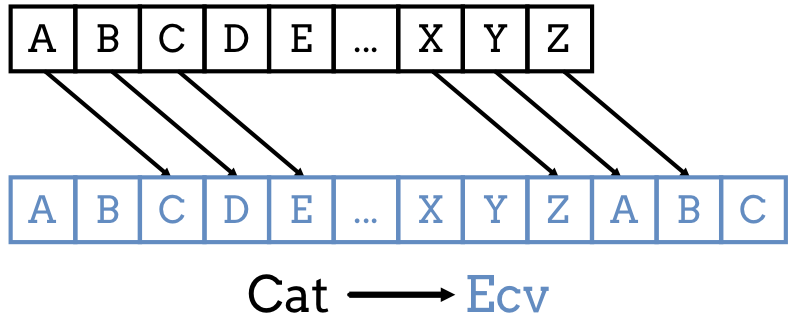

.. _coded-messages:

Assignment #2: Coded Messages
=============================

With the amount of information flowing across the internet, keeping data secure
is an important concern. Keeping usernames, passwords, bank accounts, health
records, etc. safe requires constant work.

.. index:: ! encryption

**Encryption** refers to any process that converts information into a secret
code that hides its meaning from prying eyes. For example, messages can be
*encrypted* on one user's device, sent to another user, and then changed back
into plain text on the second device. Anyone spying on the message mid-stream
will see unreadable content.

For this assignment, you will create a program that changes plain text messages
into coded ones. Your program will also decode messages to produce readable
text.

.. admonition:: Note

   If your teacher added you to a :ref:`repl.it classroom <replit-classroom-assignments>`
   or a :ref:`Trinket course <trinket-course-assignments>`, complete Assignment
   #2 there.

   If you are NOT enrolled in a repl.it classroom or Trinket course, you can
   find a copy of the starter code here:

   #. `repl.it starter code <https://repl.it/@launchcode/LCHS-Assignment-2-starter-code>`__
   #. `Trinket starter code <https://trinket.io/python/e9285d089f?showInstructions=true>`__

Requirements
------------

By the end of this assignment, your program will:

#. Prompt the user for a message and a shift value.
#. Ask the user to either *encrypt* or *translate* the message.
#. Convert the user's plain text message to a coded one (or vice versa).
#. Display the original message and the changed one.

Part 1: Simple Letter Shift
---------------------------

You will use a basic encryption tool, called the
`Caesar Cipher <https://en.wikipedia.org/wiki/Caesar_cipher>`__, to encode a
message. This process takes each letter in a message and replaces it with a
different one. The new letters are all *shifted* a certain number of spaces in
the alphabet compared to the originals.

   In this case, each original letter is shifted 2 places to the right in the alphabet.

Open a new project in your code editor and complete the following tasks.

The ``alphabet_position`` Function
^^^^^^^^^^^^^^^^^^^^^^^^^^^^^^^^^^

#. Define a function called ``alphabet_position`` with one parameter. The
   parameter receives a string containing a single letter.
#. The function returns the *index* of that letter within the alphabet.
#. The function should be case-insensitive. Capital and lowercase letters
   return the same result.

   .. list-table:: Sample Results
      :header-rows: 1

      * - ``letter``
        - Return Value
      * - a or A
        - 0
      * - d or D
        - 3
      * - z or Z
        - 25

#. *Don't forget to test your function!* In the ``main()`` function, call
   ``alphabet_position`` and send in different letters as arguments. Be sure to
   print the returned result to check your code.

.. admonition:: Tip

   #. You can assume the argument sent to the function will be a single letter.
      Do not worry about what to do with longer strings or non-letter
      characters.
   #. ``alphabet_position`` should NOT print anything. It needs to return a
      value instead.

The ``shift_character`` Function
^^^^^^^^^^^^^^^^^^^^^^^^^^^^^^^^

#. Define the function ``shift_character(char, shift)`` with two parameters.
   ``char`` accepts a character (a string of length 1) and ``shift`` accepts an
   integer value.
#. If ``char`` is a letter, the function returns a different one. The new
   letter will be ``shift`` places to the right in the alphabet.
#. The case of the original letter and the returned value should match. For
   example, ``shift_character("A", 1)`` returns ``"B"``, instead of ``"b"``.
#. If ``char`` is NOT a letter, then the function returns the same character.

   .. list-table:: Sample Results
      :header-rows: 1

      * - ``char``
        - ``shift``
        - Return Value
      * - a
        - 13
        - n
      * - D
        - 4
        - H
      * - z
        - 3
        - c
      * - J
        - 30
        - N
      * - ?, 6, &, etc.
        - (any integer)
        - ?, 6, &, etc. (no change for non-letter characters)

#. *Test your function!* In ``main()``, call ``shift_character`` and send in
   different characters and shift values. Be sure to print the letter returned
   to make sure your code works properly before moving on.

.. admonition:: Tip

   #. You should make use of your ``alphabet_position`` function! Thinking in
      terms of index values helps.
   #. Notice in the Sample Results table that the function wraps around when it
      reaches the end of the alphabet. If a shift moves the program past the
      letter ``'z'`` (index value ``25``), it moves back to the start of the
      alphabet and continues counting with ``'a'`` (index value ``0``).
   #. The :ref:`modulus operator <modulo>` will be a BIG help here to keep the
      index values in the range ``0 - 25``.

The ``build_code_dict`` Function
^^^^^^^^^^^^^^^^^^^^^^^^^^^^^^^^

#. Define the function ``build_code_dict`` that takes one parameter (an
   integer).
#. The function will build and return a dictionary. Each of the keys will be a
   letter from the alphabet. Each of the values will also be a letter, but
   shifted to the right a certain number of places. How many places? That
   depends on the integer sent to the function.

   *Hints*: The accumulator pattern strikes again! Also, think about calling
   the ``shift_character`` function to keep your code DRY.

#. The returned dictionary should include keys for BOTH lower and uppercase
   letters.
#. *Test your function!* In ``main()``, call ``build_code_dict`` and send in
   different integer values. Be sure to print the returned dictionary to check
   the results.

   .. list-table:: Sample Results
      :header-rows: 1

      * - Function Call
        - Returned Dictionary
      * - ``build_code_dict(1)``
        - {'a': 'b', 'b': 'c', 'c': 'd', 'd': 'e', 'e': 'f', 'f': 'g', 'g': 'h', 'h': 'i', 'i': 'j', 'j': 'k', 'k': 'l', 'l': 'm', 'm': 'n', 'n': 'o', 'o': 'p', 'p': 'q', 'q': 'r', 'r': 's', 's': 't', 't': 'u', 'u': 'v', 'v': 'w', 'w': 'x', 'x': 'y', 'y': 'z', 'z': 'a', 'A': 'B', 'B': 'C', 'C': 'D', 'D': 'E', 'E': 'F', 'F': 'G', 'G': 'H', 'H': 'I', 'I': 'J', 'J': 'K', 'K': 'L', 'L': 'M', 'M': 'N', 'N': 'O', 'O': 'P', 'P': 'Q', 'Q': 'R', 'R': 'S', 'S': 'T', 'T': 'U', 'U': 'V', 'V': 'W', 'W': 'X', 'X': 'Y', 'Y': 'Z', 'Z': 'A'}
      * - ``build_code_dict(10)``
        - {'a': 'k', 'b': 'l', 'c': 'm', 'd': 'n', 'e': 'o', 'f': 'p', 'g': 'q', 'h': 'r', 'i': 's', 'j': 't', 'k': 'u', 'l': 'v', 'm': 'w', 'n': 'x', 'o': 'y', 'p': 'z', 'q': 'a', 'r': 'b', 's': 'c', 't': 'd', 'u': 'e', 'v': 'f', 'w': 'g', 'x': 'h', 'y': 'i', 'z': 'j', 'A': 'K', 'B': 'L', 'C': 'M', 'D': 'N', 'E': 'O', 'F': 'P', 'G': 'Q', 'H': 'R', 'I': 'S', 'J': 'T', 'K': 'U', 'L': 'V', 'M': 'W', 'N': 'X', 'O': 'Y', 'P': 'Z', 'Q': 'A', 'R': 'B', 'S': 'C', 'T': 'D', 'U': 'E', 'V': 'F', 'W': 'G', 'X': 'H', 'Y': 'I', 'Z': 'J'}
      * - ``build_code_dict(33)``
        - {'a': 'h', 'b': 'i', 'c': 'j', 'd': 'k', 'e': 'l', 'f': 'm', 'g': 'n', 'h': 'o', 'i': 'p', 'j': 'q', 'k': 'r', 'l': 's', 'm': 't', 'n': 'u', 'o': 'v', 'p': 'w', 'q': 'x', 'r': 'y', 's': 'z', 't': 'a', 'u': 'b', 'v': 'c', 'w': 'd', 'x': 'e', 'y': 'f', 'z': 'g', 'A': 'H', 'B': 'I', 'C': 'J', 'D': 'K', 'E': 'L', 'F': 'M', 'G': 'N', 'H': 'O', 'I': 'P', 'J': 'Q', 'K': 'R', 'L': 'S', 'M': 'T', 'N': 'U', 'O': 'V', 'P': 'W', 'Q': 'X', 'R': 'Y', 'S': 'Z', 'T': 'A', 'U': 'B', 'V': 'C', 'W': 'D', 'X': 'E', 'Y': 'F', 'Z': 'G'}

.. admonition:: Note

   Remember that dictionaries are *unordered* collections. The key/value pairs
   in your results might be in a different order than the examples, and that is
   OK.

Part 2: Code and Decode Messages
--------------------------------

Now that your Part 1 functions all work, you are ready to create coded
messages! Before you dive in, however, remove any ``print`` statements you used
to test those functions.

The ``encrypt_with_shift`` Function
^^^^^^^^^^^^^^^^^^^^^^^^^^^^^^^^^^^

#. Define the function ``encrypt_with_shift(text, shift)``. The ``text``
   parameter accepts a string and ``shift`` accepts an integer. ``text`` will
   be the message to convert to code, and ``shift`` will be the number of
   spaces to shift each letter in the alphabet.
#. Just in case no ``shift`` value gets sent to the function, set its default
   value to be ``1``.
#. Inside the function, call ``build_code_dict`` and use ``shift`` as the
   argument. Assign the returned dictionary to a variable.
#. Use the accumulator pattern to build up the coded message.

   a. Define a variable to hold the coded message.
   b. Loop through each character in ``text``.
   c. If the character is a *key* in the code dictionary, add its *value* to
      the coded message. If the character is NOT a key in the dictionary,
      add the original character to the message.

#. Return the final, coded message.

The ``decrypt`` Function
^^^^^^^^^^^^^^^^^^^^^^^^

The ``encrypt_with_shift`` function codes a message by shifting all of the
letters to the *right* in the alphabet. To translate a coded message back into
clear text, you must shift the letters to the *left* the same number of steps.

#. Define a ``decrypt`` function that takes a coded message and a shift value
   as the parameters.
#. The function returns the translated message.
#. Make this happen.
#. *Hints*:

   a. There's no rule that says shift values have to be positive.
   b. Remember that functions can call other functions.
   c. The ``decrypt`` function can be completed with only a small number of
      statements.

Test Your Functions!
^^^^^^^^^^^^^^^^^^^^

#. In ``main()``, define the ``message`` and ``shift_by`` variables. Assign
   values to each one.
#. Call the ``encrypt_with_shift`` function and use the two variables as the
   arguments. Assign the returned (coded) message to another variable.
#. Print the coded message.
#. Call the ``decrypt`` function and send in the coded message and ``shift_by``
   as the arguments. Assign the returned (translated) message to another
   variable.
#. Print the translated message.

.. list-table:: Sample Results
   :header-rows: 1

   * - Message
     - Function
     - Shift
     - Returned Message
   * - LaunchCode
     - ``encrypt_with_shift``
     - 13
     - YnhapuPbqr
   * - Hello, World!
     - ``encrypt_with_shift``
     - 5
     - Mjqqt, Btwqi!
   * - Ktocji MJXFN!
     - ``decrypt``
     - 21
     - Python ROCKS!
   * - Hsz dljd T'x yze l nzopc? Hlens xp aczgp espx hczyr!
     - ``decrypt``
     - 11
     - Who says I'm not a coder? Watch me prove them wrong!

Part 3: Add User Input
----------------------

The next step is to make your program interactive.

#. In ``main()``, code some ``input`` statements so the user can enter a
   message and a shift value.
#. Ask the user to choose to *encrypt* or *translate* the message.
#. Print the original message and the result.

Part 4: Create a Module
-----------------------

The ``alphabet_position`` and ``shift_character`` functions might be useful
for other programs. Move them into a module!

#. Create a new file in your project. Remember to add ``.py`` to the end of the
   filename.
#. Cut and paste the two functions into the new file. ``alphabet_position`` and
   ``shift_character`` should no longer appear in the ``main.py`` file!
#. Try running your program. It should NOT work! Read the error message
   carefully.
#. In ``main.py`` import the required function from the module, then run your
   program again. Use any error messages to guide you as you get your code
   working again.

Sample Output
-------------

Your output does not have to look exactly like the samples, but it should be
close.

::

   Enter a message: LaunchCode
   Enter a shift value: 13
   Would you like to [e]ncrypt or [t]ranslate the message? e

   Original message: LaunchCode
   New message: YnhapuPbqr

::

   Enter a message: Ktocji MJXFN!
   Enter a shift value: 21
   Would you like to [e]ncrypt or [t]ranslate the message? T

   Original message: Ktocji MJXFN!
   New message: Python ROCKS!

Bonus Mission
-------------

The Caesar Cipher works fine, but it is VERY easy to decode. Add another
function to your program that takes a coded message and returns all possible
outcomes for how the message can be translated back into English.

For example:

::

   Coded Message: Udymts fuuwjsynhj, dtz fwj.
   Translations:
      Shift 1: Tcxlsr ettvirxmgi, csy evi.
      Shift 2: Sbwkrq dssuhqwlfh, brx duh.
      Shift 3: Ravjqp crrtgpvkeg, aqw ctg.
      Shift 4: Qzuipo bqqsfoujdf, zpv bsf.
      Shift 5: Python apprentice, you are.  <-- Scan output for clear text.
      Shift 6: Oxsgnm zooqdmshbd, xnt zqd.
      Shift 7: Nwrfml ynnpclrgac, wms ypc.
      etc.

Back in ``main()`` call the function, send it a coded message, and print each
result so you can spot the correct translation.

``Q iu bpm Xgbpwv axg uiabmz.``

Final Checks
------------

Before submitting your assignment, make sure your program:

#. Works.
#. Only displays the expected output and NOT any of the function test results.
#. Contains no loose code statements (statements placed outside of any
   function).
#. Includes enough comments to describe to a non-coder what each part of the
   program does.
#. Survives unexpected inputs (e.g. if the user enters a letter instead of a
   number when asked for a shift value).
