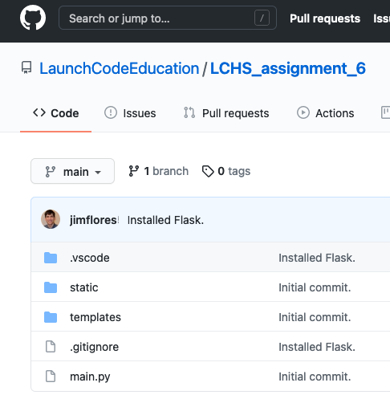

.. _flask-game-repo:

Assignment #6: Remote Repository Setup
======================================

In your earlier work, you cloned repositories from GitHub, pushed and pulled
content from the site, and collaborated with a partner on a
:ref:`shared repo <communication-log>`. However, you often performed each these
actions separately from the others.

For this assignment, you will start a project from scratch. Besides making a
cool web application, you will also refine all of your version control skills!

The sections below walk you through the setup for your project. After your
local and remote repositories are linked and ready to go,
:ref:`return to the main Assignment 6 page <flask-game>`.

Create a New Local Repository
-----------------------------

Your first step is to create a *local* project directory. This stores a copy of
your code on your personal device.

#. Launch Visual Studio Code and use the *File* menu to open your
   ``local_practice`` folder.
#. In the file tree, create a new directory for your game project. Be sure to
   give the folder a descriptive name! Also, make sure the new folder is NOT
   buried inside of a different project.
#. From the *File* menu, open your game folder. In the terminal, run
   ``git init`` to initialize the directory for version control.
#. Use the tools in VS Code to create a file tree that looks like this:

   .. figure:: figures/flask-game-start-tree.png
      :alt: Starting file tree showing static/style.css, templates/index.html, and main.py.

      The file tree contains two folders (``static`` and ``templates``) plus three code files.

   You don't need any code in ``main.py``, ``index.html``, or ``style.css``
   yet.

#. Use the terminal to create a new virtual environment for your project, then
   install Flask. If you need a reminder for how to do this, review the
   guidelines in the :ref:`Cookies & Sessions chapter <clone-venv-reminder>`.
#. Add a ``.gitignore`` file and paste in the :ref:`usual code <create-gitignore>`.
   Be sure to put the name of your project's virtual environment in line 1.
#. Properly done, your file tree should now look something like this:

   .. figure:: figures/flask-game-setup-done.png
      :alt: Project file tree after installing Flask.

      Your local file tree after installing Flask and adding ``.gitignore``.
      
#. Run through the usual ``git status/add/commit`` process to save your
   progress.
#. Finally, use ``git branch`` to check the name of your default branch.

   .. sourcecode:: bash

      $ git branch
      * main

   If the default branch is NOT called ``main``, change it with the command

   .. sourcecode:: bash

      $ git branch -m old_branch_name main

Link to a Remote Repository
---------------------------

The next step is to open an empty repository on GitHub. This will eventually
hold the *remote* copy of your project code.

#. Open your web browser and login to your `GitHub account <https://github.com>`__.
#. On your home screen, click the *New Repository* button.

   .. figure:: figures/new-GH-repo.png
      :alt: Showing the New repository button on the GitHub home screen.

      It's friendly and green. Click the button!

#. This opens a page where you must make a few choices. First, fill in
   ``Repository Name`` with the SAME NAME as your local game directory. Also,
   give a short description of your project.

   .. figure:: figures/name-GH-repo.png
      :alt: Filling in the name and description for the new repository.

      If your repo name is already taken, you'll have to think of another!

#. Next, select the *Public* option for your repo, and leave the three
   checkboxes empty. Click *Create repository*.

   .. figure:: figures/GH-repo-options.png
      :alt: Select the public repo option.
      :width: 50%

#. The next screen seems very detailed, but it's almost automatic. Copy the
   commands to *push an existing repository* and paste them into the
   terminal panel in VS Code. This will save a copy of the local repo you
   created earlier to your GitHub account.

   You may be asked to enter your GitHub username and/or password to complete
   the action.

   .. figure:: figures/push-local-repo.png
      :alt: Copy the third set of terminal instructions.
      :width: 80%

#. When successful, you'll see a lot of text appear in the console. It will end
   with something like this:

   .. sourcecode:: bash

      To https://github.com/username/project_name.git
      * [new branch]      main -> main
      Branch 'main' set up to track remote branch 'main' from 'origin'.

   ``username`` and ``project_name`` will match your GitHub username and what
   you called your repository. The last line confirms the link between your
   local ``main`` branch and the remote version.

Good! Now click on your project name in GitHub. You should see the same files
and folders in both GitHub and VS Code. The exception to this is the directory
for your virtual environment, which won't appear online.

   Congratulations! Your project code now exists online.

Add Teammate(s) to Project
--------------------------

Finally, you need to grant your partner(s) permission to make changes to the
remote repository.

#. On the GitHub repository page, click the *Settings* button. Select the
   *Manage Access* option and click the green *Invite teams or people* button.

   .. figure:: figures/com-log/manage-access.png
      :alt: Click "Settings" and "Manage Access" to let other users modify the repo.
      :width: 60%

      Give your team access to your repo.

#. Next, enter the GitHub username for your partner. Be sure to grant them the
   proper level of access. ``Admin`` gives them the ability to delete the repo
   from your account at any time. The ``Write`` and ``Maintain`` roles allow
   them to edit the repo but not delete it.

   .. figure:: figures/com-log/add-repo-partners.png
      :alt: Enter a GitHub username, choose level of access, then click the Add button.
      :width: 40%

      Decide how much control you want to give your partner.

#. When your partner logs into GitHub and visits the project URL, they will see
   an invitation to join the repository. 
#. Repeat steps 1 - 3 for each member of your team.

Partners: Clone the Project
---------------------------

Each partner on the project should *clone* a copy of the repository to their
own device.

You and your team can now *push* changes up to GitHub and *pull* updates down
to your machines. If you need a reminder how to do this, check out the
:ref:`Communication Log <git-push-and-pull>` assignment.

Ready to Go!
------------

Whew! This process gets easier with practice, and you now have a little more
experience under your belt.

Now it's time to git back to building your game!

:ref:`Return to Assignment 6 <flask-game-part-2>`.
