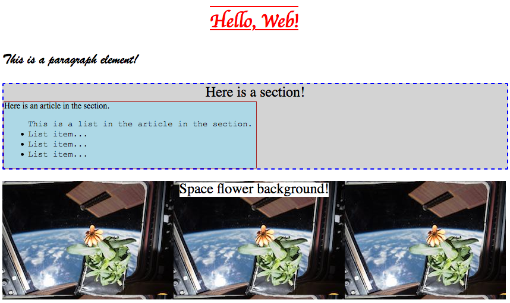
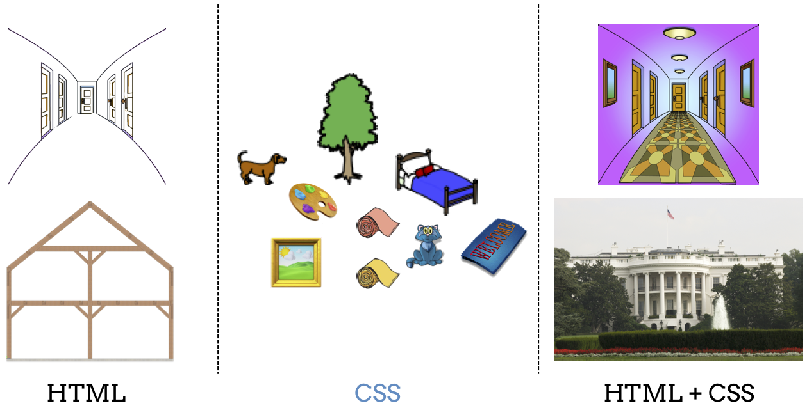

What is CSS?
============

Background
----------

As discussed in the previous chapter, HTML lays out the structure of a webpage.
However, when programmers make pages only with HTML, they might not be able to
really show off their creativity and artistic flair.

.. figure:: figures/bland-page.png
   :alt: Webpage with plain black text on a white background. It includes a heading, paragraph, section, article, and list.

   HTML by itself may not fully reflect a programmer's style.

When building a website, the structure of each page is important, but so is the
appearance of the elements. By adding ``style`` attributes inside the tags,
programmers can adjust how an element looks on the screen.

   Attributes spice up a webpage.

.. index:: ! css

The attributes provide *styling* information, not structure. As such, we
generally consider the styling of a webpage to be a separate task from building
the HTML layout.

While HTML creates the structure and content of the page, CSS adds the styling
to make it beautiful! Cascading Styling Sheets (**CSS**) is a language that
allows programmers to easily add styling instructions to HTML documents. With
CSS, programmers can change background and font colors, the size of different
elements, and many more things.

   HTML is the frame. CSS is the decoration. Combined, they make attractive webpages.

CSS works by applying style rules to different elements. A style rule could be:
*Make this lettering purple* or *Make this font Helvetica*.

The *cascading* part of the CSS name refers to how the style rules get applied.
The rules "cascade" because they follow a specific order of importance.

.. admonition:: Note

   We will explore this order of importance later in the chapter. 

Check Your Understanding
------------------------

.. admonition:: Question

   HTML is responsible for which parts of a webpage? Select ALL that apply.

   .. raw:: html

      <ol type="a">
         <li>The structure</li>
         <li>The content</li>
         <li>The appearance</li>
         <li>The web address</li>
      </ol>

.. Answers = a, b

.. admonition:: Question

   CSS is responsible for which part of a webpage?

   .. raw:: html

      <ol type="a">
         <li><input type="radio" name="Q2" autocomplete="off" onclick="evaluateMC(name, false)"> The structure</li>
         <li><input type="radio" name="Q2" autocomplete="off" onclick="evaluateMC(name, false)"> The content</li>
         <li><input type="radio" name="Q2" autocomplete="off" onclick="evaluateMC(name, true)"> The appearance</li>
         <li><input type="radio" name="Q2" autocomplete="off" onclick="evaluateMC(name, false)"> The web address</li>
      </ol>
      

.. Answer = c

