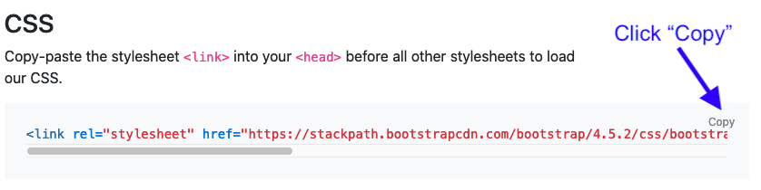
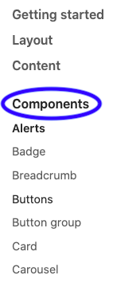
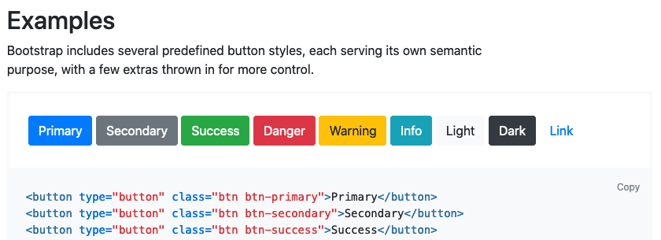

.. _bootstrap-classes:

Bootstrap
=========

CSS allows us to make our webpages attractive. For larger sites or more complex
pages, the CSS code can get long and quite detailed. Fortunately, we don't have
to reinvent the wheel every time we create a page.

If we save some of our favorite style rules in a single ``.css`` file, we can
reuse that code over multiple pages. Similarly, many developers are willing to
share their CSS rules with others. With their permission, we can import their
work to decorate our own HTML.

What is Bootstrap?
------------------

Bootstrap provides a library of ready-made CSS that we can use to quickly make
our web pages look great.

.. admonition:: Example

   The content on the left was created with plain HTML code. The right side
   shows the same code with a few Bootstrap styles added.

   .. figure:: figures/simple-bootstrap-styles.png
      :alt: Plain HTML on the left, more attractive styled content (buttons, table, lists) on the right.
   
      Bootstrap classes make our page look slick!

Instead of defining our own style rules with selectors and declaration blocks,
Bootstrap provides attractive options that we can drop into our code.

Link to the Bootstrap Library
-----------------------------

To use Bootstrap styles, we must update the ``link`` element in our HTML file.
Visit the `Bootstrap website <https://getbootstrap.com/docs/4.5/getting-started/introduction/>`__
and copy a line of code from the *Introduction* section.

   Copy the ``<link>`` element from the Bootstrap website.

Once we do that, we simply paste the code into the ``head`` element of our HTML
file. The Bootstrap CSS rules are web-based, so the ``href`` attribute in the
``<link>`` tag is a web address instead of a simple file name.

.. admonition:: Tip

   The Bootstrap link can either replace the one to our ``style.css`` file, or
   we can keep both links. Keeping both allows us to access the Bootstrap
   style rules and the ones we personally create.

   For beginners, it's best to stick with a single source of CSS code in order
   to avoid accidental conflicts.

Using Bootstrap Styles
----------------------

Most Bootstrap style rules are defined with class selectors. To add a
particular rule to an element, we must place the ``class`` attribute inside the
starting tag. The general syntax for this is:

.. sourcecode:: html

   <tag_name class="Bootstrap style name(s)">

The developers gave each class a specific name, and we can assign multiple
class styles at the same time. For example, the code
``<section class="text-center border border-dark">`` tells the browser: *Create
a section element, center the text inside that space, then add a border and
make it dark*.

Bootstrap Documentation
^^^^^^^^^^^^^^^^^^^^^^^

The Bootstrap developers created TONS of options, and learning the class names
for every one would be difficult. Fortunately,
`their website <https://getbootstrap.com/docs/4.5/getting-started/introduction/>`__
includes instructions, pictures, and copy buttons to make using the content
easier.

A good place to start is by expanding the *Components* option in the left menu.

   Take a moment to explore any components that sound interesting.

.. admonition:: Note

   Many examples on the Bootstrap website show ``
`` tags. Never fear! All
   of the class names apply equally well to the :ref:`sematic tags <semantic-tag-list>`
   we learned about in the last chapter.

The next step is to play!

   Information found in the Buttons sub-menu.

Try It!
-------

The editor below contains some plain HTML. It *also* includes the link to the
Bootstrap style rules. Explore the Bootstrap website and add class attributes
to the HTML tags. Make the page look more interesting!

.. admonition:: Tip

   Click the *Open in repl.it* and the *Open in a new tab* buttons to expand
   the views.

Possible ideas:

#. Change the appearance or arrangement of the buttons.
#. Change the `alignment of items <https://getbootstrap.com/docs/4.5/layout/grid/#alignment>`__
   within a section.
#. Update the `look of the table <https://getbootstrap.com/docs/4.5/content/tables/>`__.
#. Explore different `list group <https://getbootstrap.com/docs/4.5/components/list-group/>`__
   options.
#. Add `spinners <https://getbootstrap.com/docs/4.5/components/spinners/>`__!

.. raw:: html

   <iframe height="400px" width="100%" src="https://repl.it/@launchcode/LCHS-Bootstrap-Try-It?lite=true" scrolling="no" frameborder="yes" allowtransparency="true" allowfullscreen="true" sandbox="allow-forms allow-pointer-lock allow-popups allow-same-origin allow-scripts allow-modals"></iframe>

Check Your Understanding
------------------------

.. admonition:: Question

   Which of the following Bootstrap class attributes produces the following
   table?

   .. figure:: figures/hover-table.gif
      :alt: Table with dark cells and white text. Rows highlight when the mouse hovers over them.

   .. raw:: html

      <ol type="a">
         <li><input type="radio" name="Q1" autocomplete="off" onclick="evaluateMC(name, false)"> class="table table-dark"</li>
         <li><input type="radio" name="Q1" autocomplete="off" onclick="evaluateMC(name, false)"> class="table table-hover"</li>
         <li><input type="radio" name="Q1" autocomplete="off" onclick="evaluateMC(name, true)"> class="table table-hover table-dark"</li>
         <li><input type="radio" name="Q1" autocomplete="off" onclick="evaluateMC(name, false)"> class="table-hover table-dark"</li>
      </ol>
      

.. Answer = c

