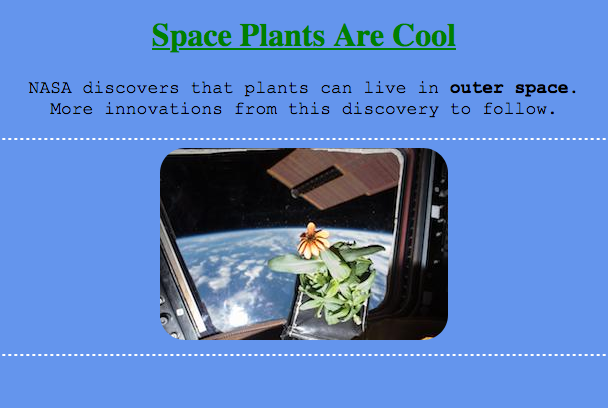

CSS Properties
==============

Below are some examples of common CSS properties and what they do. This is by
no means a complete list, but it is a good place to start.

Good CSS Properties to Know
---------------------------

.. list-table::
   :widths: auto
   :header-rows: 1

   * - CSS Property
     - Definition
     - Default Value
   * - ``background-color``
     - Sets the color of the background for an element.
     - transparent
   * - ``border``
     - Takes 3 values for the border (width, style, color).
       
       - Only the ``style`` value is required.
       - ``width`` sets the thickness of the border around an element.
       - ``style`` values include solid, wavy, dotted, dashed, and double.

     - medium (3px), none, text color
   * - ``border-radius``
     - Rounds the 4 corners of an element.
     - 0px
   * - ``color``
     - Changes the text color.
     - black
   * - ``font-family``
     - Changes the font types.
     - Depends on the browser
   * - ``font-size``
     - Changes the size of the font.
     - medium or 20px
   * - ``margin``
     - Blocks out space around an element. The property takes 1 - 4 values
       (``top, right, bottom, left``) with units of ``px`` (pixels).

       See example below.
     - 0px
   * - ``padding``
     - Sets the space between an element's content and its border. The
       property takes 1 - 4 values (``top, right, bottom, left``).
     - 0px
   * - ``text-align``
     - Aligns the text within an element.
     - left
   * - ``text-decoration``
     - Applies decorations to text and takes 3 values (line, color, and style).
       
       - Only the ``line`` value is required.
       - ``line`` values include underline, overline, and line-through. 
       - ``style`` values include solid, wavy, dotted, dashed, and double.

     - no line, text color, solid

A larger, searchable list of CSS properties can be found at
`W3Schools <https://www.w3schools.com/cssref/>`__.

.. admonition:: Example

   The ``margin`` property adds space between elements. The ``padding``
   property defines space inside a single element.

   In the figure below, the element on the left has a margin twice as large as
   the one on the right (e.g. ``10px`` vs. ``5px``). Similarly, the element on
   the right has a much larger padding than the one on the left (e.g. ``15px``
   vs. ``5px``).

   .. figure:: figures/margin-vs-padding.png
      :alt: Showing the difference between margin and padding.
      :width: 80%
   
      Margin vs. padding.

CSS Example
-----------

In the :ref:`HTML chapter <attributes-example>`, we used attributes to style a
simple webpage about space plants. Let's revisit that example, but this time we
will use *internal* CSS instead of inline CSS to style the webpage. We will
also include some of the properties listed above to create a different look.

Note how the selectors and declaration blocks between the ``   
      </head>

      <body>
         <h1>Space Plants Are Cool</h1>
         

            NASA discovers that plants can live in <b>outer space</b>. 
            More innovations from this discovery to follow.
         

         

         
         <!-- This image was taken by NASA and is in the Public Domain -->
         

      </body>
   </html>

Check Your Understanding
------------------------

.. admonition:: Question

   Play around with the `order of the values <https://www.w3schools.com/cssref/tryit.asp?filename=trycss_border>`__
   for the border property.

   ``border: 5px solid red;``
   
   Does the order matter for the thickness, style, and color values?

   .. raw:: html

      <ol type="a">
         <li><input type="radio" name="Q1" autocomplete="off" onclick="evaluateMC(name, true)"> No, the order does not matter.</li>
         <li><input type="radio" name="Q1" autocomplete="off" onclick="evaluateMC(name, false)"> Yes, the order matters.</li>
      </ol>
      

.. Answer = a

.. admonition:: Question

   Which of the following is NOT a ``text-decoration`` style?

   .. raw:: html

      <ol type="a">
         <li><input type="radio" name="Q2" autocomplete="off" onclick="evaluateMC(name, false)"> dotted</li>
         <li><input type="radio" name="Q2" autocomplete="off" onclick="evaluateMC(name, false)"> double</li>
         <li><input type="radio" name="Q2" autocomplete="off" onclick="evaluateMC(name, false)"> wavy</li>
         <li><input type="radio" name="Q2" autocomplete="off" onclick="evaluateMC(name, true)"> strike-through</li>
      </ol>
      

.. Answer = d

.. admonition:: Question

   Find an interesting CSS property that is NOT on the list above. Give its
   definition, syntax, and default value.

