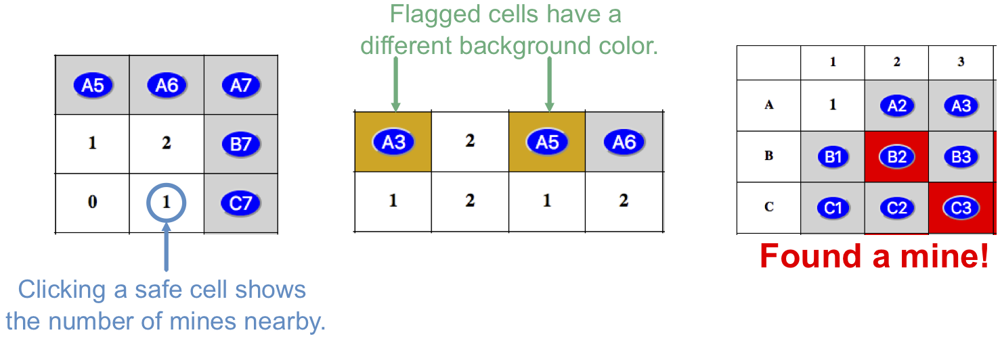

Database Functions
==================

When a player clicks a cell on the game board, several things might happen:

#. If the cell contains a mine, the game ends. The player blows up, all of the
   hidden mines are revealed, and any remaining buttons are deactivated.
#. If the cell does NOT contain a mine, the button is replaced by a number.
   This number tells the player how many mines are located in the spaces
   surrounding the cell.
#. If the *Flag Mine* checkbox is selected, the cell changes color when
   clicked. The button remains active.

   Selected cells, flagged cells, and mined cells all show different background colors.

Our goal over the next two pages will be to get all of these behaviors working.
We'll start with the required database operations.

.. _crud-tutorials:

Add Code To ``crud.py``
-----------------------

One of the central actions in the game is to display the number of mines
around a clicked cell. This data needs to be known *before* the player makes
their the first move. Let's figure out how to gather the mine information and
store it in the database.

Open the ``crud.py`` file in Visual Studio Code, then code along with each of
the following videos.

The ``record_mines()`` Function
^^^^^^^^^^^^^^^^^^^^^^^^^^^^^^^

.. raw:: html

   <section class="vid_box">
      <iframe class="vid" src="https://www.youtube-nocookie.com/embed/QcxEuR6ALns" frameborder="1" allow="accelerometer; autoplay; clipboard-write; encrypted-media; gyroscope; picture-in-picture" allowfullscreen></iframe>
   </section>

The ``count_mines()`` Function
^^^^^^^^^^^^^^^^^^^^^^^^^^^^^^

.. raw:: html

   <section class="vid_box">
      <iframe class="vid" src="https://www.youtube-nocookie.com/embed/q2EcgavIgAE" frameborder="1" allow="accelerometer; autoplay; clipboard-write; encrypted-media; gyroscope; picture-in-picture" allowfullscreen></iframe>
   </section>

Video Summary
-------------

#. The Python code for our Minesweeper application is split across three files:
   ``main.py``, ``game_logic.py``, and ``crud.py``. This provides several
   advantages:

   a. We keep related functions together, which helps organize our work.
   b. We keep the individual files small.
   c. Smaller files are easier to debug.
   d. Any of the separate files can be used as modules in other projects.

#. The database functions are all located inside the ``crud.py`` file.
#. The ``execute_query()`` function has one job - to run SQL queries and return
   the results. It is identical to the function we used in Part 2 of the
   :ref:`Movie SQLs project <movie-sql-part-2>`.
#. The ``record_mines()`` function adds rows to the ``mines`` table. The
   function also updates the ``board`` table. Each action requires its own
   SQL query string, which will be formatted and executed as part of a loop.

   .. admonition:: Note

      Using the ``counter`` variable works because the ``mines`` and ``board``
      table are reset before each new game.

      If we wanted to add new data to *existing* content, we would need to use
      a different approach. We would have to write extra SQL queries, then use
      the results to match the ``mine_id`` values in the two tables.
   
#. The ``count_mines()`` function runs one ``SELECT`` query on the ``board``
   table. This collects the coordinates (like ``B7``) for each cell in the game
   board. Once that is done, ``count_mines()`` uses a loop to repeatedly call
   the ``check_surroundings()`` function.

   a. The ``execute_query()`` function returns a list of results when it
      runs a ``SELECT`` query. However, the elements in the list are NOT simple
      string values.
   b. To extract the cell coordinates from the list, we must access each
      element and include an ``[index]`` value to retrieve the string.
   
#. A detailed review of the ``check_surroundings()`` function will be done
   later in this chapter.
