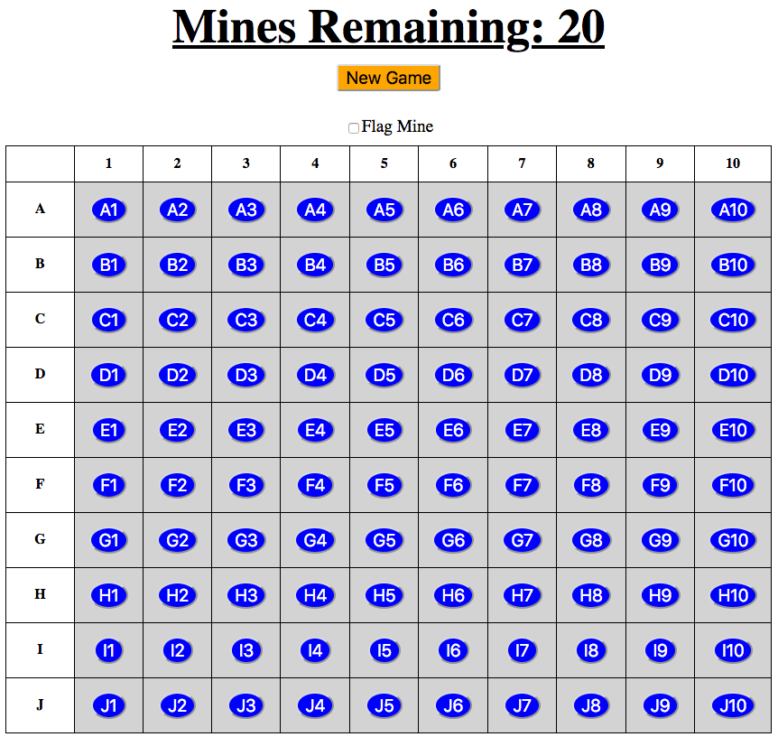

Create the Game Page
====================

To play Minesweeper, the home page links to a different HTML template. The
game screen contains a title, a mine counter, a *New Game* button, and the
the active board.

   The game board is one big HTML form.

Build ``mines.html``
--------------------

The structure of the game board is very similar to the one we built in
``index.html``. However, this time the buttons will be active, and the entire
table will be part of a large ``form`` element.

Unlike the home page, the HTML we use for the board will change once we start
adding Python code to run the game. We'll start simple, and then update the
elements and/or attributes in later steps.

The form on the game page behaves differently than most of the ones we've
created before. Instead of filling in an ``input`` field, users submit their
cell choices by clicking the different buttons. In this case, *each button*
serves as a separate input. To make the form work this way, we must assign a
different value to each button. One of these will be submitted when the user
clicks on the board.

Open your Minesweeper project and code along with the video to build the game
page:

.. raw:: html

   <section class="vid_box">
      <iframe class="vid" src="https://www.youtube-nocookie.com/embed/Q-4gN3tx6h8" frameborder="1" allow="accelerometer; autoplay; clipboard-write; encrypted-media; gyroscope; picture-in-picture" allowfullscreen></iframe>
   </section>

Video Summary
-------------

#. The game board looks just like the one on the home page. However, this one
   has active buttons, and it is included inside a ``<form></form>`` element.
#. Paste in the same table code from ``index.html``. Change the attributes in
   the ``button`` elements to:
   
   a. Make them active,
   b. Give each one the same ``name``,
   c. Set ``type="submit"``,
   d. Use a placeholder to assign a ``value`` that matches the cell coordinates
      (A10, B4, C7, etc.).

#. Inside the same form, add a *Flag Mine* checkbox above the game board, and
   center it.
#. In the ``<header></header>`` element, add the *New Game* button.

   a. Style the ``<button>`` with the ``menu`` class.
   b. Give it the same ``name`` and ``type`` as the buttons in the table.
   c. Set the ``value`` to be the empty string.
   d. Use the ``form`` attribute to match the button to the
      ``<form id="game-board" ...>`` element.

#. As we add more code to ``main.py``, we will need to update the HTML and
   styling for the cells in the table.
