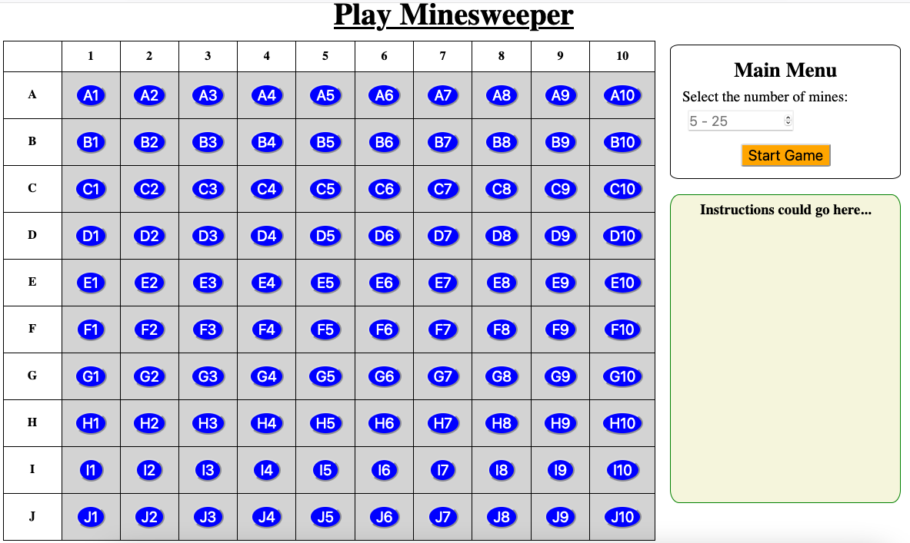

Create the Home Page
====================

The Minesweeper game uses two different webpages: a home screen plus an active
playing space. We need to build an HTML template for each page.

Review ``base.html``
--------------------

Since both game pages use the same ``<head>`` element, we can put that common
code into a base template:

.. admonition:: Example

   Open ``base.html`` file to find this code:

   .. sourcecode:: HTML
      :linenos:

      <!DOCTYPE html>
      <html lang="en">
      <head>
         <head>
            <meta charset="UTF-8">
            <meta name="viewport" content="width=device-width">
            <title>LCHS Minesweeper</title>
            <link rel="stylesheet" type="text/css"
               href="{{ url_for('static', filename='style.css') }}">
         </head>
      </head>
      <body>
         <h1>{{page_title}}</h1>
         
         
      </body>
      </html>

Note the following:

#. We link to a ``style.css`` file in line 8. It contains some basic styling
   rules for the game, and the tutorials won't instruct you to change any of
   the settings. However, you absolutely CAN adjust the properties and values
   as you see fit! Don't like the gray background on the board? Fix it!
#. On line 13, the placeholder for the page title needs to be filled. Don't
   forget to :ref:`pass a value <template-placeholders>` to ``page_title`` from
   each ``render_template()`` function.
#. Feel free to add extra elements to ``base.html``. Remember that this
   content will appear on any template that extends from the base.

Build ``index.html``
--------------------

The home screen for the game presents users with an inactive copy of the board,
a menu for choosing the number of mines, and a space for instructions.

   The LCHS Minesweeper home page.

Remember that our goal is to get the game working, so we will keep this page
simple for now. We can always make improvements and add other features later!

Open your Minesweeper project and code along with the video as we build the
HTML template:

.. raw:: html

   <section class="vid_box">
      <iframe class="vid" src="https://www.youtube-nocookie.com/embed/iKkYGMHWWco" frameborder="1" allow="accelerometer; autoplay; clipboard-write; encrypted-media; gyroscope; picture-in-picture" allowfullscreen></iframe>
   </section>

Video Summary
-------------

#. Our focus is to set up the structure for the home page. We won't worry about
   placing the mines or collecting data from the form.
#. The home page includes a title, one small form (``Main Menu``), an inactive
   copy of the game board, and a reserved space for game instructions.
#. The form contains a single ``input`` field of type ``number``. Other
   attributes include ``min`` and ``max`` values to encourage the user to
   select a reasonable number of mines. Adding some ``placeholder`` text
   inside the input box helps with the UI/UX.
#. Use a ``table`` element to build the rows and columns in the game board.

   a. Use one ``<tr></tr>`` element for each row in the table.
   b. Inside each row element, use ``<th>`` or ``<td>`` tags for the individual
      cells. The number of cells in each row matches the number of columns we
      want in the table.
   c. Use one Jinja3 loop to display the column headings (1 - 10) at the top
      of the table.
   d. Use a nested pair of loops to display the row label or button in each
      individual cell.

#. The text that appears on the board is stored in a session cookie. Column
   headings can be accessed from a list assigned to the ``session['columns']``
   key. Row data can be accessed from ``session['rows']``.

.. admonition:: Note

   Remember, you don't have to keep the default styling! Feel free to
   modify your project's CSS file to change the appearance of the page.

   If you wish, you can also link to the `Bootstrap CSS library <https://getbootstrap.com/docs/5.0/getting-started/introduction/>`__
   and use :ref:`their classes <bootstrap-classes>` to style your page.
