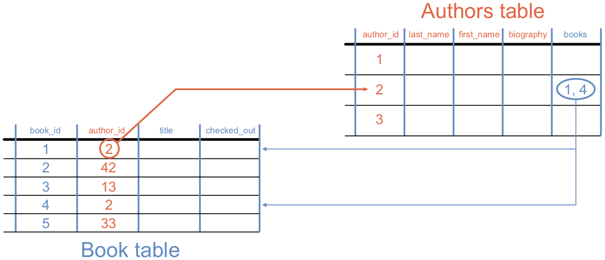

Linking Database Tables
=======================

When we store multiple tables in a database, we can create *relationships*
between them. To do this, each table must have a set of primary keys.

Recall the diagram we used earlier in the chapter:

   A column from the ``Book`` table forms a relationship with rows in the
   ``Authors`` table, and vice versa.

The idea here is that one column in the ``Book`` table stores integers that
match the primary keys of the ``Authors`` table. Similarly, one column in
``Authors`` contains integers that match up with the primary keys in ``Book``.

Unfortunately, exploring how to build these relationships is beyond the scope
of this course. For those interested in learning more about this advanced
database skill, `W3Schools <https://www.w3schools.com/sql/sql_foreignkey.asp>`__
is a good place to start.
