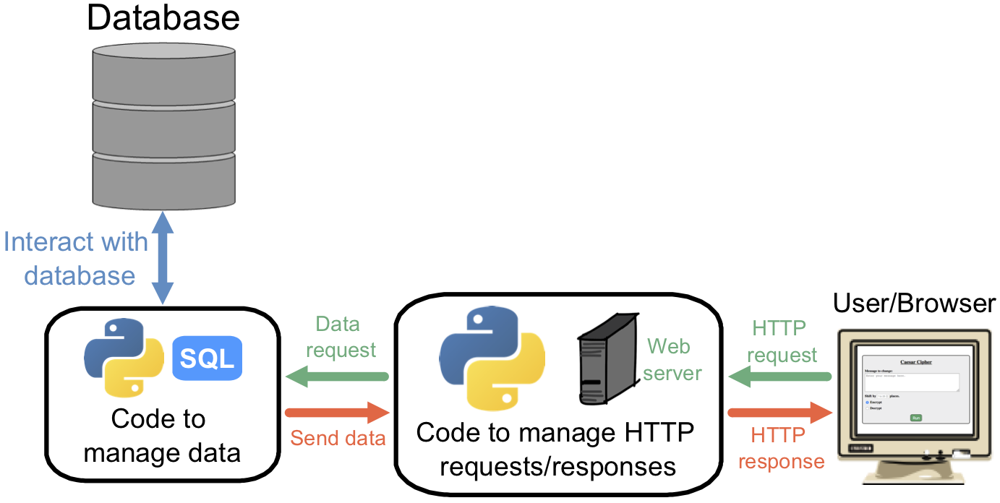

What are Databases?
===================

In the previous chapter, we learned how to use sessions to store data on a
user's device. This allows us to make the information persist after refreshing
a web page or stopping and restarting our Flask app. However, the data is still
temporary. It will be lost when the user quits their browser or clears their
cookies.

In this chapter, we will learn how to store data in a more permanent way. We
will also keep the data off of users' machines, which gives us greater control
over the information.

.. index:: ! database

A **database** stores information and organizes it in a specific way. Unlike
cookies, which contain a single key/value pair, databases allow us to manage a
huge amount of content. Think of a database like a large hard drive. However,
its only job is to store information. It runs no programs.

Using a database instead of sessions lets developers decide what information to
save, who can access it, and how long to keep it.

Adding a Database
-----------------

Databases remain separate from both the web server and a user's computer. The
diagram below shows how a database fits in with the server and a browser.

The figure splits the task of running a website into three large pieces. Let's
take a look at the different sections.

#. A user launches their browser and navigates to a website. They send HTTP
   requests to the web server, and their browser displays the responses on the
   screen. The user can only interact with the server. 
#. The database only interacts with a special program built to manage data. The
   code accesses the database and creates new entries, reads information,
   updates exiting data, or deletes content that is no longer needed. The
   program does NOT communicate directly with visitors to the website.
#. A *control* program sits in between. It receives HTTP requests and sends
   back the responses. The code manages the web server, makes decisions, sends
   data to the browser, and interacts with the data management program. The
   control provides a useful middle step. It analyzes HTTP requests and filters
   out anything that might corrupt the database or access it without
   permission.

In the Flask applications we've built so far, ``main.py`` serves as the
control.

.. admonition:: Warning

   News stories pop up frequently about hackers stealing information or
   companies accidentally posting their customers' data online.
   
   When you attach a database to your web application, you MUST take steps to
   protect the information. Visitors to your website should never have direct
   access to where you store sensitive data.

An exploration of database security is beyond the scope of this course.
Fortunately, you have access to the web. Feel free to study this topic on your
own!

Communicating With a Database
-----------------------------

.. index:: ! SQL
   single: SQL; structured query language

To maintain consistency across the world, many companies use the same basic
structure when they set up their databases. To interact with this structure,
programmers use a tool called **SQL**, which stands for *Structured Query
Language*.

.. admonition:: Fun Fact

   Are you a Marvel or DC person? How about Hufflepuff vs. Ravenclaw?

   People pronounce ``SQL`` one of two ways, either like the word "sequel" or
   by sounding out each letter, "ess-que-ell". Both ways are acceptable, but
   some programmers hold strong opinions about which one to use. Here's a handy
   cheat sheet to keep you out of trouble:

   #. **Pronounced "SQL"**: Yep! 🙂
   #. **Pronounced "SQL"**: Nope! 😡

   Really, it doesn't matter! 😉

Learning how to use SQL is a complete course by itself. Fortunately, Python
provides us with some shortcuts. We will import the necessary module and
explore how to use it later in this chapter.

For those who are interested in a good SQL tutorial, `W3Schools <https://www.w3schools.com/sql/default.asp>`__
provides one.

Check Your Understanding
------------------------

.. admonition:: Question

   Visitors to a website interact with which of the following? Select ALL that
   apply.

   .. raw:: html

      <ol type="a">
         <li>The web server</li>
         <li>The control program</li>
         <li>The data management program</li>
         <li>The database</li>
      </ol>

.. Answers = a, b

.. admonition:: Question

   How long does information remain on a database?

   .. raw:: html

      <ol type="a">
         <li><input type="radio" name="Q2" autocomplete="off" onclick="evaluateMC(name, false)"> Until the user quits their browser.</li>
         <li><input type="radio" name="Q2" autocomplete="off" onclick="evaluateMC(name, false)"> Until the user clears their sessions/cookies.</li>
         <li><input type="radio" name="Q2" autocomplete="off" onclick="evaluateMC(name, false)"> For 24 hours.</li>
         <li><input type="radio" name="Q2" autocomplete="off" onclick="evaluateMC(name, true)"> Until the developer decides to delete it.</li>
      </ol>
      

.. Answer = d
