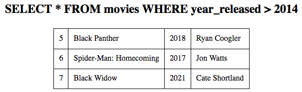

.. _movie-sql-part-2:

Project: Movie SQLs (Part 2)
============================

Now that each of your CRUD functions creates a ``sql_query`` string, the next
step is to perform those actions! On this page, you will add a new function to
your Python code. Its job is to execute any query string it receives.

Define the ``execute_query`` Function
-------------------------------------

#. BEFORE the ``index()`` function, paste in this starter code for the
   ``execute_query()`` function:

   .. sourcecode:: Python
      :lineno-start: 8

      def execute_query(query_string):
         db = sqlite3.connect('project.db')
         cursor = db.cursor()
         if "select" in query_string.lower():
            pass
         else:
            pass
         db.close()
         return

      @app.route('/', methods=['GET', 'POST'])
         def index():

   a. Line 8 defines the function with a single parameter. ``query_string``
      receives the SQL queries created by the other functions.
   b. Lines 9 and 10 open a connection to the database and initialize the
      ``db`` and ``cursor`` objects.
   c. Line 15 closes the connection to the database after each SQL query.
   d. Lines 11 - 14 will contain the code to run the SQL queries.
#. Note the condition in line 11. If the SQL query calls for a SELECT
   operation, the function will return a list of results from the database.
   Update the code to assign those results to a variable, then return them.

   .. sourcecode:: Python
      :lineno-start: 8

      def execute_query(query_string):
         db = sqlite3.connect('project.db')
         cursor = db.cursor()
         if "select" in query_string.lower():
            results = list(cursor.execute(query_string)) # Create a list of data from project.db.
         else:
            pass
         db.close()
         return results    # Return the results of the SQL query.
#. The INSERT, UPDATE, and DELETE queries all follow the same the pattern of
   execution. Add the following code to the ``else`` clause:

   .. sourcecode:: Python
      :lineno-start: 8

      def execute_query(query_string):
         db = sqlite3.connect('project.db')
         cursor = db.cursor()
         if 'select' in query_string.lower():
            results = list(cursor.execute(query_string))
         else:
            cursor.execute(query_string)  # Execute the query.
            db.commit()                   # Commit the changes to the database.
            results = 'success'           # Assign a value to 'results'.
         db.close()
         return results

The ``execute_query()`` code works, but it contains a rather large hole. You
will find this when you run the test queries in the next section.

.. admonition:: Note

   The code for displaying the query results is already part of ``base.html``.
   Feel free to explore the Jinja2 logic in the template to see how it uses
   the data from ``render_template()`` and the session cookie.

Don't Expect Perfect Syntax
^^^^^^^^^^^^^^^^^^^^^^^^^^^

Launch ``main.py``, then run these two test cases:

#. From the home page, choose ``SELECT`` and ``movies``. Enter ``*`` in the
   first box and leave the WHERE box empty. If your ``execute_query()``
   function works, you will see a table of data appear below the form.
#. Submit the form again, but this time use a column name that does NOT appear
   in the ``movies`` table. How does your program respond?

Yikes! Hopefully, you saw your program crash.

.. figure:: figures/sql-error.png
   :alt: Showing an Operational Error message. The submitted column name isn't in the movies table.

   Entering an incorrect column name throws an error and crashes the application.

Any error in the SQL query causes the application to crash. This occurs no
matter how tiny the mistake. Even forgetting to put quotes around a string
value is enough to throw an error.

You should expect users to make mistakes in any of the forms, so your program
must be able to survive these errors. You should also provide users feedback
about what went wrong.

Catch SQL Syntax Errors
-----------------------

As shown above, if a user submits invalid information, the application crashes.
While it is possible to check a SQL string before calling ``.execute()``, this
requires a rather large amount of code. Fortunately, there is a nifty shortcut
we can use instead.

#. Update the ``execute_query()`` function as follows:

   .. sourcecode:: Python
      :lineno-start: 11

      if "select" in query_string.lower():
         try:
            results = list(cursor.execute(query_string))
         except:
            results = 'error'

   .. index:: ! try/except

#. This demonstrates how to use a **try/except** block. Python *tries* to run
   the code on line 13. If ``query_string`` contains no mistakes,
   ``.execute()`` runs fine, and ``results`` is assigned data from the table.

   If ``query_string`` is incorrect, ``.execute()`` throws an error. However,
   instead of crashing, Python moves to the ``except`` clause and runs the code
   there! The ``try/except`` block *prevents the program from crashing* by
   providing a safe, alternative set of code. In this case, it assigns the
   ``'error'`` string to ``results``.
#. Cool! ``try/except`` saves you some time, since you don't need to do a
   detailed check of the SQL string.
#. Add a ``try/except`` block to the ``else`` clause as well:

   .. sourcecode:: Python
      :lineno-start: 16

      else:
         try:
            cursor.execute(query_string)
            db.commit()
            results = "success"
         except:
               results = 'error'
      db.close()
      return results

Run Test Cases
^^^^^^^^^^^^^^

Test out the new ``execute_query()`` function. Be sure to try valid and invalid
entries in each form.

#. From the home page, select ``INSERT`` and ``movies``. Enter ``title`` in the
   columns box. In the values box, enter the title of your favorite movie.
   IMPORTANT: Put quotes around the movie title.

   If your ``execute_query()`` function works, ``Query successfully executed!``
   should appear below the form. If an error occurred, you will see the message
   ``Sorry, there was a syntax error in your query.``
   
   After a successful ``INSERT``, view the ``movies`` table in Visual Studio
   Code to confirm the new entry.
#. ``UPDATE`` the ``movies`` table to make yourself the director of one of the
   existing films. Once you see ``Query successfully executed``, view the table
   in VS Code to confirm the change.
#. ``DELETE`` a row from the ``directors`` table based on its ``director_id``
   value. Follow this with a ``SELECT`` query to confirm the change.

Continue testing your application until you are comfortable with how it works.

Display Column Names
--------------------

Use the ``SELECT`` form to run a few successful queries. Notice how the column
names do NOT appear in the output.

   It would be nice if the output displayed the column names!

To make the results more clear, it would be helpful to add the column names to
the output. ``base.html`` already contains code to do this, but it's missing
some data.

.. admonition:: Example

   Take a look near the middle of ``base.html``. The Jinja3 loop

   ````
   
   creates a heading for each column name assigned to ``selected_columns``.

   .. sourcecode:: html
      :lineno-start: 23

      <table>
         <tr> <!-- 'tr' indicates a table row. 'th' is a heading cell. -->

            <!-- The 'selected_columns' key points to a list of column names. -->
            
               <th class="centered">{{column.strip()}}</th>
            
         </tr>

To display the column names, you need to assign a list to the
``selected_columns`` key in the session.

#. Open ``main.py`` and find the ``select_query()`` function.
#. Add a conditional just before calling ``execute_query()``:

   .. sourcecode:: Python
      :lineno-start: 55

      def select_query():
         if request.method == 'POST':
            table = session['table']
            columns = request.form['columns']
            condition = request.form['condition']
            sql_query = f"SELECT {columns} FROM {table}"
            if condition != '':
               sql_query += f" WHERE {condition}"

            # Here's the 4 lines of new code!
            if columns == '*':
               session['selected_columns'] = session['columns'].copy()
            else:
               session['selected_columns'] = columns.split(',')

            results = execute_query(sql_query)

Line 58 requests the string of column names from the SELECT form and assigns it
to the ``columns`` variable.

If ``columns == '*'`` returns ``True``, then line 66 runs. The
``selected_columns`` key is assigned the full list of column names. If
``False``, then the string assigned to ``columns`` is split into a list. This
list is assigned to the session key.

Make the updates, then submit the SELECT form a few more times to test the new
feature.

Gloat
-----

Whew! This was a long project, so take a moment to show off your work.

Bonus
-----

Your SQL application now works, but there are ways to fine tune the project
to make it your own!

Feel free to update your program by doing any or all of the following:

#. Add CSS styling to make the forms look nicer.
#. Make the data collected from the forms entries case-insensitive.
#. To confirm changes made to a table, automatically run a ``SELECT`` query
   after ``UPDATE``, ``INSERT``, or ``DELETE``.
#. Add more specific error messages based on what's wrong with a SQL query.
