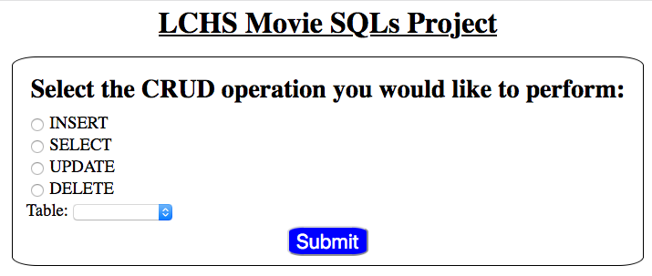
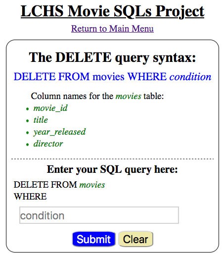
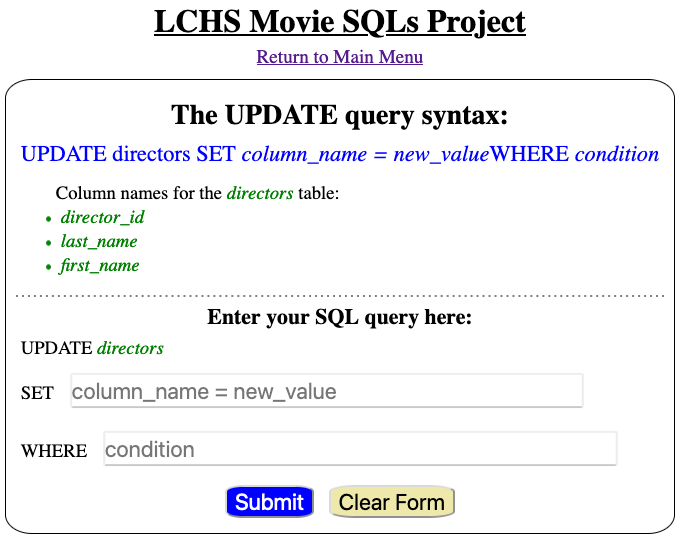
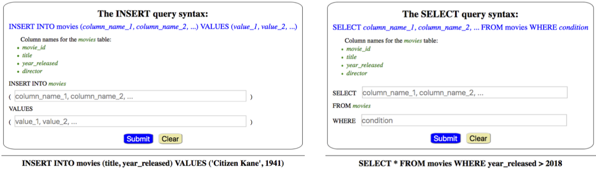

Project: Movie SQLs
===================

In this chapter, we assigned different string values to a ``sql_query``
variable and used that to execute SQL commands. For the short practice
examples, this worked well. However, we need a better way to create and run
our queries, since we don't want to rewrite our code every time we interact
with the database!

In this project, you will use input from a web form to build ``sql_query``
strings. These queries will work on two tables stored in a database: ``movies``
and ``directors``.

The database and the HTML templates are ready to go, but the application is
incomplete. Your job is to fill in the gaps to successfully collect and execute
SQL queries. You will also get to review your HTML, CSS, and Flask skills!

Project Setup
-------------

#. Open your ``local_practice`` directory in Visual Studio Code. Clone a copy
   of the starter code from this `GitHub repository <https://github.com/LaunchCodeEducation/LCHS_movie_sql_project>`__.
#. Use the *File* menu to open the ``LCHS_movie_sql_project`` folder you just
   downloaded.
#. Follow the usual procedure to create a new virtual environment, activate it,
   and install Flask. If you need a reminder for how to do this, the ``README``
   file contains a summary of the process.
#. Add the name of your virtual environment to the ``.gitignore`` file.
#. The project file tree should now look something like the figure below. If
   you gave a different name to your virtual environment, it will appear
   instead of ``movie-env``.

   .. figure:: figures/db-project-tree-start.png
      :alt: File tree showing 4 folders, 6 templates, main.py, db_setup.py, style.css, .gitignore, and a README file.

      For this project, you will do most of your work in the ``main.py`` file.

Create the Database
^^^^^^^^^^^^^^^^^^^

The file ``db_setup.py`` is a separate program. Its only job is to create the
database, add the ``movies`` and ``directors`` tables, and insert several rows
into each one.

#. Run ``db_setup.py``. A database file called ``project.db`` should appear in
   the file tree.

   .. figure:: figures/project-db-in-tree.png
      :alt: The project.db file name appears in the file tree.

      The database name appears gray because its name appears in the ``.gitignore`` file.
#. Right-click on ``project.db`` and select *Open Database*.
#. Use the tools in the :ref:`SQLite Explorer <sqlite-explorer>` tab to confirm
   that the tables and data were successfully created.

.. admonition:: Note

   At any time during the project, you can rerun ``db_setup.py`` to reset the
   database to its starting configuration.

Use ``git status/git add ./git commit -m`` to begin a version control record.
If you have your own GitHub account, take a moment to push the repository up to
the site.

The Home Page (``index.html``)
------------------------------

Run ``main.py`` and open the application in a browser. You should see a home
page:

   The form lets users select the SQL query type and a table from the database.

.. index:: ! gateway page

The home page gives users four options to choose from, plus a dropdown menu to
select a table. ``index.html`` serves as a **gateway page**. Its job is to
direct users to different pages based on the CRUD operation they pick.

Try it! Select an option and table, then click *Submit*. Repeat this for the
other choices.

.. admonition:: Tip

   If you're curious about how the gateway page operates, check out the
   comments included with the ``index()`` function in ``main.py``.

   The ``index.html`` template also includes comments describing how the page
   is put together.

Each form is complete, but none of them produce correct SQL strings yet. The
functions controlling the pages need to be finished.

Your job is to fill in the missing pieces, starting with the easiest function.
Be sure to follow the recommended order! Each part asks you to do a little more
than the one that came before.

The DELETE Form
---------------

From the home page, select ``DELETE`` and the ``movies`` table. This will
redirect you to a specific form.

   With the ``DELETE`` form, users submit a condition for the ``WHERE`` clause.

Try typing something into the input box, then submit the form. Nothing seems to
happen, because the ``delete_query()`` function in ``main.py`` is almost empty.
You need to add code to the function that will:

- Request data from the form.
- Build a ``sql_query`` string based on that input.
- Render the page again, but display the ``sql_query`` string below the form.

  .. figure:: figures/delete-form-function.png
     :alt: The DELETE query form, with an input box where users can enter a WHERE condition.
     :width: 80%

     The ``delete_query()`` function in ``main.py`` builds a SQL query string.

#. Open ``main.py`` and add this code inside the ``delete_query()`` function.

   .. sourcecode:: Python
      :lineno-start: 48

      def delete_query():
         if request.method == 'POST':
            pass
         else:
            pass
         return render_template('delete.html', tab_title = 'DELETE query', home = False)

#. Next, add code to collect the ``condition`` text from the form. Also,
   collect the table name from the session cookie.

   .. sourcecode:: Python
      :lineno-start: 48

      def delete_query():
         if request.method == 'POST':
            condition = request.form['condition']
            table = session['table']
         else:
            pass
   
   On line 50, ``['condition']`` matches to the name attribute given to the
   input element in ``delete.html``. Line 51 retrieves the value assigned to
   ``session['table']``. This value was set inside the ``index()`` function.
#. Use the ``table`` and ``condition`` variables to build the string for the
   SQL query. Also, assign the empty string to ``sql_query`` in the ``else``
   clause.

   .. sourcecode:: Python
      :lineno-start: 48

      def delete_query():
         if request.method == 'POST':
            condition = request.form['condition']
            table = session['table']
            sql_query = f"DELETE FROM {table} WHERE {condition}"
         else:
            sql_query = ''
            
#. Finally, use the ``render_template()`` function to pass ``sql_query`` to the
   ``delete.html`` template.

   .. sourcecode:: Python
      :lineno-start: 48

      def delete_query():
         if request.method == 'POST':
            condition = request.form['condition']
            table = session['table']
            sql_query = f"DELETE FROM {table} WHERE {condition}"
         else:
            sql_query = ''
         
         return render_template('delete.html', tab_title = 'DELETE query',
            home = False, sql_query = sql_query)

#. Save your changes. Run ``main.py`` and submit the form several times to
   check your code. Fix any bugs that occur.

Congratulations! The ``delete_query()`` function now builds the required
string. Be sure to save, commit, and push your work.

.. admonition:: Note

   Right now, users can type whatever they want into the input box. Don't worry
   about checking the accuracy of the SQL query yet.

The UPDATE Form
---------------

From the home page, select ``UPDATE`` and the ``directors`` table. When the new
page loads, notice that the form contains two input fields.

   With the ``UPDATE`` form, users submit text for both ``SET`` and ``WHERE``.

This page behaves in a similar way to ``delete.html``. Users submit TWO text
fields, and the ``update_query()`` function sends back a completed query
string.

#. Open ``update.html`` and identify the name for each input element.

   .. sourcecode:: HTML
      :lineno-start: 16

      <h3>Enter your SQL query here:</h3>
      
UPDATE {{session['table']}}

      <label>SET <input class="query-input" name="new_value" type="text" placeholder="column_name = new_value" required/></label>
      <label>WHERE <input class="query-input" name="condition" type="text" placeholder="condition"/></label>
#. Open ``main.py`` and find the ``update_query()`` function. Add a basic
   ``if/else`` conditional.

   .. sourcecode:: Python
      :lineno-start: 44

      def update_query():
         if request.method == 'POST':
            pass
         else:
            sql_query = ''
         
         return render_template("update.html", tab_title = "UPDATE query", home = False)
#. Using the ``delete_query()`` function as a model, replace the ``pass``
   keyword. Collect the SET and WHERE entries from the form and the table name
   from the session. Assign the values to the variables ``new_value``,
   ``condition``, and ``table``.
#. Use the ``table`` and ``new_value`` variables to build the first part of the
   ``sql_query`` string:

   .. sourcecode:: Python

      sql_query = f"UPDATE {table} SET {new_value}"

#. For an ``UPDATE`` query, the ``WHERE`` clause is optional. A user might not
   always submit one. Add a conditional to deal with this possibility:

   .. sourcecode:: Python

      sql_query = f"UPDATE {table} SET {new_value}"
      if condition != '':
         sql_query += f" WHERE {condition}"
#. Finally, use the ``render_template()`` function to pass ``sql_query`` to the
   ``update.html`` template.
#. Save your changes and run the application to check your code.

.. figure:: figures/update-form-working.png
   :alt: A properly formatted SQL query string displayed below the UPDATE form.
   :width: 70%

   The ``update_query()`` function combines several pieces of data to complete a SQL query string.

The INSERT and SELECT Forms
---------------------------

Follow the same process as above to finish the ``insert_query()`` and
``select_query()`` functions.

#. Make sure to place parentheses ``()`` around the column names and values
   in the ``INSERT`` query.
#. The ``WHERE`` clause is optional in ``SELECT``. Your ``select_query()``
   function needs to deal with this.

   The ``insert_query()`` and ``select_query()`` functions also return SQL strings.

Next Steps
----------

Congratulations! Your Flask application builds SQL query strings from different
web forms. Now you need to execute those queries, update the database, and
display feedback to the user.

Continue on to :ref:`Part 2 <movie-sql-part-2>` of this project.
