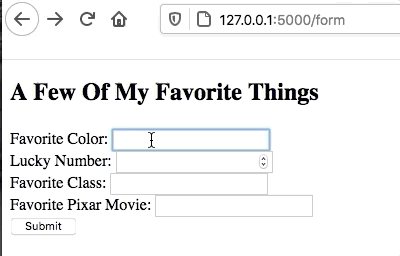
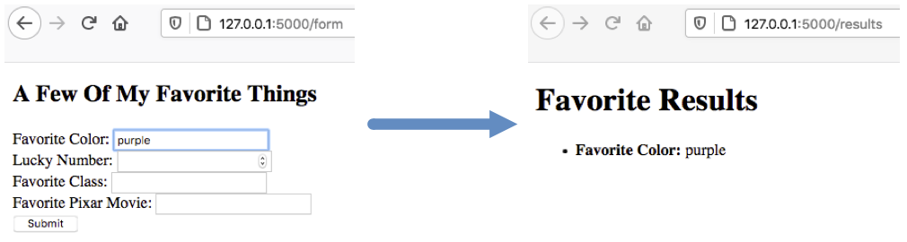
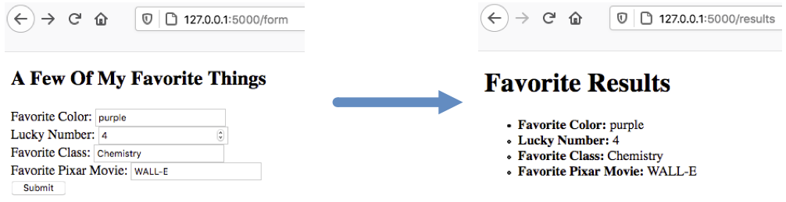

Data Collection
===============

On the previous page, we saw how to use the ``render_template()`` function to
send data from Python to an HTML file. Our next step is to figure out how to
move data in the opposite direction.

For example, when a user clicks *Submit* after filling out a form, they send
data to the web server. The HTTP request contains values for each of the input
fields. As programmers, we need to be able to access this data and work with it
in our Python code.

To collect data from a webpage, we need to add another item to the ``import``
statement in ``hello.py``:

.. sourcecode:: Python

   from flask import Flask, render_template, request

.. admonition:: Note

   ``request`` is an object, not a function. We will use *dot notation* to call
   its methods and access its properties:

   .. sourcecode:: Python

      request.property_name
      request.method_name()

Collect Color
-------------

Let's start by collecting one piece of data from our ``favorite_form.html``
template. When the user fills in the input fields and clicks *Submit*, we will
send them to a different page that displays their choice.

   Collecting the color choice from the form.

Update ``favorite_form.html``
^^^^^^^^^^^^^^^^^^^^^^^^^^^^^

The only change we need to make to our form template is to add the ``action``
and ``method`` attributes inside the ``<form>`` tag:

.. sourcecode:: html
   :lineno-start: 9

   <form action="/results" method="POST">  <!-- Change this line -->
      <h2>A Few Of My Favorite Things</h2>
      <label>Favorite Color: <input type="text" name="color"/></label> 
      <label>Lucky Number: <input type="number" name="luck_num"/></label> 
      <label>Favorite Class: <input type="text" name="fav_class"/></label> 
      <label>Favorite Pixar Movie: <input type="text" name="best_pix"/></label> 
      <button>Submit</button>
   </form>

Recall that ``action`` sends the form data to the URL for a server. In this
case, it's the Flask server. The address ``/results`` identifies the route we
will use in our Python code.

Add a New Route
^^^^^^^^^^^^^^^

When we click the *Submit* button, we send an HTTP request to the server. In
``hello.py``, we need to add a function to deal with this request.

Add this function to the Python code:

.. sourcecode:: Python
   :lineno-start: 23

   @app.route('/results', methods=["POST"])
   def results():
      color_choice = request.form['color']

      return render_template('form_results.html', color = color_choice)

Code breakdown:

#. **Line 23**: The ``/results`` in the decorator matches the value assigned to
   ``action`` in the form. ``methods`` tells the program what types of HTTP
   requests to expect. In this case, only ``POST`` requests will be accepted.
#. **Line 25**: Recall that we included a ``name`` attribute for each of the
   input fields in our form. ``request.form['color']`` pulls the value from the
   field named ``color`` and assigns it to the ``color_choice`` variable.
#. **Line 27**: Renders the template called ``form_results.html`` and passes it
   the value for ``color_choice``.

If we save the changes and navigate to ``http://127.0.0.1:5000/form``,
submitting the form produces an error. This is because the ``results()``
function calls for a template that we haven't created yet!

Add the ``form_results`` Template
^^^^^^^^^^^^^^^^^^^^^^^^^^^^^^^^^

In the ``templates`` directory, create a new file called ``form_results.html``.
Paste in this code:

.. sourcecode:: html
   :linenos:

   <!DOCTYPE html>
   <html>
      <head>
         <meta charset="UTF-8">
         <meta name="viewport" content="width=device-width">
         <title>Favorite Results</title>
      </head>
      <body>
         <h1>Favorite Results</h1>
         <ul>
            <li><strong>Favorite Color:</strong> {{color}}</li>
         </ul>
      </body>
   </html>

Notice that the code includes a ``{{color}}`` placeholder. This variable name
matches the argument from the ``render_template()`` function above.

After saving the code, our web application can now handle the form submission.

   The value ``purple`` fills in for the ``{{color}}`` placeholder.

Try It!
-------

#. Update ``form_results.html`` to display the value from the ``Lucky Number`` field.

   .. sourcecode:: html
      :lineno-start: 11

      <li><strong>Favorite Color:</strong> {{color}}</li>
      <li><strong>Lucky Number:</strong> {{lucky_number}}</li>

#. Update the ``results()`` function to collect the value from the
   ``Lucky Number`` input field. Also, update the ``return`` statement to send
   the lucky number to the template.

   .. sourcecode:: Python
      :lineno-start: 24

      def results():
         color_choice = request.form['color']
         fav_num = request.form['luck_num']

         return render_template('form_results.html', color = color_choice, lucky_number = fav_num)

#. Save your code and check to make sure the form submission works.
#. Repeat steps 1 - 3 for the rest of the fields in the form. 

   The ``form_results.html`` page showing four values collected from the form.

Template Variable Names
-----------------------

Notice that with the ``Lucky Number`` field, we wound up using 3 different
variable names to refer to the same value. The input field had
``name="luck_num"``, the Python code used ``fav_num``, and the placeholder in
the results template used ``lucky_number``.

To avoid confusion, many developers prefer to use the SAME variable names between
their Python code and the templates. With this in mind, we can *refactor* ``hello.py``
and ``form_results.html`` to match the names used in ``favorite_form.html``.

.. admonition:: Example

   ``favorite_form.html``:

   .. sourcecode:: html
      :lineno-start: 11

      <label>Favorite Color: <input type="text" name="color"/></label> 
      <label>Lucky Number: <input type="number" name="luck_num"/></label> 

   ``hello.py``:

   .. sourcecode:: Python
      :lineno-start: 24

      def results():
         color = request.form['color']
         luck_num = request.form['luck_num']

         return render_template('form_results.html', color = color, luck_num = luck_num)

   ``form_results.html``:

   .. sourcecode:: html
      :lineno-start: 11

      <li><strong>Favorite Color:</strong> {{color}}</li>
      <li><strong>Lucky Number:</strong> {{luck_num}}</li>

Video Summary
-------------

There are a LOT of details on this page. The video below is a little longer
than the others in this chapter.

.. raw:: html

   <section class="vid_box">
      <iframe class="vid" src="https://www.youtube.com/embed/y9foALqPE6U" frameborder="0" allow="accelerometer; autoplay; clipboard-write; encrypted-media; gyroscope; picture-in-picture" allowfullscreen></iframe>
   </section>

Check Your Understanding
------------------------

.. admonition:: Question

   Indicate whether each of the following is a *class*, *function*, *method*, or
   *object*. (Click on each option to display the answer).

   .. raw:: html

      <ol type="a">
         <li onclick="revealAnswer('A', 'class')"><code class="pre">Flask</code> </li>
         <li onclick="revealAnswer('B', 'object')"><code class="pre">request</code> </li>
         <li onclick="revealAnswer('C', 'function')"><code class="pre">render_template</code> </li>
      </ol>

.. Answers = class, object, function

.. admonition:: Question

   What goes inside the brackets for ``request.form['___']``?

   .. raw:: html

      <ol type="a">
         <li><input type="radio" name="Q2" autocomplete="off" onclick="evaluateMC(name, true)"> The <code class="pre">name</code> of the input field from the form.</li>
         <li><input type="radio" name="Q2" autocomplete="off" onclick="evaluateMC(name, false)"> The <code class="pre">id</code> of the input field from the form.</li>
         <li><input type="radio" name="Q2" autocomplete="off" onclick="evaluateMC(name, false)"> The <code class="pre">type</code> of the input field from the form.</li>
         <li><input type="radio" name="Q2" autocomplete="off" onclick="evaluateMC(name, false)"> The <code class="pre">value</code> of the input field from the form.</li>
      </ol>
      

.. Answer = a
