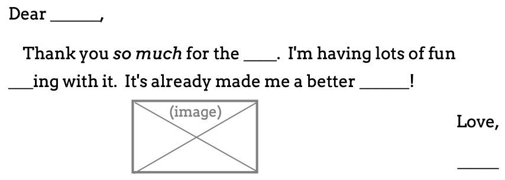
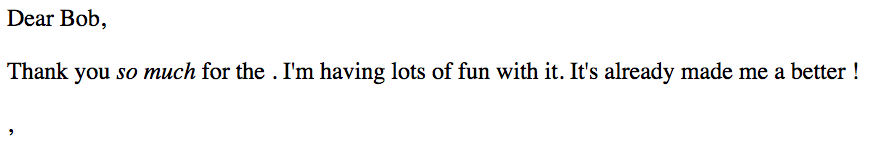

.. _flask-templates:

HTML Templates
==============

In our first Flask app, we simply returned a string to display on a webpage.
By including HTML tags, we provided some structure for the content. However,
this is inefficient. Even for simple webpages, properly formatting the strings
becomes tedious, and avoiding errors is difficult. Since every page needs its
own string, adding these to our Python functions clutters up our code and makes
our program harder to debug. A better approach is to put all of the HTML in a
separate file.

This idea lets us separate the *logic* of our application (the Python code)
from the *view* (what the user sees in their browser).

Why reinvent the wheel? We already learned how to create nice webpages using
HTML and CSS, so we can build those files and include them in our project.
Instead of returning a string, we have each Python function point to a specific
``.html`` file. Flask sends that file to the browser, which *renders* the
webpage we want.

What are Templates?
-------------------

.. index:: ! template
   single: Flask; template

A **template** is an outline that can be used multiple times to produce similar
results. For example, think of a simple thank-you note:

   Warning: Form letters don't work so well with close relatives.

With this *template*, we can send out dozens of messages very quickly. Most of
the text stays the same. We just need to fill in the blanks (or write some code
to do it for us). The template itself stays the same, but each message looks
slightly different.

For our web applications, we can use a ``.html`` template to fill in most of
the content for a page. Then we call a Python function to fill in the blanks.

Templates with Flask
--------------------

To use a template in Flask, we need to organize our project files in a very
specific way. We'll start by creating a ``templates`` directory.

#. Save and commit your work, then checkout a new branch called
   ``template-practice``.
#. In the File Explorer, use the buttons to create a new directory called
   ``templates``.

   .. figure:: figures/templates-in-filetree.png
      :alt: File tree showing the 'templates' directory inside 'hello_flask'.

#. Any file we want to use as a template MUST go inside this directory. If we
   don't put it there, then Flask won't be able to find the file when we need
   it.

Add a Template
^^^^^^^^^^^^^^

Inside the ``templates`` folder, create a new file called
``favorite_form.html``. Paste in this HTML code:

.. sourcecode:: html
   :linenos:

   <!DOCTYPE html>
   <html>
      <head>
         <meta charset="UTF-8">
         <meta name="viewport" content="width=device-width">
         <title>Flask Template</title>
      </head>
      <body>
         <form>
            <h2>A Few Of My Favorite Things</h2>
            <label>Favorite Color: <input type="text" name="color"/></label> 
            <label>Lucky Number: <input type="number" name="luck_num"/></label> 
            <label>Favorite Class: <input type="text" name="fav_class"/></label> 
            <label>Favorite Pixar Movie: <input type="text" name="best_pix"/></label> 
            <button>Submit</button>
         </form>     
      </body>
   </html>

In the :ref:`Local HTML/CSS section <view-local-html>` we learned how to open
HTML files in the browser. Now, however, we are going to have Flask do that job
for us.

The ``render_template`` Function
^^^^^^^^^^^^^^^^^^^^^^^^^^^^^^^^

.. index::
   single: Flask; render_template

#. Return to the ``hello.py`` program. In order to use the template we just
   created, we need to update the first ``import`` statement:

   .. sourcecode:: Python
      :linenos:

      from flask import Flask, render_template

#. The ``render_template`` function contains the code we need to find a file
   and send it to the browser. We do NOT need to know how the function actually
   works. All we need to remember is the syntax for calling it:

   .. sourcecode:: Python

      render_template("name_of_template")

   ``name_of_template`` MUST include the extension for the file, like
   ``.html``.

#. Next, add this new function to ``hello.py``:

   .. sourcecode:: Python

      @app.route('/form')
      def form():
         return render_template("favorite_form.html")

#. Save the code, then run the program. Open a browser and navigate to
   ``http://127.0.0.1:5000/form``. Ta da! There's our form.

   .. figure:: figures/favorite-form.png
      :alt: An HTML form with four input fields plus a Submit button.

      Flask sent the ``favorite_form.html`` file to the browser.

``render_template("favorite_form.html")`` locates the HTML file in our project.
``return`` sends this information to Flask, which passes the file to the
browser. Note that the URL in the address bar is NOT the location of the file
on our computer. The template is *on the server*, so its web address reflects
this.

Our form doesn't actually do anything yet, but we'll deal with that on the next
page.

.. _template-placeholders:

Sending Data to a Template
--------------------------

One of the benefits of using a template is that we can pass data to the file
and change its appearance in the browser. To practice this, let's add another
HTML file to the ``templates`` directory. It will be a copy of the thank you
note shown at the top of this page.

#. Create a new file called ``tynote.html`` in the ``templates`` folder.
#. Paste in this code:

   .. sourcecode:: html
      :linenos:

      <!DOCTYPE html>
      <html>
         <head>
            <meta charset="UTF-8">
            <meta name="viewport" content="width=device-width">
            <title>Thank You Note</title>
         </head>
         <body>
            <section style="font-size: 18pt;">
                  
Dear {{name}},

                  

                     Thank you <em>so much</em> for the {{gift}}. 
                     I'm having lots of fun {{verb}} with it.
                     It's already made me a better {{noun}}!
                  

                  
{{closing_word}},

                  
{{author}}

            </section>    
         </body>
      </html>

#. Note that instead of blanks, the text includes *placeholders* where we want
   to insert data. Each placeholder contains a variable inside a set of double
   curly braces ``{{}}``.
#. Now add this function to ``hello.py``:

   .. sourcecode:: Python

      @app.route('/thanks')
      def thanks():
         return render_template("tynote.html")

#. Save the code, then run the program. Open a browser and navigate to
   ``http://127.0.0.1:5000/thanks``.

   .. figure:: figures/thank-you-blanks.png
      :alt: Thank-you text with blank spaces.
      :width: 80%

Notice that the text appears on the screen, but NOT any of the placeholders
like ``{{name}}``. To fill in the blank spaces, we need to send some data to
the template.

Arguments with ``render_template``
^^^^^^^^^^^^^^^^^^^^^^^^^^^^^^^^^^

Let's start by filling in the ``{{name}}`` placeholder. We do this by adding
another argument to ``render_template`` function call. The general syntax is:

.. sourcecode:: Python

   render_template("name_of_template", placeholder_name = value)

``placeholder_name`` is the variable used in the template. ``value`` is what we
want to display on the page. For our thank-you message, this looks something
like:

.. sourcecode:: Python

   render_template("tynote.html", name = "Bob")

Updating the Python code and refreshing the page gives us:

.. admonition:: Tip

   Instead of hard-coding values inside ``render_template``, we can use
   variables instead.

   .. sourcecode:: Python

      @app.route('/thanks')
         def thanks():
            person = "Bob"
            action = "dancing"
            return render_template("tynote.html", name = person, verb = action)

.. admonition:: Try It!

   #. Add arguments to ``render_template()`` to complete the thank you note.

      .. figure:: figures/ty-note-done.png
         :alt: Template text with all placeholders filled.

         The ``tynote.html`` template will all placeholders filled.

   #. Move the ``name = person`` argument to the end of the list in
      ``render_template()``. Does this change where the ``name`` value appears
      on the webpage?

Expressions in Placeholders
---------------------------

``render_template`` sends data to a selected file. When Flask sees a
placeholder like ``{{name}}`` in that template, it replaces it with the
matching value from the data.

Besides variables, Flask can also evaluate simple expressions.

.. admonition:: Try It!

   #. In ``tynote.html``, replace the ``{{name}}`` placeholder with
      ``{{name*3}}``. What happens?
   #. Replace ``{{verb}}`` with ``{{verb.capitalize()}}``. What happens?
   #. Replace ``{{gift}}`` with ``{{gift=='wand'}}``. What happens?

Video Summaries
---------------

Here is a walkthrough for creating an HTML template, then rendering it from a
Flask application.

.. raw:: html

   <section class="vid_box">
      <iframe class="vid" src="https://www.youtube.com/embed/zNM31X-l58I" frameborder="1" allow="accelerometer; autoplay; clipboard-write; encrypted-media; gyroscope; picture-in-picture" allowfullscreen></iframe>
   </section>

The next clip shows how to send data to a webpage from a Python program.

.. raw:: html

   <section class="vid_box">
      <iframe class="vid" src="https://www.youtube.com/embed/ZNvH2IbJck0" frameborder="1" allow="accelerometer; autoplay; clipboard-write; encrypted-media; gyroscope; picture-in-picture" allowfullscreen></iframe>
   </section>

Check Your Understanding
------------------------

.. admonition:: Question

   In ``render_template()``, the name of the template must come first in the
   list of arguments. But what about the other entries?
   
   Does changing the order of the arguments change where their values appear on
   the webpage?

   .. raw:: html

      <ol type="a">
         <li><input type="radio" name="Q1" autocomplete="off" onclick="evaluateMC(name, false)"> Yes</li>
         <li><input type="radio" name="Q1" autocomplete="off" onclick="evaluateMC(name, true)"> No</li>
      </ol>
      

.. Answer = b
