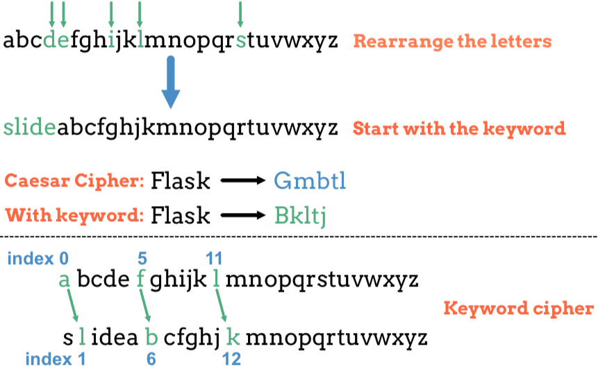

.. _web-caesar-part2:

Project: Web Form (Part 2)
==========================

In :ref:`Part 1 of this project <web-caesar-part1>`, you designed a form to
collect a text message and two other inputs from the user.

.. figure:: ../forms/figures/caesar-form.png
   :alt: A Caesar Cipher form, with inputs for the original message, the amount to shift, and whether to encrypt or decrypt the text.
   :width: 60%

   One possible form style.

Today, you will move your HTML/CSS code into a Flask application. The goal is
to create a webpage that will encrypt or decrypt the user's message when they
click *Run*.

Part A: Setup
-------------

Good news! When you cloned the GitHub repository for the
:ref:`chapter exercises <flask-repo>`, you also got access to the starter code
for this project.

.. admonition:: Note

   If you didn't clone the repository, do that now. Return to the exercises
   and follow the Git instructions in the *Setup* section.

The starter code is located in a different branch in the repository.

#. Open your ``lchs_flask_into`` folder in Visual Studio Code.
#. Save and commit any work you have from the exercises.
#. In the terminal, checkout the project branch:

   ::

      git checkout caesar-project

#. The file tree will change, but don't worry! All your old work is saved in
   your local repository. It's just in a different branch. The new file
   structure looks like this:

   .. figure:: figures/caesar-filetree.png
      :alt: Filetree showing 2 folders and 5 files.

      The ``static`` and ``templates`` directories are ready for your HTML and CSS files.

Pull in Your Part 1 Work
^^^^^^^^^^^^^^^^^^^^^^^^

You have a couple of different ways to move your form from Part 1 into this
Flask project.

#. On your device, locate the ``style.css`` file you created for Part 1.
#. To transfer the CSS code to your new project EITHER:

   a. Drag-and-drop your old file into the ``static`` folder. A dialog box
      might pop up and ask if you really want to do this. Agree.

      *OR*
   
   b. Copy your old code and paste it into the empty ``style.css`` file. You now
      have two copies of the same code on your machine. This isn't really DRY,
      but we won't judge (much).

#. Follow a similar process to move your old HTML code into the
   ``user_message`` file.
#. Once the two files are in place, launch the ``webcaesar.py`` program. Open
   your browser and navigate to the form page.

   a. If you used a different name for your ``.html`` file, update the
      ``render_template()`` function in the Python code.
   b. Remember to use ``url_for`` in your template to link it to the
      stylesheet.

#. When your form renders properly, save and commit your setup.

Part B: Update the Form Page
----------------------------

#. Update the ``action`` and ``method`` attributes in the ``<form>`` tag. When
   you submit the form, send the data to the ``/user_message`` route.
#. Add a section underneath the form to display the message the user submits
   and the coded result. Use placeholders where you want the text to appear
   on the page.
#. In ``webcaesar.py``, add variables for the plain and coded message. Pass
   their values to the template using ``render_template()``.
#. Refresh the page to make sure the data moves correctly from your Python code
   to the template.

   .. figure:: figures/form-with-message.png
      :alt: The Caesar Cipher form, with space underneath for displaying messages.
      :width: 60%

      Use one placeholder for each message. The italicized text changes after submitting the form.

Collect and Display Message
^^^^^^^^^^^^^^^^^^^^^^^^^^^

Return to ``webcaesar.py``.

#. Update the ``@app.route('/user_message')`` handler to accept both ``GET``
   and ``POST`` requests.
#. Using the :ref:`hex code exercise <flask-check-method>` as an example, add
   a conditional to check the type of request made when the page loads.
#. If ``POST``:

   a. Collect data from all 3 of the input fields on the form. This will
      include the user's message, the number of letters to shift, and whether
      to encrypt or decrypt the text.
   b. The ``Shift by`` value is a number, but *Flask pulls the data in as a
      string*. You need to convert the value to ``int``.
   c. For now, just send the user's message back to the form page. It should
      appear below the form after submission.

#. For a ``GET`` request, assign the empty string to the placeholder variables,
   then render the template.
#. Use the form to submit a few test messages. Make sure they appear below the
   form.

Remember to save and commit your work before starting the next section.   

Part C: Change the Message
--------------------------

In :ref:`Assignment #2 <coded-messages>`, you wrote a Python program that takes
a string and converts it into a coded message. Now it's time to reuse that
code! At the time, you were still using repl.it or Trinket to store your
projects. Login to your account and locate your ``Coded Messages`` program.

#. Copy the ``alphabet_position()`` function and paste it into the
   ``encrypt.py`` file in Visual Studio Code.
#. Do the same thing for the ``shift_character()``, ``build_code_dict()``, and
   ``encrypt_with_shift()`` functions.
#. If your functions depend on any Python modules (like ``string``), import
   those into ``encrypt.py``.
#. Finally, return to ``webcaesar.py``. Add an ``import`` statement for the
   ``encrypt_with_shift()`` function.

   .. sourcecode:: Python
      :lineno-start: 2

      from encrypt import encrypt_with_shift

.. admonition:: Note

   If your teacher didn't ask you to complete Assignment 2, never fear. You can
   find a scaled down version of the functions
   `on GitHub <https://github.com/LaunchCodeEducation/LCHS-web-form-part-2>`__.

   Paste the posted code into ``encrypt.py``.

Encrypt the Message
^^^^^^^^^^^^^^^^^^^

After all of the ``request.form`` statements execute, you should have the
user's message and the amount to shift each letter.

#. Call the ``encrypt_with_shift()`` function. Send the message text and shift
   value as arguments.
#. The function returns a coded message. Assign this to a variable.
#. Send the original text and the new message to the template.
#. Save your work, then refresh the page in your browser.
#. Test your code by submitting a simple message like ``abc`` and a shift
   value of ``1``. If ``bcd`` appears on the page, congratulations!
#. Test your code with more complicated messages with MixED CasE, digits,
   symbols, etc.

Decrypt Message
^^^^^^^^^^^^^^^

#. If the user submits the form with the ``Decrypt`` radio button selected,
   call the ``encrypt_with_shift()`` function like before. However, send in the
   *negative* of the shift value.
#. Test your code again to make sure it correctly encrypts and decrypts
   messages using the Caesar Cipher.

.. list-table:: Sample Results
   :header-rows: 1

   * - Message
     - Action
     - Shift
     - New Message
   * - Hello, World.
     - Encrypt
     - 5
     - Mjqqt, Btwqi.
   * - Agvnf MJXFN!
     - Decrypt
     - 21
     - Flask ROCKS!

Part D: Server-Side Validation
------------------------------

In :ref:`Part 1 of this project <web-caesar-part1>`, you used the ``max``,
``min``, ``required``, and ``checked`` attributes to validate the form inputs.
However, client-side checks are surprisingly easy to bypass, or they may not be
specific enough to catch every error. It's always a good idea to combine client
and server-side validation.

Add code to ``webcaesar.py`` to catch the following errors:

#. The message contains no letters or is blank.
#. The shift value is less than 1 or greater than 25.
#. The message exceeds a maximum number of characters or words.

For any error, your program should generate a message that tells the user
exactly what went wrong. Add a placeholder to the HTML page to display the
message *inside* the form. If no problems occur, that space should remain
empty.

Bonus Mission
-------------

The Caesar Cipher is pretty easy to decode. All we need to do is take the
message and apply different shift values until we see a clear result.

To bump up the security of the cipher, we can add a *keyword* to the alphabet
string. Instead of using ``"abcdef..."``, we move selected letters to the start
of the string. This makes it harder to decode a captured message because the
letter order isn't as predictable.

   Difference between the original and keyword cipher. The shift value in each case is 1.

Add a keyword input field to the form. This word can have no repeated
letters, so you will need some server-side validation. Next, add a new function
in ``encrypt.py`` to build the keyword string. Use that result instead of the
plain alphabet to code a message.
