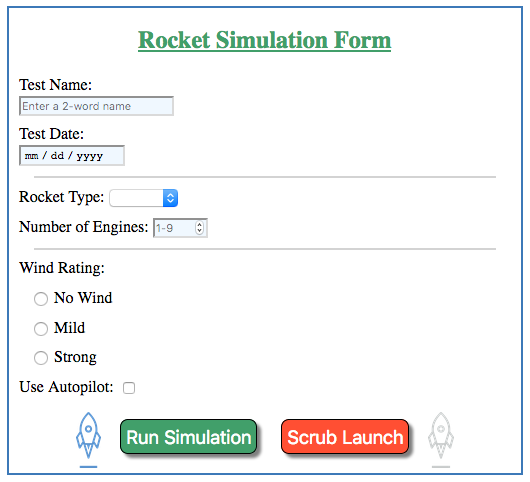

Exercises: Launch Form
======================

Hello, programmer. We need you to make a Rocket Simulation form. Please follow
the steps below. Happy coding!

Part A: Setup
-------------

#. From the ``main`` branch in your ``forms_chapter`` repository, create a new
   branch called ``rocket-form``.
#. In the new branch, create the ``rocket_sim.html`` and ``rocket.css`` files.
#. Paste the following starter code into the HTML file:

   .. sourcecode:: html
      :linenos:

      <!DOCTYPE html>
      <html>
         <head>
            <meta charset="utf-8">
            <meta name="viewport" content="width=device-width">
            <title>Rocket Form</title>
            <link rel="stylesheet" type="text/css" href="rocket.css">
         </head>
         <body>
            <!-- TODO: Add your code here. -->
         </body>
      </html>

#. Paste this code into the CSS file.

   .. sourcecode:: css
      :linenos:

      label {
         display: block;
         margin: 10px;
      }

   .. admonition:: Tip

      ``display: block;`` formats an element as a block-type. In this case, each
      ``label`` (and its wrapped input) will start on a new line. Now you won't
      need to use as many `` `` elements to separate the rows in your form!

#. Save and commit your work.

Part B: First Input
-------------------

#. Create a ``<form>`` with these attributes.

   a. Set ``method`` to ``"POST"``
   b. Set ``action`` to
      ``"https://handlers.education.launchcode.org/request-parrot"``.

#. Inside the ``form`` element, add a ``<label>`` and ``<input>`` for
   ``Test Name``:

   .. sourcecode:: html

      <label>Test Name: <input type="text" name="test-name"/></label>

#. Save your work, then open ``rocket_sim.html`` in your browser. What keeps
   you from submitting the form right now?
#. Add a submit button called *Run Simulation* to your form.

   .. sourcecode:: html

      <button>Run Simulation</button>
      <!-- OR -->
      <input type="submit" value="Run Simulation"/>

#. Enter a value into the ``test-name`` input and submit the form. Was the
   key/value pair properly sent to the server?

   .. figure:: figures/exercises-partB.png
      :alt: Request Parrot page showing the key/value pair "test-name/Input success!"

      Data successfully sent to the parrot server.

#. Save and commit your work before starting Part C.

Part C: More Inputs
-------------------

#. Add these five ``inputs`` to your form. Pay attention to the types and
   required values. Be sure to add a ``<label>`` for each input.

   .. list-table::
      :header-rows: 1

      * - Label
        - Input Type
        - Input Name
        - Required Values
      * - Test Date
        - ``date``
        - ``test-date``
        - Date format ``mm/dd/yyyy``
      * - Rocket Type
        - ``select``
        - ``rocket-type``
        - Options for ``Falcon``, ``Saturn``, ``Orion``, and ``Terrier``.
      * - Number of Engines
        - ``number``
        - ``engine-count``
        - A whole number from 1 - 9.
      * - Wind Rating
        - ``radio``
        - ``wind-rating``
        - Options for ``No Wind``, ``Mild``, and ``Strong`` (see note below).
      * - Use Autopilot
        - ``checkbox``
        - ``autopilot``
        - ``on`` or ``off``

#. *Note*: Each ``wind-rating`` input needs to include a ``value`` attribute.
   For ``No Wind``, set the value to ``0``. For ``Mild``, set the value to
   ``10``. For ``Strong``, set the value to ``20``.
#. Add placeholder text to the ``test-name`` and ``engine-count`` input fields.
#. Include an empty ``<option>`` element with the ``select`` input. Make it the
   default choice, set ``value=""``, and add the ``disabled`` attribute.
#. Use the ``required`` attribute to add some validation. Prevent the form from
   being submitted if any input *besides* ``autopilot`` is left blank.
#. Add a *Scrub Launch* button that resets the form.

   .. admonition:: Example

      Before submitting, your form should look something like:

      .. figure:: figures/rocket-form.png
         :alt: The empty form on the left, and the completed form on the right.
         :width: 80%

         The empty and filled rocket simulation form.

      After submitting:

      .. figure:: figures/rocket-response.png
         :alt: The response from the parrot server, showing the key/value pairs set by the form submission.

#. Save and commit your work before starting Part D.

Part D: Style the Form
----------------------

#. Add a centered heading to your form. Make the text a different color, font,
   and/or style compared to the labels.
#. Add a border or a background color (or both) to the form.
#. Center the *Run Simulation* and *Scrub Launch* buttons inside the form.
   Also, make them different colors.
#. Divide the form into three parts: One for the test name and date, one for
   the rocket type and engine count, and one for the wind rating and autopilot.
#. Align the ``test-name`` and ``test-date`` fields. Also, make the
   ``engine-count`` field shorter than the name and date boxes.
#. *Optional*: Add more styling to the form and inputs! Feel free to include
   images or adjust the text/background color, margins, padding, borders,
   shading, font, etc. Have a little fun.
#. Remember to save and commit your work.

   **Note**: The LaunchCode rocket logo is trademarked.
