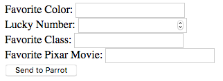
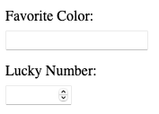
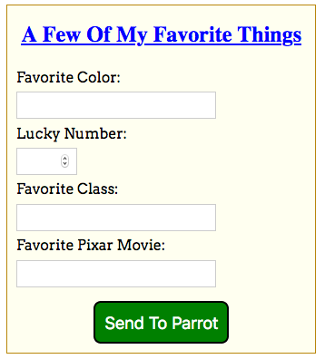

.. _style-forms:

Styling Forms
=============

The forms we created in this chapter look pretty bland, since we stuck with
plain HTML. For example:

Visually, the form needs some work. First, the input fields don't line up
evenly. They don't have to, but aligning them makes our form look more
professional. Next, it would be nice to put some space between the boxes to
keep them from pushing right up against each other. Finally, the text is pretty
plain, and the button blends into the background.

Vanilla is a great ice cream flavor, but *vanilla HTML* makes a pretty weak web
form. We want visitors to our site to have a good experience, and presenting an
attractive page is a key part of this. Here are a few tips to keep in mind when
coding a form. None of these items are *required*, but each one improves a
user's experience with our work.

#. Include a short heading that identifies the purpose of the form.
#. Place only one input element on each line of the form. Vertically stacked
   fields are easier to navigate than side-by-side ones.
#. For text inputs, try to keep the width of the boxes the same. Also, have the
   fields line up with each other.
#. The part of the page that belongs to the form should be clear. Use shading
   or a border to separate the form from the other content on the page.
#. Break longer forms into multiple sections. Each section should deal with
   related information. For example, name and email would go in one section,
   while options for a lunch order would go in another.
#. The user shouldn't need to zoom in. Keep the font size large enough to
   easily read. (*Hint*: If your parent or teacher needs to squint and lean
   closer to the screen, bump up your font size).

Fortunately, we can meet these guidelines by applying some CSS style rules!

Add CSS
-------

.. admonition:: Note

   One thing to keep in mind as we style our forms is that ``label``,
   ``input``, ``select``, ``textarea``, and ``button`` are all
   :ref:`inline elements <block-vs-inline-elements>`. Even if we put them on
   separate lines in our HTML code, they will appear in the same line of our
   webpage.

Return to the ``main`` branch of your ``forms_chapter`` repository. Save and
commit any work, then use ``git checkout -b`` to make a new branch called
``form-style``.

Paste in this starter code for the ``form`` element:

.. sourcecode:: html
   :lineno-start: 10

   <form method="POST">
      <h2>A Few Of My Favorite Things</h2>
      <label>Favorite Color: <input type="text" name="color"/></label> 
      <label>Lucky Number: <input type="number" name="luck-num"/></label> 
      <label>Favorite Class: <input type="text" name="fav-class"/></label> 
      <label>Favorite Pixar Movie: <input type="text" name="best-pix"/></label> 
      <button>Submit</button>
   </form>

Save your work, then open the ``index.html`` file in your browser.

Margins
^^^^^^^

.. index:: ! margin property

Let's start by putting some space between the inputs in our form. We do this
with the **margin** property. *Margin* sets the amount of whitespace that
surrounds an element. The larger its value, the more spaced out two neighboring
elements will be.

#. Open the ``style.css`` tab in the editor below. Note how the ``margin``
   property is assigned inside the element selector. Experiment with changing
   the number of pixels (``px``) assigned.
#. What happens to the form if you add a ``label`` selector that also
   includes a ``margin`` value?

   .. raw:: html

      <iframe src="https://trinket.io/embed/html/728e86b6f9" width="100%" height="400" frameborder="1" marginwidth="0" marginheight="0" allowfullscreen></iframe>

Once you finish exploring ``margin``, open Visual Studio Code and paste the CSS
code into your local ``style.css`` file. Be sure to refresh the page in your
browser to see how it looks.

Field Size
^^^^^^^^^^

We can change the size of an input field with the ``width`` property. The value
assigned can be in pixels or a percentage. Using a percentage is recommended,
since this changes the field size to always fit within a given space.

.. admonition:: Example

   Resize your browser window to see how these two fields respond:

   .. raw:: html

      <input style="width:50%" type="text" placeholder="Width set to 50%."/>  
      <input style="width:600px" type="text" placeholder="Width set to 600 pixels."/>

   Note that the input field set at ``50%`` *always* stretches halfway across
   this Example box, no matter how small we make the window. The ``600px`` box
   remains the same size.

#. In the editor above, add a ``width`` property to the ``input`` selector.
   Experiment by assigning different ``px`` and ``%`` values to the property.
#. What about the ``type="number"`` input? That field doesn't need to be as
   large as the others. With CSS we can either add a *class* to set the width,
   or we can try out a new technique. Add this to the CSS code in the editor:

   .. sourcecode:: css

      input[type=number] {
         width: 10%;
      }

   ``input[type=number]`` sets the style rules for ``input`` elements that have
   the ``type="number"`` attribute. Since we don't include a ``margin``
   property, the number type uses the value set in the other ``input``
   selector.

Once you finish exploring ``width``, paste the CSS code into your local
``style.css`` file. Save and commit your work.

Button Style
^^^^^^^^^^^^

Note that the HTML form uses ``<button>`` tags for *Send to Parrot* instead of
``<input>``. This lets us separate the styles for the submit button vs. the
other input fields.

In the editor below, open the ``style.css`` tab and play around with the
properties in the ``button`` selector. What does each property do? In
particular, how is ``padding`` different from ``margin``?

.. raw:: html

   <iframe src="https://trinket.io/embed/html/14d550fada" width="100%" height="350" frameborder="1" marginwidth="0" marginheight="0" allowfullscreen></iframe>

Once you've designed a button you like, paste the CSS code into your local
``style.css`` file. Save and commit your work.

Alignment
^^^^^^^^^

Right now, the edges of the input fields do not line up because their labels
are different lengths. There are *lots* of ways to address this, but one simple
fix is to put the labels and input fields on different lines.

   It's not fancy, but it's quick and easy.

By default, ``label`` and ``input`` elements start out aligned on the left
side of the screen. As long as they have the same ``margin`` value, they should
line up nicely.

In VS Code, update your HTML code to align the input fields how you like. For
an added amount of control, you can add ``section`` elements inside the form to
help align the content.

Finally, include a ``form`` element inside ``styles.css`` to add a few final
touches, like a background color or border.

   One option for a styled form.

Refresh your ``index.html`` page in your browser to make sure it looks the way
you want. When you are happy with the result, save and commit your work.

Wrap-Up
-------

Return to the ``main`` branch in your repo. Use ``git merge form-style`` to
combine the two branches. Resolve any merge conflicts.

Resources
---------

The following websites provide more detailed information about styling forms
with CSS:

#. `How to style forms with CSS: A beginner’s guide <https://blog.logrocket.com/how-to-style-forms-with-css-a-beginners-guide/>`__
#. `W3Schools CSS Forms <https://www.w3schools.com/css/css_form.asp>`__
#. Dive deep with the `MDN documentation <https://developer.mozilla.org/en-US/docs/Learn/Forms/Styling_web_forms>`__.
#. `Bootstrap Form Styles <https://getbootstrap.com/docs/4.5/components/forms/>`__
   (Review the :ref:`Bootstrap <bootstrap-classes>` section in the CSS chapter
   if necessary).
