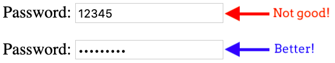
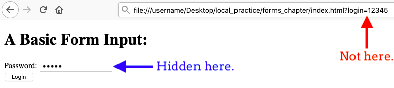

Submitting Forms
================

.. index::
   single: form; submission

Forms collect data from the user. Our first basic web form included two simple
text inputs, one for a ``Username`` and one for a ``Team Name``. We can type
whatever we want into the two fields, but that's it. The form doesn't actually
*send* the information anywhere.

As we learned in the :ref:`HTTP chapter <request-response>`, actions on the web
involve a series of *requests* and *responses*. When we click on a link or
enter a URL in the browser's address bar, we request a specific page stored on
a server somewhere. Data moves from the server to our browser (the client). A
**form submission**, on the other hand, is an HTTP request that contains values
collected from a form. In this case, data moves from the client to the server.

To collect the data entered by a user and send it on its way, we need to
*trigger* the form submission.

Submit a Form
-------------

Form submission is triggered by clicking a button. This often has a label like
*Submit*, *OK*, or *Login*. Regardless of the label, we call this a ``submit``
button. We add it to our forms one of two ways:

#. Using a separate ``input`` element with the ``type="submit"`` attribute.
#. Using a ``button`` element.

Each of these methods is shown in the box below.

.. admonition:: Example

   Here is our basic form again, but this time we added two buttons inside the
   element.

   .. sourcecode:: html
      :lineno-start: 13

      <form>
         <label>Username <input type="text" name="username"/></label> 
         <label>Team Name <input type="text" name="team"/></label>
         <!-- clicking either of these will cause a form submission -->
         <input type="submit"/>
          
         <button>Login</button>
      </form>

   .. figure:: figures/two-form-buttons.png
      :alt: Form with two text inputs and two buttons ("Submit Query" and "Login")

      Adding two buttons to our basic form.

   Note that the ``<input type="submit"/>`` syntax automatically adds the words
   ``Submit Query`` inside the button. To change the text, we add the
   ``value="button-text"`` attribute inside the tag and replace ``button-text``
   with the label we want.
   
   The ``<button>`` element has no default value. The text we put between the
   tags appears inside. If we leave this out, an empty button appears with
   the form.

   We only need one button in our form, but we used both here just to see the
   HTML code for each option. Note that without the `` `` element on line
   18, the two buttons would appear side by side.

Try It!
^^^^^^^

#. In Visual Studio Code, open the ``index.html`` file that contains your form.
#. Select one of the button options and add the new element to your HTML code.
   Make the text inside the button say something other than ``Submit Query`` or
   ``Login``.
#. Save your work.
#. Open the ``index.html`` file in your browser.
#. Type something into each input field, then click the button. Pay attention
   to what happens inside the address bar of your browser.

Did you catch the change? Try it again, but this time enter ``Bob`` for the
username and ``Python`` for the team.

When you first loaded your form, the URL probably looked something like this:

::

   file:///username/Desktop/local_practice/forms_chapter/index.html

After filling in the input boxes and submitting the form, the address changes
to something like:

::

   file:///username/Desktop/local_practice/forms_chapter/index.html?username=Bob&team=Python

Let's explore why this happens.

Taking ``action``
-----------------

When a form is submitted, an HTTP request is sent to a server. However, we need
to identify *where* to send the data. To do this, we must include an attribute
inside the ``<form>`` tag, and this attribute is called ``action``.

We will learn more about using ``action`` later. For now, recognize that when
the attribute is missing or empty, the form submits all of the collected data
to the current URL. This is why we saw a change in the address bar after we
clicked *Submit*.

.. index::
   single: url; query parameter

The start of the new address matches the old one. However, it also contains
some extra information. The URL now includes a :ref:`query string <query-string>`
after the ``?`` in the address. The query string is made up of separate
**query parameters**, which contain the data collected from each input in the
form.

For example, the query string ``?username=Bob&team=Python`` contains two
parameters. The first indicates that ``Bob`` was collected from the
``username`` input. The second shows us that ``Python`` was entered in the
``team`` field.

.. admonition:: Note

   Since spaces are not allowed in URLs, the browser replaces them with ``+``.

   Try it! Submit the form again, but type several words into one of the input
   boxes.

Key/Value Pairs
^^^^^^^^^^^^^^^

When a form is submitted, a key/value pair is created for each input field. The
*keys* match the ``name`` attributes used in the ``input`` tags. The *values*
match the data entered into each box of the form.

.. admonition:: Example

   Let's take a close look at the HTML code for our form as well as the query
   string from the URL.

   **HTML Code:**

   .. sourcecode:: html
      :lineno-start: 14

      <label>Username <input type="text" name="username"/></label> 
      <label>Team Name <input type="text" name="team"/></label>

   **URL After Submit:**

   ::

      file:///username/Desktop/local_practice/forms_chapter/index.html?username=Bob&team=Python

   Line 14 in the HTML gives us the first *key* in the query string,
   ``username``. The *value* assigned to that key is whatever we typed into
   that input box (``Bob``, in this case).
   
   The second key, ``team``, comes from the ``name`` attribute in line 15. The
   second value is ``Python``, or whatever else we typed into the field before
   submitting the form.

When we submit a form, the HTTP request always contains a set of key/value
pairs. This data gets transmitted to the server, which does something with the
information.

Submitting Passwords
--------------------

What about entering a password into an input box? Obviously, we don't want our
super-secret code to appear on the webpage for anyone to see.

   It's hard enough thinking up a good password. Don't just give yours away!

Fortunately, the most recent versions of HTML include a special input type to
deal with this exact situation.

.. admonition:: Try It!

   #. Return to your form in ``index.html``. Save and commit your work before
      moving on.
   #. Modify the ``form`` element to include only one input field and a single
      button:

      .. sourcecode:: html
         :lineno-start: 13

         <form>
            <label for="pass-code">Password: </label>
            <input id="pass-code" name="login" type="text"/>
             
            <button>Login</button>
         </form>
   
   #. Save your work, then open ``index.html`` in your browser.
   #. Note that anything you type into the input appears as plain text. This is
      NEVER a good idea when dealing with passwords. To fix this, change the
      ``type="text"`` attribute to ``type="password"``.
   #. Save the change, then refresh the page in your browser. Now what do you
      see as you type in the input box?

      .. raw:: html

         <form>
            <label for="pass-code">Password: </label>
            <input id="pass-code" name="login" type="password"/>
         </form>

   #. By changing the ``type`` in the ``input`` tag, we hide what the user
      enters in the field!

*HOWEVER*...

Enter a simple string of characters into your form and click *Login*. Now check
the updated URL.

   Yikes! There's a password in the address bar.

Even though your password was hidden inside the form, it appears as plain text
in the URL after submitting. We need to fix this. Even if nobody is looking
over your shoulder to see the URL, it is possible to intercept an HTTP request
on its way to the server. If that happens, someone could capture your password.

The reason the password appears in the address bar is due to another default
setting. When we submit a form, it automatically creates a ``GET`` request,
which adds the query string to the URL.

In the next section, we will learn how to submit a form with a ``POST``
request. Unlike ``GET``, ``POST`` hides form data.

Check Your Understanding
------------------------

.. admonition:: Question

   What must be added to a ``form`` element in order to submit the collected
   data?

   .. raw:: html

      <ol type="a">
         <li><input type="radio" name="Q1" autocomplete="off" onclick="evaluateMC(name, false)"> A <code class="pre">name</code> attribute.</li>
         <li><input type="radio" name="Q1" autocomplete="off" onclick="evaluateMC(name, true)"> A button.</li>
         <li><input type="radio" name="Q1" autocomplete="off" onclick="evaluateMC(name, false)"> An <code class="pre">action</code> attribute.</li>
         <li><input type="radio" name="Q1" autocomplete="off" onclick="evaluateMC(name, false)"> A POST request.</li>
      </ol>
      

.. Answer = b

.. admonition:: Question

   By default, are HTTP forms submitted as ``GET`` or ``POST`` requests?

   .. raw:: html

      <ol type="a">
         <li><input type="radio" name="Q2" autocomplete="off" onclick="evaluateMC(name, true)"> <code class="pre">GET</code></li>
         <li><input type="radio" name="Q2" autocomplete="off" onclick="evaluateMC(name, false)"> <code class="pre">POST</code></li>
      </ol>
      

.. Answer = b
