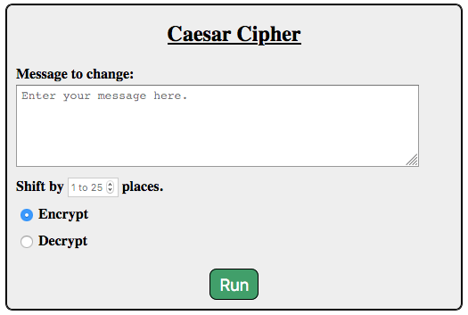

.. _web-caesar-part1:

Project: Web Form (Part 1)
==========================

In this chapter, we coded several forms and used the *Parrot Server* to check
the data submitted. Of course, the parrot isn't a real server. It stores no
data, and it performs no actions other than sending back the key/value pairs it
receives in an HTTP request. It behaves like an electronic mirror.

In the next few chapters, we will learn how to run a *local* server on our
computer. This will allow us to receive form data, *do something* with it,
and then send back a carefully crafted response. By doing this, we can create
truly interactive webpages and websites.

With this in mind, we are going to split this project across two chapters. In
Part 1 (this chapter), you will create a form and verify that it submits its
data correctly. In Part 2 (next chapter), you will write Python code to collect
the data and act on it.

Introduction
------------

In :ref:`Assignment #2 <coded-messages>`, you wrote a Python program that takes
a string and *encrypts* it to create a coded message. The program also changes
a coded message back into plain text.

Your old program ran in the console. In this project, you will adapt the
program to run in a browser. To do this, you will need to create a form with
inputs for the original message, the size of the character shift, and whether
to encrypt or decrypt the message.

   One possible form style.

You will deal with the Python code later. For now, your job is to build a nice
looking form.

Getting Started
---------------

#. Launch Visual Studio Code and open your ``forms_chapter`` folder.
#. Save and commit any recent work in the repository.
#. From ``main``, checkout a new branch called ``web-caesar``.
#. In the *File Explorer* panel, use the buttons to create a new folder. Call
   it ``project``.
#. Inside ``project`` create empty ``.html`` and ``.css`` files. Be sure to
   give the files descriptive names.
#. In the empty HTML file, type ``html:5`` and hit *Enter*. Whoa! Instant
   starter code appears!

   .. figure:: figures/boilerplate-html.gif
      :alt: Typing html:5 in VS Code automatically adds boilerplate HTML.

      OK, that's really cool.

#. Change the text in the ``title`` element, then add a ``<link>`` to your
   project's CSS file.
#. Save and commit your work.

.. admonition:: Tip

   You will be working on this project over multiple chapters, and possibly
   from different locations or devices. It would be a good idea to add a
   :ref:`remote repository <git-project>` on GitHub to help track your work.

Collect a Message From the User
-------------------------------

The `Caesar Cipher <coded-messages>`__ codes a message by shifting each letter
a certain number of places in the alphabet. In your old assignment 2 Python
code, you used the console to collect input from the user. In this updated
project, you will use a web form to gather the same information.

#. Create a new ``form`` element in your HTML file. For now, assign the URL for
   the parrot server to ``action``.

   .. sourcecode:: html

      <form action="https://handlers.education.launchcode.org/request-parrot" method="POST">

#. Add a heading inside the form.
#. Add a ``textarea`` element where the user will enter their original message.
   Be sure to give this input a ``label``. Also, add some placeholder text.
#. Add a *Submit* button to the form. However, label it something more clever
   than *Submit*.
#. Save your code, then open the ``.html`` file in your browser. Test your form
   to make sure it works.

   .. figure:: figures/textarea-input.png
      :alt: Showing a label and textarea input, followed by the response.
      :width: 70%

      Check that the form sends a key/value pair for the ``textarea`` input.

#. Commit your work before moving to the next section.

Add Number and Radio Inputs
---------------------------

Now that you have the ``textarea`` element working, you need to gather the rest
of the required information.

#. Below the ``textarea``, add an ``input`` element that accepts an integer.
   The user will use this field to set how many places to shift each letter in
   the original message.
#. Use the ``max`` and ``min`` attributes to add validation to the field.
   Allowed values for this input run from ``1`` to ``25``.
#. Add placeholder text to this input to tell the user the allowed range.
#. Below the number field, use radio buttons to let the user select if the
   message should be encrypted or decrypted. Use the ``checked`` attribute to
   select one of the choices as the default.
#. Save your code, then refresh the page in your browser. Test the form to make
   sure it sends three key/value pairs to the server.

   .. figure:: figures/parrot-project-response.png
      :alt: Request Parrot response to sending 3 input values from the form.

      The form sends key/value pairs for the message, shift value, and whether to encrypt or translate the message.

#. Commit your work before moving to the next section.

Style the Form
--------------

Now you need to make your form look nice.

#. Open the empty ``.css`` file. Add style rules for the form, input fields,
   and submit button.
#. Center the form on the page. By default, the browser displays it on the left
   side of the screen. Here's one way to change this:

   a. In the CSS file, define a new class called ``centered``. Inside this
      class, add the rule ``text-align: center;``.
   b. Wrap the ``form`` element between ``<section>`` tags.
   c. Add the ``class="centered"`` attribute to the ``<section>`` tag.
   d. Back in the CSS file, add ``display: inline-block;`` to the ``form``
      selector.

#. Save your CSS code, then refresh the page in the browser. Properly done,
   your form should now be horizontally centered on the screen. Try changing
   the ``text-align`` value to ``left`` or ``right`` to see how this affects
   the view.
#. Commit your work. If you created a remote repository, don't forget to
   ``push`` the changes up to GitHub.

Coming Up Next
--------------

In :ref:`Part 2 <web-caesar-part2>` of this project, you will write some
Python code to collect the form data. Your program will then encrypt or
decrypt the message and display it on the webpage.
