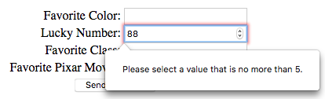

Text Inputs
===========

Our first basic web form included two simple text inputs. The fields allowed us
to enter whatever we wanted, and they displayed everything we typed on the
keyboard. Inside the ``input`` tag, the ``type="text"`` attribute set up this
behavior.

We also saw how to use ``type="password"`` to set up a field that hides what
the user enters. Besides ``text`` and ``password``, there are other options we
can assign to the ``type`` attribute. Each one changes how the input field acts
on the screen.

The table below summarizes several common ``type`` options. Try out each field
in the *Demo* column to see how it behaves.

.. admonition:: Note

   Form inputs will NOT look exactly the same in all browsers. However, the
   inputs should function the same way. Use `<https://caniuse.com>`_, if you
   ever need to answer a question about browser support for a certain feature.

.. role:: raw-html(raw)
   :format: html

.. list-table:: Different Text Input Types
   :header-rows: 1

   * - Type
     - Syntax
     - Description
     - Demo
   * - text
     - ``<input type="text" name="basic"/>``
     - A single line text field.
     - :raw-html:`<input type="text" name="basic"/>`
   * - password
     - ``<input type="password" name="pass-code"/>``
     - The field hides the text typed by the user.
     - :raw-html:`<input type="password" name="pass-code"/>`
   * - number
     - ``<input type="number" name="num-choice"/>``
     - Provides an *increase/decrease* option in the field. Also, creates an
       error message if the user tries to submit a non-numerical entry.
       Optional ``min`` and ``max`` attributes restrict the range.
     - :raw-html:`<input type="number" name="num-choice"/>`
   * - email
     - ``<input type="email" name="email-address"/>``
     - Requires the user to enter an email address with the format
       ``text@server``. The browser displays an error message if the user tries
       to submit an invalid address.
     - :raw-html:`<input type="email" name="email-address"/>`
   * - date
     - ``<input type="date" name="grad-date"/>``
     - The browser checks that the entered value has a valid date format. Some
       browsers provide a *date picker* when the input field is clicked.
     - :raw-html:`<input type="date" name="flightDate"/>`
   * - time
     - ``<input type="time" name="nvr-L8"/>``
     - The browser checks that the field contains a valid time format. Some
       browsers provide a *time picker*.
     - :raw-html:`<input type="time" name="nvr-L8"/>`

Try It!
-------

.. _client-side-validation:

Return to your ``index.html`` form.

#. Save and commit the changes you made from the previous page.
#. Change one input type to ``number``. Use the ``max`` and ``min`` attributes
   to set the allowed range between ``1`` and ``5``.
#. Save the change, then refresh the page in your browser. Try to submit the
   form with invalid entries in the field (e.g. ``abc``, ``-38``, or ``3.33``).
   What happens?
#. Change a different input type to ``email``. Try submitting an entry without
   the ``@`` symbol. When ``@`` is included, does text have to appear on both
   sides of the symbol?

.. index:: ! client-side validation
   single: form; client-side validation

By choosing different HTML input types, we can add **client-side validation**
to our forms. This means that the browser will prevent form submission if any
of the input fields contain invalid data.

   The user tried to submit a number outside of the allowed range.

A Larger Text Input Field
-------------------------

Sometimes, we need a larger text box to accept multi-line user input. In these
cases, we use the ``textarea`` HTML element instead of ``input``. It functions
exactly the same way as the input type ``text``, and it has its own set of
useful attributes. On a webpage, the field also includes a resizing tab in the
lower-right corner.

Unlike ``input``, the ``textarea`` element does require a closing tag:

.. sourcecode:: html

   <textarea name="input-name"></textarea>

.. admonition:: Try It!

   In the editor below, experiment with the ``textarea`` element:

   #. Enter some text in the field. What happens when you reach the end of a
      line? What happens when you tap *Enter*?
   #. Use the resizing tab to expand or shrink the field.
   #. What happens when you add text between the two ``<textarea>`` tags?
   #. Experiment with these attributes inside the ``<textarea>`` tag:

      a. ``rows="..."`` (Fill in a whole number).
      b. ``cols="..."`` (Fill in a whole number).
      c. ``maxlength="10"``

   .. raw:: html

      <iframe src="https://trinket.io/embed/html/f09baf1ad5" width="100%" height="400" frameborder="1" marginwidth="0" marginheight="0" allowfullscreen></iframe>

Now replace one of the ``input`` elements in ``index.html`` with a ``textarea``
field. What does the data look like when the server sends its response? How
does submitting the form deal with newlines entered into the field?

Check Your Understanding
------------------------

.. admonition:: Question

   Which input type is the BEST choice when the user needs to suggest a day for
   a meeting?

   .. raw:: html

      <ol type="a">
         <li><input type="radio" name="Q1" autocomplete="off" onclick="evaluateMC(name, true)"> <code class="pre">date</code></li>
         <li><input type="radio" name="Q1" autocomplete="off" onclick="evaluateMC(name, false)"> <code class="pre">time</code></li>
         <li><input type="radio" name="Q1" autocomplete="off" onclick="evaluateMC(name, false)"> <code class="pre">text</code></li>
         <li><input type="radio" name="Q1" autocomplete="off" onclick="evaluateMC(name, false)"> <code class="pre">number</code></li>
      </ol>
      

.. Answer = a

.. admonition:: Question

   Which input type is the BEST choice when the user needs to choose how many
   items to purchase from an online store?

   .. raw:: html

      <ol type="a">
         <li><input type="radio" name="Q2" autocomplete="off" onclick="evaluateMC(name, false)"> <code class="pre">date</code></li>
         <li><input type="radio" name="Q2" autocomplete="off" onclick="evaluateMC(name, false)"> <code class="pre">time</code></li>
         <li><input type="radio" name="Q2" autocomplete="off" onclick="evaluateMC(name, false)"> <code class="pre">text</code></li>
         <li><input type="radio" name="Q2" autocomplete="off" onclick="evaluateMC(name, true)"> <code class="pre">number</code></li>
      </ol>
      

.. Answer = d

.. admonition:: Question

   Which element would be the BEST choice if the user needs to enter a large
   amount of text?

   .. raw:: html

      <ol type="a">
         <li><input type="radio" name="Q3" autocomplete="off" onclick="evaluateMC(name, false)"> <code class="pre">input</code>, with <code class="pre">type="text"</code></li>
         <li><input type="radio" name="Q3" autocomplete="off" onclick="evaluateMC(name, false)"> <code class="pre">input</code>, with <code class="pre">type="paragraph"</code></li>
         <li><input type="radio" name="Q3" autocomplete="off" onclick="evaluateMC(name, true)"> <code class="pre">textarea</code>, with a large number assigned to <code class="pre">cols</code></li>
         <li><input type="radio" name="Q3" autocomplete="off" onclick="evaluateMC(name, false)"> <code class="pre">textarea</code>, with a large number assigned to <code class="pre">rows</code></li>
      </ol>
      

.. Answer = c
