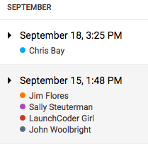

What is Git?
============

Imagine that we code a nice, solid program. We're very proud of our work, but
we decide to add a new feature to make it even better. We dive in, modify
several functions and modules, and then launch the program. It crashes. Drat!

No worries, we just need to debug a little. Unfortunately, after several hours
of work, we still can't seem to get our program running again. Even worse,
we've lost track of the changes we made to our original, working code. Is now a
good time to cry and panic?

Nope! This type of situation happens *all the time* in coding. Even very
experienced programmers break working code when they try to make improvements
or add a new feature. Since this problem pops up so often, we have tools we can
use to rescue ourselves from disaster.

Version Control Systems
-----------------------

.. index:: ! version control system

A **version control system** (VCS) tracks changes we make to our code file, and
it keeps a history of each version. One example of this comes with Google Docs.
If we create a new document and add content over time, we can see a history of
our work by choosing *File --> Version history --> See version history*. This
opens a panel on the right side of the page.

   Google tracks changes we make in a file.

By clicking on a particular day and time, we can view the changes made to the
file. If we want, we can also restore an older version of the document.

Version control systems for coding work in the same way. They help programmers
by keeping backups and a history of the changes made to the code. With that
record, coders can restore a previous version of a project. For the situation
described at the top of the page, we could use the history to roll back our
code to an earlier, working copy. Presto! We get a do-over.

A VCS also lets programmers work on different features of the same program.
Each person works on their own copy of the code, and the version control
system keeps track of who is working on what.

Version Control for This Course
-------------------------------

.. index:: ! git, ! repository

We will use **Git** as the VCS for this class. Git is not the only version
control system out there, but it is widely used by programmers and companies.

Git (and other VCS software) stores a project in a **repository**. Think of a
repository as a container for all the files that belong to a particular
program. Repositories also include the different versions of the code over time
and a log of the changes.

When a programmer updates the repository, Git does not overwrite the old
version. Instead, it saves a new copy of the files. This preserves each older
version, allowing us to restore our earlier code if necessary. With each
update, Git also modifies a log so we can easily view a record of our changes.

Getting Started with Git
^^^^^^^^^^^^^^^^^^^^^^^^

In order to git started with version control, you need to install the software
on your machine.

If you are a student and using a device provided by your school, Git should
already be installed on your machine. If you are working through this textbook
on your own, you may need to perform some installations before continuing.

Instructions for :ref:`installing Git <git-install>` can be found in the
:ref:`Setting up Software <software-installations>` appendix.

Replit Users
^^^^^^^^^^^^

.. admonition:: Note

   You do not need to install git.  Replit has it's own method of 
   version control. While it is possible to connect to your github account and 
   repositories it is still in beta testing and at times doesn't work as expected.
   Follow your teachers instuctions and modifications for this chapter.

Check Your Understanding
------------------------

.. admonition:: Question

   What are some benefits of using a version control system (VCS)? Check ALL
   that apply.

   .. raw:: html
      
      <ol type="a">
         <li>Keeping track of changes made in a project.</li>
         <li>Restoring older, working versions of a project.</li>
         <li>Allowing different users to work on the same project without interfering with each other.</li>
         <li>Saving yet another abbreviation (VCS) in our brains.</li>
      </ol>

.. Answers = a, b, c.

.. admonition:: Question

   How many Git puns can you think of right off the top of your head?

   #. "None, I don't git the question."
   #. "Lots! Let me git started right now."
