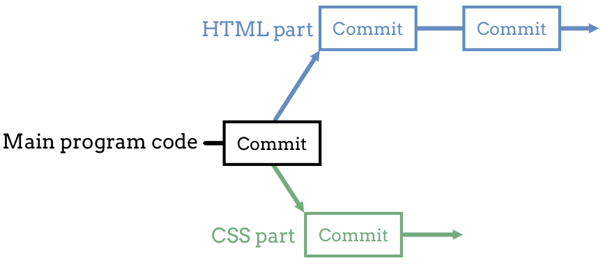
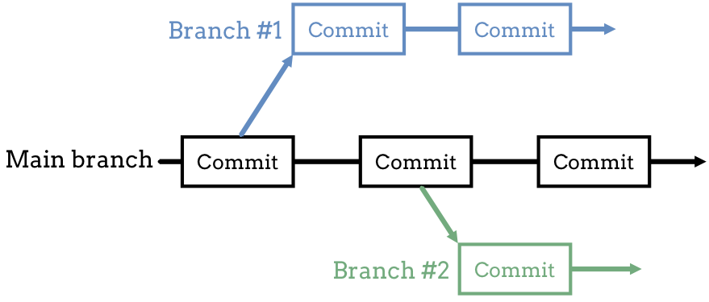
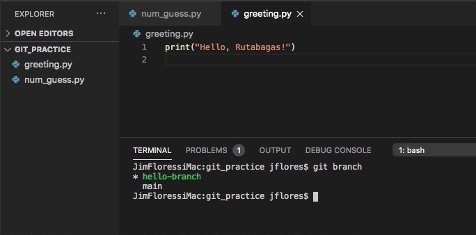

Branching Out
=============

What if we want to experiment with a new feature, and we know that we will need
to make several commits before it's done? Similarly, what if two students want
to work on different parts of a project at the same time?

For example, one student could work on some HTML code while their partner
completes the CSS. They can both work during class to save themselves some
time. However, their commits won't follow the same path. Each person will have
their own version of the Git history for the same project.

Eventually, they will combine their work. What happens if they need to roll
back to an earlier commit? With different histories, this becomes complicated.

Unless...

   Branches to the rescue.

Not only does Git allow us to store the version history of our project, it also
lets us split the development into different paths.

.. index:: ! branch

.. index::
   single: git; branch

.. _branching-in-git:

Branching in Git
----------------

A Git **branch** is a separate version of the same ``main`` code. Like a branch
on a tree, a branch in Git shares the same trunk as the other limbs. However,
each branch is distinct from all of the others.

With branches, the two students can work on *separate* versions of the same
project. They won't need to worry about messing up each other's work every time
they want to make a new commit. They share the same base code, but they update
their own parts of it. Eventually, they will merge their separate branches back
into the main program.

Branches let programmers start, update, store, and test new features for their
code without disrupting the main flow of the Git history.

On Branch ``main``
------------------

In the :ref:`previous section <check-git-status>`, we used ``git status`` to
check the state of the ``git_practice`` repository. The first line in the
output was ``On branch main``.

.. sourcecode:: bash
   :linenos:

   $ git status
   On branch main
   Changes not staged for commit:
      (use "git add <file>..." to update what will be committed)
      (use "git checkout -- <file>..." to discard changes in working directory)

         modified:   num_guess.py

.. _change-branch-name:

.. admonition:: Note

   When we run ``git init`` to start a new repo, part of the process creates a
   single, default branch. For all of the examples in this book, we refer to
   this branch as ``main``.

   If your installed version of ``git`` gives the default branch a name other
   than ``main``, you can rename it with the command:

   ::

      $ git branch -m old-branch-name main

   In this case, ``old-branch-name`` becomes ``main``.

Many programmers consider ``main`` like the trunk of a tree. They use it to
store and track the central, working part of their code. They use other
branches to experiment with new features and split up work between partners.

   ``main`` contains the central, working code for the project. Branches 1 & 2 contain separate copies of the main code.

.. admonition:: Tip

   Working on a new piece for your project? Do it in a different branch! That
   way your commits won't interfere with the working copy of your program.

To see a list of all the active branches in a project, enter ``git branch`` in
the terminal.

.. admonition:: Try It!

   Open VS Code and navigate into the ``git_practice`` directory.

   .. sourcecode:: bash
      :linenos:

      $ git branch
      * main

For our ``git_practice`` repo, we only have one branch so far. Let's add
another.

.. _create-git-branch:

Create a New Branch
-------------------

To create a new branch, the general terminal syntax is:

.. sourcecode:: bash

   git checkout -b branch-name

``-b`` creates a new branch called ``branch-name``, and ``checkout`` switches
us into that branch.

.. admonition:: Try It!

   #. In VS Code, enter the following commands in the terminal pane. Feel free
      to think up your own name for the new branch, but it cannot contain any
      spaces.

      .. sourcecode:: bash

         $ git checkout -b hello-branch
         Switched to a new branch 'hello-branch'
         $ git branch
         * hello-branch
           main
      
      Notice that in the list of branch names, the one we are currently on is
      highlighted with a ``*``. The name might also appear in a different
      color.
   #. Enter ``git log`` into the terminal. Notice that the repo history is the
      same as before. When we created ``hello-branch``, we split it off of
      ``main`` and made a copy of all its code.
   #. Add a new file to ``git_practice`` called ``greeting.py``. Inside this
      Python file, add statements to print a simple, polite greeting.
   #. Save and commit your changes. The terminal output will look something
      like:

      ::

         $ git status
         On branch hello-branch
         Untracked files:

            greeting.py

         $ git add .
         $ git commit -m "Added greeting.py file to the project."
         [hello-branch d99e424] Added greeting.py file to the project.
         1 file changed, 1 insertion (+)
         create mode 100644 greeting.py

      Just like before, ``git status`` identifies our current branch
      (``hello-branch``), and it lists the files that contain changes.

   #. Enter ``git log`` again and notice that there is a new entry at the top
      of the output.

OK. We created a new branch, added a file, put in some code, and committed all
of those changes to the repository. What's going on back in ``main``?

Switching Between Branches
--------------------------

Now that ``git_practice`` has two different branches, we can switch between
them with the syntax:

.. sourcecode:: bash

   git checkout branch-name

Enter ``git checkout main`` into the terminal. Pay close attention to the
file tree in VS Code and the ``greeting.py`` tab in the editor.

   Branches contain different versions of the project files and code.

Notice that ``greeting.py`` disappears from the file tree. Also, note that
``(deleted)`` appears in its editor tab.

Fear not! Our work hasn't gone away. Enter ``git checkout hello-branch`` in the
terminal to see the file and its code reappear.

The ``checkout`` command switches between branches. When we first made
``hello-branch``, it was identical to ``main``. However, once we commit some
changes, the two branches no longer match. By flipping back and forth between
them, we call up different versions of our project.

.. admonition:: Try It!

   #. Return to the ``main`` branch in the ``git_practice`` repository.
   #. Create a new branch off of ``main``.
   #. In the new branch, add some comments to ``num_guess.py``.
   #. Save the changes in VS Code, then use ``git status``, ``git add .``, and
      ``git commit -m`` to commit the changes to the repository.
   #. Use ``git branch`` to see the list of branches in the repo.
   #. Use ``git checkout`` to switch between the branches. Notice how the file
      tree and code both update.

Uncommitted Work
^^^^^^^^^^^^^^^^

Usually, switching between branches occurs smoothly. However, Git will block
the process if the current branch contains uncommitted work. Even if we saved
our code in the editor, Git will return an error message.

.. admonition:: Example

   Assume we make some changes in ``hello-branch`` and then try moving back
   to ``main``. We will receive an error message that looks something like:

   .. sourcecode:: bash

      $ git checkout main
         error: Your local changes to the following files would be overwritten by checkout:
            
            greeting.py

         Please, commit your changes or stash them before you can switch branches.
         Aborting

Without committing before using ``checkout``, we could easily wipe out any
changes we made in the old branch! Git prevents us from accidentally erasing
our work by forcing us to make a commit before switching branches.

Check Your Understanding
------------------------

.. admonition:: Question

   What is a reason for creating a branch in Git?

   .. raw:: html

      <ol type="a">
         <li><input type="radio" name="Q1" autocomplete="off" onclick="evaluateMC(name, false)"> To split work between team members.</li>
         <li><input type="radio" name="Q1" autocomplete="off" onclick="evaluateMC(name, false)"> To try out a new feature before adding it to the main program.</li>
         <li><input type="radio" name="Q1" autocomplete="off" onclick="evaluateMC(name, false)"> To keep the commit history clear and reliable.</li>
         <li><input type="radio" name="Q1" autocomplete="off" onclick="evaluateMC(name, true)"> All of the above.</li>
      </ol>
      

.. Answer = d

.. admonition:: Question

   Do you think we can create a branch off of a branch, like this?

   .. figure:: figures/branches-cc.png
      :alt: A two-level branch: Branch 1 splits off of main, and brach 2 splits off of branch 1.
      :width: 60%

   .. raw:: html

      <ol type="a">
         <li><input type="radio" name="Q2" autocomplete="off" onclick="evaluateMC(name, true)"> Yes we can, but we should really keep branches only one layer deep.</li>
         <li><input type="radio" name="Q2" autocomplete="off" onclick="evaluateMC(name, false)"> No.</li>
      </ol>
      

.. Answer = a
