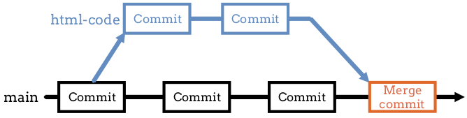

Merging in Git
==============

Let's say we branch off of ``main`` to work on a new feature for our program.
After some work, debugging, and several commits, we finally get the new code
running (yay). Our next step is to git that code into the main branch of our
program.

.. index:: ! merge
   single: git; merge

We do this by **merging** two separate branches. A merge takes the files and
code from one branch and combines them to the files and code in another. As
long as no problems occur, Git will automatically commit the combined files.
The two branches become one, with a combined history and Git log. (We'll talk
about the case when problems *do* occur a bit later).

   The ``html-code`` branch is merged into ``main``.

How to Merge
------------

To combine two branches, we must check a few things first:

#. Use ``git status`` to check both branches for uncommitted changes. If found,
   save them to the repository with ``git add .`` and ``git commit -m``.
#. Once the line ``nothing to commit, working tree clean`` appears in the
   ``status`` output for both branches, they are ready to merge.
#. Use ``git checkout`` to switch to the branch that will *receive* the other
   one. For example, if we want to merge ``html-code`` into ``main``, then we
   need to switch into ``main``.

After completing these checks, the terminal syntax for a merge is:

.. sourcecode:: bash

   git merge branch-name

This merges ``branch-name`` into the current one.

.. admonition:: Example

   Use the figure at the top of this page as a model. We want to merge the
   ``html-code`` branch into ``main``.
   
   After we finish the ``git status`` checks, the terminal output would look
   something like this:

   ::

      $ git branch
       * html-code
         main
      $ git checkout main
      Switched to branch 'main'
      $ git merge html-code
      Updating db231f2..5e43d6f
      index.html | 5 ++++-
      1 file changed, 4 insertions(+), 1 deletion(-)
   
   The output after the ``git merge`` command will vary depending on the
   branches involved and how many changes need to be combined.

Try It!
-------

On the :ref:`previous page <create-git-branch>`, you created a second branch in
the ``git_practice`` repository. Let's merge that branch into ``main``.

#. In VS Code, use the terminal pane to navigate into the ``git_practice``
   folder.
#. Enter ``git branch`` to see a list of the branches in the repo. This will
   also indicate the current branch.
#. Use ``git checkout`` to move into ``hello-branch``.
#. Use ``git status`` to check for uncommitted changes in the branch. If
   necessary, add and commit those changes to the repo.
#. Repeat steps 3 and 4 for the ``main`` branch.
#. Make sure you are in ``main``, then enter ``git merge hello-branch`` to
   combine the two branches. Properly done, you should see ``greeting.py``
   appear in the file tree.
#. Enter ``git log`` to see the updated history for the repo. Notice that it
   includes the commit messages from ``hello-branch`` in addition to one about
   the merge.

.. _local-merge-conflict:

Merge Conflicts
---------------

The merge process usually runs smoothly. In the examples above, we changed the
code in different files across two branches. These edits were small and didn't
interfere with each other, so the merge was quick.

However, sometimes there is a catch.

.. index::
   single: git; merge conflict
   single: merge; conflict

A **merge conflict** occurs when we change the same lines of code in both
branches. Git doesn't know which change to accept, so it flags the issue in an
error message. The programmer must then fix the conflict by deciding which
edits to keep and which ones to ignore.

Merge conflicts might sound scary to new Git users. However, after fixing a few
conflicts, solving the problems becomes routine. Merge conflicts don't always
happen, but we need to git used to dealing with them when they appear.

Every programmer deals with merge conflicts, and the best way to deal with them
is to face them head on. Let's create a conflict on purpose. That way, we can
practice resolving it.

Conflict Demo
^^^^^^^^^^^^^

Let's return to the ``main`` branch in our ``git_practice`` repo. Make sure you
have committed all recent changes before diving into the steps below.

Setup
~~~~~

#. Add a new file called ``conflict_demo.txt``. The ``.txt`` extension means
   that this will be a simple text file instead of one that holds active code.
   For now, there is no need to type anything in the file.
#. Use the usual ``status/add/commit`` process to save the text file to the
   repository.
#. Use ``git checkout -b`` to create a new branch called ``make-conflict``.

   .. sourcecode:: bash
      :linenos:
   
      $ git checkout -b make-conflict
      Switched to a new branch 'make-conflict'
      $ git branch
      * make-conflict
        main

OK. Let's do some typing in ``conflict_demo.txt``.

Add Text In Both Branches
~~~~~~~~~~~~~~~~~~~~~~~~~

#. Open ``conflict_demo.txt`` in the VS Code editor.
#. Add a few lines of text to the file. It doesn't matter what you write, as
   long as it's school-appropriate.
#. Save the file, then add and commit the changes to the repo.

   .. figure:: figures/merge-conflict1.png
      :alt: Excerpt from Green Eggs & Ham added to the conflict_demo.txt file.
      :width: 80%

      Changes made to ``conflict_demo.txt`` in the ``make-conflict`` branch.

#. Use ``git checkout`` to switch back to the ``main`` branch.
#. Add a few lines of text to ``conflict_demo.txt``. Make sure these lines are
   different than the ones you used before. Save and commit the changes to the
   repo.

   .. figure:: figures/merge-conflict2.png
      :alt: Excerpt from the LCHS textbook added to the conflict_demo.txt file.
      :width: 80%

      Changes made to ``conflict_demo.txt`` in the ``main`` branch.

.. _resolving-merge-conflict:

Resolving the Conflict
~~~~~~~~~~~~~~~~~~~~~~

#. Try merging the ``make-conflict`` branch into ``main``.

   ::

      $ git branch
        make-conflict
      * main
      $ git merge make-conflict
      Auto-merging conflict_demo.txt
      CONFLICT (content): Merge conflict in conflict_demo.txt
      Automatic merge failed; fix conflicts and then commit the result.

#. The CONFLICT line tells us that Git hit a problem when it tried to merge the
   changes in the ``conflict_demo.txt`` file. The last line offers us some
   encouragement! Although the automatic merge failed, we can still fix things
   and save the result.
#. Notice that the text in the editor is now highlighted:

   .. figure:: figures/merge-conflict3.png
      :alt: Green and blue highlighting points out the changes made in each branch.
      :width: 80%

      ``conflict_demo.txt`` was changed in both branches.

   The green area points out the changes made in our *current* branch
   (``main``), and the blue area shows the changes coming in from
   ``make-conflict``.
#. Just above the green area, we see several options for resolving the conflict:

   a. **Accept Current Change** keeps the green highlighted text and ignores
      the the text coming in from the other branch (the blue content). Clicking
      on this option causes the result:

      .. figure:: figures/merge-conflict4.png
         :alt: Kept the changes made in the main branch.
         :width: 60%

   b. **Accept Incoming Change** keeps the blue highlighted text and uses it to
      replace the green content. The work from the incoming branch overrides
      the current one. Clicking on this option causes the result:

      .. figure:: figures/merge-conflict5.png
         :alt: Kept the changes made in the make-conflict branch.
         :width: 60%

   c. **Accept Both Changes** combines all of the changes. The incoming content
      gets inserted just after the existing lines. Clicking on this option
      causes the result:
   
      .. figure:: figures/merge-conflict6.png
         :alt: Kept the changes made in both branches.
         :width: 60%
   
   d. **Compare Changes** sets up a side-by-side comparison of the overlapping
      lines. You might find this view helpful at times.

      .. figure:: figures/merge-conflict7.png
         :alt: Side by side view of the changes made in each branch.
         :width: 80%

#. Choose one of the ``Accept`` options, then save. Use ``git status`` to check
   the state of the branch, then ``add`` and ``commit`` to the repo.

Congratulations! You just fixed your first merge conflict.

::

   $ git log
   commit 47f150deb908f93cc0161fd4bc5f3a4374cb29e3
   Merge: ffc3860 2c5619e
   Author: Conflict Resolver <student@schoolname.edu>
   Date:   Thu Oct 29 10:18:47 2020 -0500

      Resolved first merge conflict.

Avoiding Conflicts
------------------

Git happens. Merge conflicts will pop up, but they're not a big deal. Still,
the best way to handle them is to try to avoid them in the first place. Here
are some tips:

#. Deal with any uncommitted work before trying to merge.
#. Try to avoid working on the same file, at the same time, in two different
   branches.
#. Try to avoid adding code directly into ``main``. New ideas should be
   explored in a different branch first and then merged.

Check Your Understanding
------------------------

.. admonition:: Question

   ::

      $ git log
        feature
        main
      * test

   A programmer is on the branch ``test`` and wants to merge ``feature`` into
   ``main``. What should they enter in the terminal? Assume that the status
   for all branches is clean.

   .. raw:: html

      <ol type="a">
         <li><input type="radio" name="Q1" autocomplete="off" onclick="evaluateMC(name, false)"> <code class="pre">git checkout feature</code>, then <code class="pre">git merge main</code>.</li>
         <li><input type="radio" name="Q1" autocomplete="off" onclick="evaluateMC(name, true)"> <code class="pre">git checkout main</code>, then <code class="pre">git merge feature</code>.</li>
         <li><input type="radio" name="Q1" autocomplete="off" onclick="evaluateMC(name, false)"> <code class="pre">git checkout main</code>, then <code class="pre">git merge test</code>.</li>
         <li><input type="radio" name="Q1" autocomplete="off" onclick="evaluateMC(name, false)"> <code class="pre">git checkout feature</code>, then <code class="pre">git merge test</code>.</li>
         <li><input type="radio" name="Q1" autocomplete="off" onclick="evaluateMC(name, false)"> Just <code class="pre">git checkout feature</code>.</li>
      </ol>
      

.. Answer = b.

