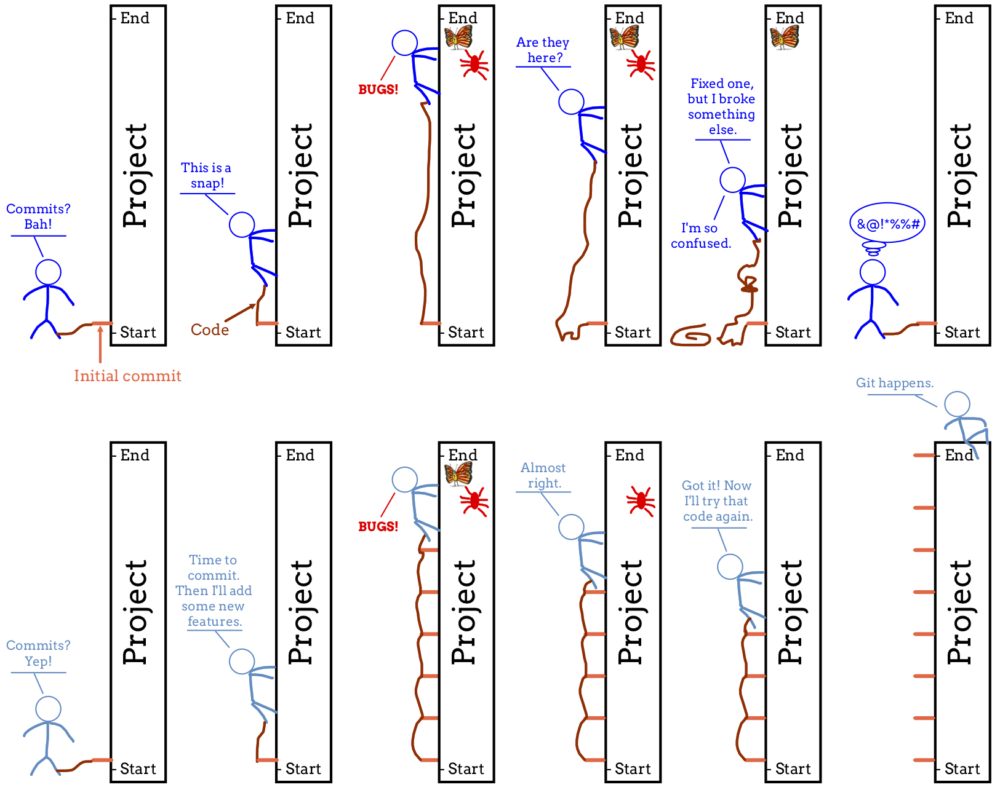

Repositories and Commits
=========================

To use all of the tools and benefits of Git, we need to set up a repository for
each new project we create. Once we do that, the next step is learning how to
save and track our changes.

Create a Repository
-------------------

To create a Git repository, we will use Visual Studio Code, the terminal, and a
series of specific commands.

.. index::
   single: git; repository
   single: git; repo

.. admonition:: Try It!

   Follow these steps to create your first repository (called a **repo** for
   short).

   #. Launch Visual Studio Code and open the ``local_practice`` folder you
      created in the last chapter.
   #. Use the buttons in the File Explorer to create a new directory called
      ``git_practice``.

      .. figure:: figures/git-init-filetree.png
         :alt: VS Code file tree showing the new git_practice directory.

         Our new file tree for local_practice.

   #. Open the terminal panel if it's not already there. Use it to navigate
      into the new ``git_practice`` directory.

      .. sourcecode:: bash
         :linenos:

         $ ls
         git_practice   hello.py   hello_web   module_practice   turtle_fun.py
         $ cd git_practice
         $ pwd
         /Users/username/Desktop/local_practice/git_practice

   #. Finally, initialize the new repository with the command ``git init``.

      .. sourcecode:: bash
         :lineno-start: 6

         $ git init
            Initialized empty Git repository in /Users/username/Desktop/local_practice/git_practice/.git

      Notice ``.git`` at the end of the file path on line 7. This is the name
      for a *hidden* directory that stores the repository data. The folder won't
      appear in our file tree, but we can see it if we use the terminal command
      ``ls -a``.

.. admonition:: Tip

   Sometimes programers accidentally enter the ``git init`` command when they
   are inside the wrong directory. This initializes a new repository where it
   doesn't belong.
   
   No worries! The solution is quick. Just delete the ``.git`` directory using
   the terminal and the :ref:`rm command <terminal_rm>`.

   .. sourcecode:: bash
      :linenos:

      $ pwd
      /Users/username/wrong_directory
      $ ls -a
      .     ..    .git     oops.py
      $ rm -rf .git

   After that, move to the *correct* directory and use ``git init`` again.

We are now set up to have Git track all changes made inside the
``git_practice`` folder. Let's make some changes and see how to track our
project!

.. _check-git-status:

Making Commits
--------------

Right now, ``git_practice`` is empty. However, the version control is already
tracking the directory. We can see this by trying out a second Git command in
the terminal:

.. sourcecode:: bash
   :linenos:

   $ git status
   On branch main

   No commits yet

   nothing to commit, create/copy files and use "git add" to track

We will deal with ``On branch main`` later in this chapter, but the next two
lines deserve some attention.

.. index:: ! commit

.. index::
   single: git; commit

#. Line 4 tells us that we have made ``No commits yet``. A **commit** is an
   update recorded in the repo. If we think of the repository as a container,
   then the commits are smaller containers stacked on top of each other inside
   the repo. Each commit includes a timestamp and a copy of all the files as
   they existed at that time. The deeper we dig down inside a repository, the
   farther back in time we go.
#. Line 6 tells us, *Hey, if you want to track your project, you need to put
   something in this directory!*

Let's add a new file to the ``git_practice`` folder and then make our first
commit.

.. admonition:: Try It!

   In VS Code, complete the steps described in the next three sections.

Step 1: Make a Change
^^^^^^^^^^^^^^^^^^^^^

#. Using either the terminal or the buttons in VS Code, create the file
   ``num_guess.py`` in the ``git_practice`` folder. This action makes a change
   to the repository.
#. In the terminal, make sure you are in the ``git_practice`` folder.
#. Enter the command ``git status``.

   .. sourcecode:: bash
      :linenos:

      $ pwd
      /Users/username/Desktop/local_practice/git_practice
      $ git status
      On branch main

      Initial commit

      Untracked files:
      (use "git add <file>..." to include in what will be committed)

         num_guess.py

      nothing added to commit but untracked files present (use "git add" to track)

The ``git status`` command returns information about two types of changes:
modified *tracked* files and modified *untracked* files. *Tracked* means that
the file already exists in the Git repository. *Untracked* means that the file
is not currently in the repo.

Since we just added ``num_guess.py``, lines 8 - 11 list it as an untracked
file. Line 13 tells us about changes found in the ``git_practice`` directory,
but the updates are not set up as part of the tracking. The output also gives
us a clue about what we need to do next.

Step 2: Add Changes to a Commit
^^^^^^^^^^^^^^^^^^^^^^^^^^^^^^^

Currently, Git notices ``num_guess.py``, but it will NOT track the changes we
make to the file yet. Our next step is to add the file to the tracking record
to make it part of our first *commit*.

#. In the terminal, use the command ``git add .`` (The period is part of the
   command).
#. Follow this with ``git status`` to see what happens as a result.

   .. sourcecode:: bash
      :linenos:

      $ git add .
      $ git status
      On branch main

      Initial commit

      Changes to be committed:
      (use "git rm --cached <file>..." to unstage)

         new file:   num_guess.py

The command ``git add .`` takes ALL of the tracked and untracked files in the
current directory and adds them to the commit. We only have one change this
time, but later on the list will be longer.

Lines 7 - 10 tell us that ``num_guess.py`` will be included in the repository
once we finish the commit.

.. admonition:: Note

   If we have a long list changes and only want to add a few of them to the
   commit, we can do that. Just replace the ``.`` with a list of specific file
   names.

Step 3: Commit the Changes
^^^^^^^^^^^^^^^^^^^^^^^^^^

The last step of the commit process is to give the saved changes a description
and add them to the repository.

In the terminal, enter the command ``git commit -m "My first commit."``

.. sourcecode:: bash
   :linenos:

   $ git commit -m "My first commit."
   [main (root-commit) 84310df] My first commit.
   1 file changed, 0 insertions(+), 0 deletions(-)
   create mode 100644 num_guess.py

#. The ``git commit`` command creates a new commit in the repository. It
   contains all of the files that we created or modified since our last commit.
#. The ``-m`` syntax adds a message to the commit. The message itself follows
   the ``-m`` and is inside quotation marks. In this case, we added the comment
   ``"My first commit."``
#. Using the ``-m`` feature is helpful because it lets us leave notes for when
   we look back into the history. ALWAYS add detailed comments to describe the
   changes made in each commit.

Note that line 3 in the output gives us some details about the changes we just
saved to the repository. ``0 insertions(+), 0 deletions(-)`` means we
modified no lines inside the file. This makes sense, because all we did was
to create the new Python file. We haven't added any code to it yet.

Make Another Commit
-------------------

#. In ``num_guess.py``, use the ``random`` module to select an integer from 1 -
   100. Print that number to the console.
#. Once you have your program running, save your work and go through the commit
   process again. The terminal output will look something like this:

   .. sourcecode:: bash
      :linenos:

      $ git status
      On branch main
      Changes not staged for commit:
         (use "git add <file>..." to update what will be committed)
         (use "git checkout -- <file>..." to discard changes in working directory)

            modified:   num_guess.py

      no changes added to commit (use "git add" and/or "git commit -a")
      $ git add .
      $ git commit -m "Added random number selection code."
      [main 9bdcaab] Added random number selection code.
      1 file changed, 4 insertions(+)

#. You now have two sets of changes recorded in your Git repository.

Lines 3 - 7 show the changes Git found since our first commit. Since we set up
tracking for ``num_guess.py`` earlier, the file is listed as ``modified``. Line
10 adds all of the changes found in the directory. Line 13 summarizes the
changes saved to this commit. The output will vary depending on what you did
in ``num_guess.py``, but in this example 4 new lines were added to 1 file.

When to Commit Changes
----------------------

As we take a project from start to finish, we will make lots of changes and
save our files many times over. How often should we add commits to the
repository?

.. admonition:: Note

   Git does NOT automatically save changes to a project! To update the repo, we
   must use the ``git status``, ``git add .``, and ``git commit -m`` commands
   in the terminal.

The general rule of thumb is that any time we make a significant change to the
project, we should also do a commit. This includes things like:

#. The initial setup when we make our new project directory and add the first
   empty file.
#. After we add a new, working feature (loop, function, module, HTML/CSS, etc.)
   to our code.
#. Just before we share our project with another developer, especially if they
   want to modify the code.

There is nothing wrong with making lots of tiny commits. However, there will be
a problem if we make too few. Commit early, and commit often!

Imagine we are working on a big project, and we're almost done. Unfortunately,
somewhere along the line we created some :ref:`logic errors <logic-error>`. Now
imagine that the debugging causes other problems in the program. Frustrating!
However, if we made plenty of commits to the repository, one solution is to
search through the history and find a spot BEFORE we introduced the errors. We
can then restore that working version and move on from there.

If we didn't make any commits, then we might just have to start all over again.
Many developers have ignored version control and regretted it later!

   Committing often makes it easy to roll back to an earlier, working version of your program.

.. admonition:: Tip

   NEVER commit broken code! If your program isn't working, then don't save it
   as part of the version control.

   You want your version history to be clean. Saving a bug means that if you
   roll back to that earlier version, you will need to re-fix the same error.

.. _commit-summary:

Commit Process Summary
----------------------

The procedure for making a commit to a Git repository includes 4 stages.

#. Make one or more changes to the project files.
#. Use ``git status`` to see information about files that have been changed.
#. Use ``git add`` to include some or all of the changed files to the commit.
#. Use ``git commit -m "Notes..."`` to create the new commit (with a message)
   in the repo.

.. admonition:: Warning

   ``git add`` only collects a list of changes that need to be recorded. It
   does NOT save them to the repository. Remember to follow ``git add`` with
   ``git commit -m``.

Check Your Understanding
------------------------

.. admonition:: Question

   Which command creates a new repository?

   .. raw:: html

      <ol type="a">
         <li><input type="radio" name="Q1" autocomplete="off" onclick="evaluateMC(name, false)"> <code class="pre">git add .</code></li>
         <li><input type="radio" name="Q1" autocomplete="off" onclick="evaluateMC(name, true)"> <code class="pre">git init</code></li>
         <li><input type="radio" name="Q1" autocomplete="off" onclick="evaluateMC(name, false)"> <code class="pre">git commit -m "notes..."</code></li>
         <li><input type="radio" name="Q1" autocomplete="off" onclick="evaluateMC(name, false)"> <code class="pre">git status</code></li>
      </ol>
      

.. Answer = b

.. admonition:: Question

   Which command saves a group of changes to an existing repository?

   .. raw:: html

      <ol type="a">
         <li><input type="radio" name="Q2" autocomplete="off" onclick="evaluateMC(name, false)"> <code class="pre">git add .</code></li>
         <li><input type="radio" name="Q2" autocomplete="off" onclick="evaluateMC(name, false)"> <code class="pre">git init</code></li>
         <li><input type="radio" name="Q2" autocomplete="off" onclick="evaluateMC(name, true)"> <code class="pre">git commit -m "notes..."</code></li>
         <li><input type="radio" name="Q2" autocomplete="off" onclick="evaluateMC(name, false)"> <code class="pre">git status</code></li>
      </ol>
      

.. Answer = c

