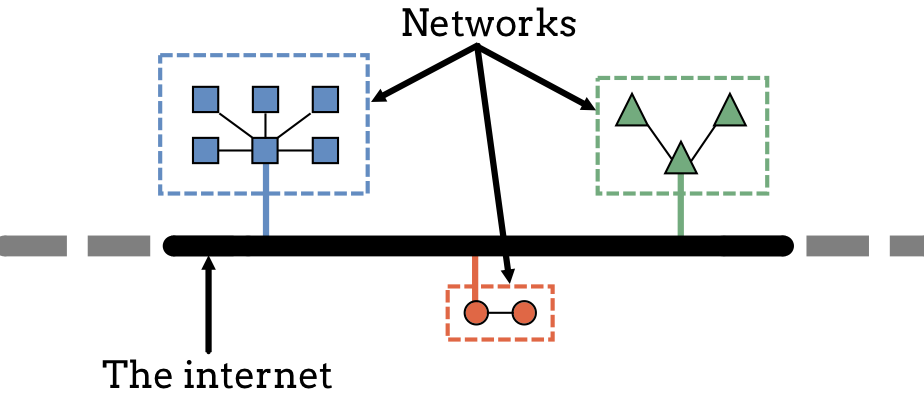
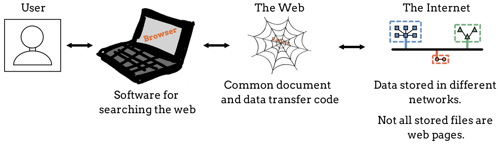

Background
==========

When programmers make websites, they want their pages to be beautiful,
interactive, and fun. Python allows us to control the logic for a website
behind the scenes, but it does not do much to define the structure and
appearance of a web page.

In the next two chapters, we will learn about HTML and CSS. These are the two
most common languages for organizing content and making it look beautiful.

Before jumping in to learn HTML and CSS, we need to first understand how web
pages appear on screens.

.. _internet-vs-web:

The Internet vs. The Web
------------------------

.. index:: ! internet, ! web, ! browser, ! network

We often hear the phrase "connected to the internet", but what does this
actually mean?

At the most basic level, the internet is just a wire.

Picture all of the computers, tablets, phones, etc. that get used at your
school. All these devices form a **network** when they connect to each other
via WiFi or cables. Devices on the same network can communicate with each other
and exchange data.

.. admonition:: Note

   Even just two devices linked together form a network.

Different schools, businesses, homes, libraries, coffee shops, etc. all create
their own separate networks. If we connect two of these, say a school and a
library, then devices from one network can communicate with devices on the
other. If we add another network to the school-library connection, then we
increase the resources available to all of the devices in all of the networks.

When a network includes a device that can communicate with the outside world,
then it can join forces with others. All of these different networks, connected
together, form the **internet**.

.. admonition:: Fun Fact

   *Inter* is a prefix that means "between two groups". *Net* stands for
   "network".
   
   Thus, the internet is the connection between networks.

   The internet is a network of networks.

The connections formed by the internet provide us with an amazing amount of
information and ideas. However, we cannot walk up to a group of wires and ask,
*What movies are opening this weekend?* We need something between us and the
wires.

What is the Web?
^^^^^^^^^^^^^^^^

The **World Wide Web** is one system we can use to interact with the internet.
There are other options, but the **web** is the most common. It uses a specific
programming language to move data between different networks. This *file
transfer protocol* helps people all over the world request and share
information.

The web forms a smaller part of the whole internet. It is a collection of
documents that are all formatted with a common structure and set of rules.
These documents also connect to each other through a series of links embedded
inside the files. However, the documents are not written in a way that is
easily understood by non-coders.

When we view a page in a browser, like Chrome, Firefox, or Safari, we use the
web to access a portion of the internet. **Browsers** are programs that
translate requests for data (like clicking a link about the
`periodic table <https://www.webelements.com/>`__) into the code machines use
to communicate over the wires. This sets up a transfer of data between
networks.

When a browser receives a response to a request, it translates the data from
the original, user-unfriendly form into something easy to look at on the
screen. Browsers convert document code into something we recognize, and they
also convert our actions into a language the machines understand.

   Browsers allow users to search the web. The web consists of documents that
   link to each other and use the same formatting code.

The internet is really just hardware and data - the machines and structures
that store and transmit information. The web and browsers provide the software
we use to access those machines and display the data in a useful way.

Web Pages
---------

.. index:: ! server

A **server** is a machine that provides data to other devices. This includes
data related to specific web pages. Somewhere, there is a machine that stores
the information for the page you are looking at right now: the text, images,
formatting, etc. However, this data is saved as *code*.

You are viewing this web page in a browser. Behind the scenes, the program
requested information from the server about this page, and it received some
code as a response. The browser then executed that code to build the page you
see on your screen.

.. admonition:: Try It!

   Right-click on this page and choose *View Page Source*. A tab should open
   in your browser showing the code used to create the clean page.

When you visit a web page in a browser, three main steps happen:

#. The browser sends a **request** to the server for the web page.
#. The server **responds** with the code that makes up the web page. 
#. The browser receives the code and executes it. This displays the page in the
   browser window in a clean way.

Looking at the *View Page Source* result, we see that the code for this web
page is NOT Python. What language is it?

Well, let's take a look at HTML...
