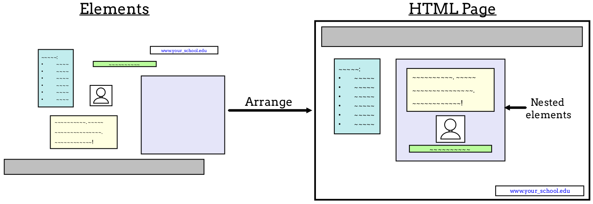

What is HTML?
=============

.. index:: ! hypertext, ! markup language, ! HTML

The web is a collection of documents, which are stored in servers. Many of
these documents are written in a language called **HTML**, which stands for
*Hypertext Markup Language*.

The term **hypertext** refers to text that includes links (also called
*hyperlinks*) to other text.

HTML documents are made up of:

#. *Text* - The words we see on a page.
#. *Links* to other pages.
#. **Markup** - Determines what the text looks like and how that text and other
   content is arranged on the page.
#. *References* to other documents - Videos, images, code editors, etc.

HTML code does not execute logic or perform calculations like Python. There are
no ``for`` loops, ``if/else`` statements, or functions. Instead, HTML is an
example of a **markup language**. Markup languages provide instructions for
what text should look like on the screen. They format the text of a document
(like the size of a section heading) and define the structure of the page (like
the number of sections or placement of images).

HTML uses two main components, *elements* and *tags*, to define the structure
of a web page.

HTML Elements
-------------

With HTML, a programmer can add a lot of different types of content to a page.
In this chapter, we focus on headings, paragraphs, images, and more.

When a programmer creates a web page, they break the content down by type:

#. What text needs to be on the page, and how will it be organized?
#. Are there any images/figures/videos?
#. How many links?
#. Will there be a form to fill out?
#. Will there be a menu or a navigation bar?
#. etc.

The next step for many developers is to sketch the layout for the page on paper
or in a drawing app. They highlight what each item is, where it belongs on the
page, and ideas about what it might look like.

.. index:: ! element

An **element** is one portion of an HTML page. By combining and arranging
different elements, a developer builds the structure for the page.

Elements are often broken down by content type---text, links, images, titles,
etc. Elements can also be *nested* inside other elements. This makes it easy,
for example, to align a figure caption with the image it describes.

   The seven elements on the left are arranged to create the layout for the HTML page.

HTML tags
---------

.. index:: ! tag

An HTML **tag** tells the computer the type and content of an HTML element.
Most elements include a *start tag* and an *end tag*, with content in between.

Every tag has the following structure:

#. Begin with the ``<`` symbol and end with the ``>`` symbol.
#. The tag name goes inside the ``<>``, and it indicates the element type.
#. Start tags and end tags share the same structure. However, end tags (also
   called *closing tags*) include the ``/`` symbol after the ``<`` bracket.
#. Start tags may include extra content that affects the element's appearance.

The general syntax for an HTML element is:

::

   <element type>content</element type> 

.. admonition:: Warning

   Tags surround the content within the element. If you forget the ending tag,
   some HTML elements will still display correctly, but not all. To avoid
   unexpected results or errors, always include both tags!

.. _first-html-page:

Try It!
-------

The editor below provides a practice HTML document (note the ``.html`` at the
end of the filename).

#. Notice that the plain text ``Hello, web!`` in the editor shows up as plain
   text on the "webpage" to the right. No quotes are needed around the words.
   Try adding some to see what happens.
#. On line 2, add the statement ``<h1>Hello!</h1>``. How does this affect the
   appearance of the text in the right panel?

   ``h1`` the name for a *heading* element, and the number indicates the size
   of the text.

#. Try changing the number after ``h``! Allowed values range from 1 - 6.
#. Try making the mistakes ``<h2>Hello!</h4>`` and ``<h4>Hello!</h2>``. How
   does each one affect the text? Hover over red *X* in the editor to read the
   error messages.

   .. raw:: HTML

      <iframe src="https://trinket.io/embed/html/18c0e4c318?runMode=autorun" width="100%" height="300" frameborder="1" marginwidth="0" marginheight="0" allowfullscreen></iframe>

#. Add the ``<strong></strong>`` tags around the ``Hello, web!`` text. What
   does ``strong`` do?
#. Replace each ``strong`` with ``em``. What happens?
#. Here is one example of nested elements:
   ``<h3>Nested element <em>here</em></h3>``. Paste the statement into the
   editor to see what it does.

Whitespace
----------

When a browser displays an HTML document, it treats all whitespace (spaces,
tabs, new lines, etc.) within a set of text in a very specific way. Let's take
a moment to explore this.

In the editor above, type these lines at the top of the file.

.. sourcecode:: html
   :linenos:

   Text with one space between words.
   Text     with     two      tabs.
   Text
   over
   multiple
   lines.

When the new page renders on the screen, the output may be surprising!

::

   Text with one space between words. Text with two tabs. Text over multiple lines.

The first sentence appears just as we typed it. However, the tabs and new lines
in the other two sentences were replaced with single spaces. Also, all three
sentences appear one after the other on the screen.

This is the standard result when HTML renders text on the screen. Any
whitespace between words appears as a single space. The same effect occurs with
text inside an element. ``<h2>Text     with     two      tabs.</h2>`` appears
as a heading, but with only one space between each of the words.

The advantage of this is that we can break long strings of text over multiple
lines in the editor without affecting how the words look on the web page. This
makes our code more readable.

Later in this chapter, we will learn how to make different sections of text
appear on separate lines of a web page.

Check Your Understanding
------------------------

.. admonition:: Question

   What does HTML stand for?

   .. raw:: html

      <ol type="a">
         <li><input type="radio" name="Q1" autocomplete="off" onclick="evaluateMC(name, false)"> Happy Tickles Make Laughter</li>
         <li><input type="radio" name="Q1" autocomplete="off" onclick="evaluateMC(name, true)"> Hypertext Markup Language</li>
         <li><input type="radio" name="Q1" autocomplete="off" onclick="evaluateMC(name, false)"> Hypertext Mockup Language</li>
         <li><input type="radio" name="Q1" autocomplete="off" onclick="evaluateMC(name, false)"> Hyperlink Markup Layout</li>
      </ol>
      

.. Answer = b

.. admonition:: Question

   In HTML, ending tags are optional.

   .. raw:: html

      <ol type="a">
         <li><input type="radio" name="Q2" autocomplete="off" onclick="evaluateMC(name, false)"> True</li>
         <li><input type="radio" name="Q2" autocomplete="off" onclick="evaluateMC(name, true)"> False</li>
      </ol>
      

.. Answer = b

.. admonition:: Question

   Which of the following is an example of an HTML element?

   .. raw:: html

      <ol type="a">
         <li><input type="radio" name="Q3" autocomplete="off" onclick="evaluateMC(name, false)"> h1</li>
         <li><input type="radio" name="Q3" autocomplete="off" onclick="evaluateMC(name, false)"> &lt;/em&gt;</li>
         <li><input type="radio" name="Q3" autocomplete="off" onclick="evaluateMC(name, false)"> Hello!</li>
         <li><input type="radio" name="Q3" autocomplete="off" onclick="evaluateMC(name, true)"> &lt;h2&gt;Hello!&lt;/h2&gt;</li>
      </ol>
      

.. Answer = d

