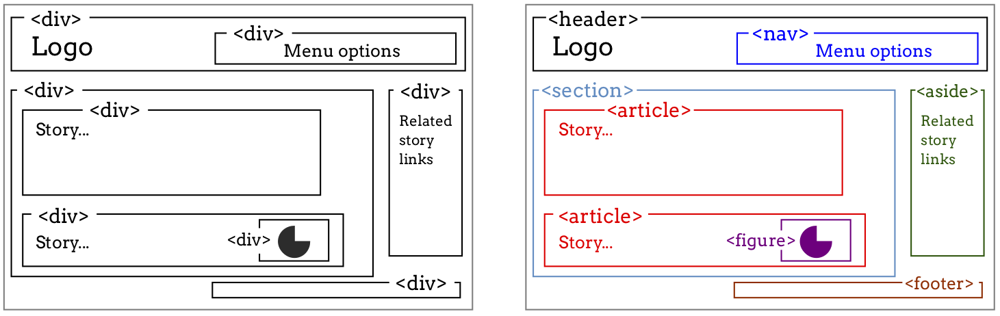

Semantic HTML
=============

In the *Try It* section on the :ref:`Tags page <tags-try-it>`, we used a
``

`` element to center two paragraphs on the screen. This is an
example of a very common technique. To organize content on the page, we often
split the page into separate sections. We can then fiddle with the size, color,
alignment, etc. for the elements in each section without affecting the
properties in other parts of the page.

Here's an example of an HTML file that organizes a page into six sections:

.. sourcecode:: html
   :lineno-start: 6

   <body>
      
Content...

      

         

            Content...
            

               
               
Content...

            

         

      

      
Content...

   </body>

For this short file, we can count the number of opening ``
`` tags to
identify the number of sections. However, figuring out what each section does
is more difficult. Is the ``
`` element on line 13 a figure caption for the
``img``? Before we can say for sure, we would need to examine the content
inside that element, or look at the final page in a browser.

For the sample code above, we would want to include plenty of comments in the
file to describe the purpose of each ``div`` element. After all, once we move
on to our next project, another programmer might need to update the code for
this page. We must make sure they understand what we created.

.. admonition:: Tip

   Making code work is important, but so is making it easier for others to
   understand. Not every piece of code a programmer reads is something they
   wrote!

Besides comments, HTML also includes a way to use the tags themselves to
describe the layout of a page. The code below builds exactly the same page as
the first example. However, note how it helps answer the question, *What does
this section do?*

.. sourcecode:: html
   :lineno-start: 6

   <body>
      <header>Content...</header>
      <section>
         <article>
            Content...
            <figure>
               
               <figcaption>Content...</figcaption>
            </figure>
         </article>
      </section>
      <footer>Content...</footer>
   </body>

Aha! Finding the figure caption is a snap now, and we can see that we have a
header and footer at the top and bottom of the page. It looks like the purpose
of the ``section`` element is to organize related ``article`` and ``figure``
elements, and the ``article`` tag name gives us a clue about the type of
content that begins on line 10.

HTML Writing Style
------------------

.. index:: ! semantic html

Just like any other author, programmers write HTML with different style guides
and ways of thinking. Two different coders can look at the same set of content
and choose different ways to arrange it on the screen. However, both of them
use the same set of HTML tags to do their work.

**Semantic HTML** is not about the appearance of the webpage. Instead, it's
about the specific meaning of the elements. Semantic HTML uses more descriptive
tag names to help identify what each section of the code does. This helps
programmers clarify the structure of a webpage.

For example, developers can make paragraph text larger than heading text if
they want to. By looking at the HTML, however, we can still identify what is
the paragraph and what is the heading. The ``
`` and ``<h>`` tags give us
that information. This is the strength of semantic HTML. The tag names express
meaning.

Another benefit to semantic HTML is that programmers find it easier to
visualize the results when they can put a specific name to a section of their
code.

Screen Readers and Accessibility
^^^^^^^^^^^^^^^^^^^^^^^^^^^^^^^^

A well designed webpage organizes content in a clean and attractive way. For
these pages, sighted users can easily find the navigation bar or identify the
main content of the page. However, individuals with visual impairments may use
screen readers to navigate the page.

Screen readers are tools that verbally describe the content on a page. They
also describe the HTML tags surrounding the content. With semantic HTML, we can
make our webpages accessible to all people, including those who use screen
readers.

For example, the ``div`` and ``span`` elements organize content on the page,
but they do not provide any information about the content itself. If we use
separate ``div`` elements to build a navigation bar and organize a set of blog
posts, a screen reader can give no clarification to the user. As the person
listens, they might not recognize which words deal with navigation. However, if
we replace a ``
`` tag with ``<nav>``, the device can alert the user that
the elements inside provide links to key locations.

A screen reader just reads what's in each element. With semantic HTML, the
device can inform the user that they have reached a navigation bar, a header, a
login form, a news article, etc. This helps the user understand the layout of
the page.

Without semantic HTML, programmers must add extra attributes (like
``class="nav-bar"``) to assist those who rely on screen readers.

Search Engines
^^^^^^^^^^^^^^

Search engines also benefit from semantic HTML. If we can communicate which
part of our page holds the most important content, we give the software a
better chance to find our website and show users an accurate description.

For example, assume we create a website with the title "My Great Site", and we
follow that title with with a collection of ``div`` elements. When a user
types *My Great Site* into a search engine, the software will find our site and
display a description of the content. Since ``div`` tags provide no information
about the content they contain, the description of our site may be incomplete.

Carefully using semantic HTML tags helps search engines find and steer users
toward our home page. If we include a ``main`` element with some ``article``
elements inside, the engines find our most important content faster and provide
a more accurate description.

With search, speed and accuracy are critical! Semantic tags let us tell search
engines what our website is about. This can help keep our website from
getting pushed off of the first page of results.

.. admonition:: Fun Fact

   Search Engine Optimization (SEO) is big deal for anyone who wants to build a
   successful and relevant website. Just like coding, students can train to
   become SEO experts.

   If you are curious about how people and companies boost their placement in
   web searches, here are a couple of articles to get you started:

   #. `What is SEO <https://www.webfx.com/internet-marketing/how-SEO-works.html>`__
   #. `SEO Made Simple <https://neilpatel.com/what-is-seo/>`__

.. _semantic-tag-list:

A ``
`` by Another Name
---------------------------

Open a new tab in your browser and visit one of your favorite websites. Before
you get too distracted, right-click on the page and choose *View Page Source*.
Examine the HTML code used to build the page. Most likely, you will find a
huge number of ``
`` tags. These tell the browser how to display the page,
but they provide few details about the different sections.

There is absolutely nothing wrong with using ``
`` tags in our HTML, but
semantic tags offer us a better option for our code.

The latest versions of HTML provide several tag names that can be used in place
of ``div``. They work the same way, but provide more information to readers of
the code. These include:

.. list-table:: Semantic HTML Tags
   :widths: auto
   :header-rows: 1

   * - Tag Name
     - Code
     - Definition
   * - Article
     - ``<article>``
     - Contains content that can stand on its own, outside of the page (like
       a news story).
   * - Aside
     - ``<aside>``
     - Contains content that supports the main information on the page.

       .. admonition:: Note

          This is an example of an aside! It contains useful, but not critical
          information.

   * - Figure
     - ``<figure>``
     - Contains independent visual content like diagrams, photos, code, etc.
   * - Figure Caption
     - ``<figcaption>``
     - Contains the description for a ``figure`` element.
   * - Footer
     - ``<footer>``
     - Appears at the bottom of a page. Usually includes contact or copyright
       information as well as some site navigation.
   * - Header
     - ``<header>``
     - Contains content like headings, a logo, or introductory information.
   * - Main
     - ``<main>``
     - Identifies the main content of the page. It should not include navigation
       tools or any information that is repeated on other pages of the website.
       There should only be one ``main`` element for a page.
   * - Nav
     - ``<nav>``
     - Contains a set of navigation links, like menu options or buttons.
   * - Section
     - ``<section>``
     - Groups together elements that follow a similar theme.

Many of the tag names we :ref:`considered before <html-tags>`, like ``p``,
``h1``, and ``ol`` are also semantic.

Inline elements like ``strong`` and ``em`` instruct screen readers to place
verbal emphasis on chosen words. Even though the HTML statements

.. sourcecode:: html

   <b>Bold text</b>
   <strong>Strong text</strong>

both cause text to appear in bold, the ``<strong>`` tag tells a screen reader
to place stress on the words.

The figure below shows how helpful semantic HTML tags are in describing the
content of a webpage. The tag names tell us something about what each element
represents on the page.

   Semantic HTML tags provide more detail than ``div`` tags about the content of a page.

If we needed to update the page by adding more story links, the code for the
right hand HTML file would be easier to manage. We would simply find the
``aside`` tag and add new ``<a>`` elements inside of it. Adding to the code for
the left hand page would take more time, since we would need to look at each of
the ``div`` tags to find the one we want.

Try It!
-------

The HTML in the editor below is mostly complete. You just need to rearrange the
elements to organize the page.

Lines 38-49 contain the elements you need to move, but they are NOT in the
correct order. Cut and paste each element from the bottom of the editor into
the spaces above. Use the hints given by the tag names to decide where to put
everything!

*Consider*:

#. Which two elements make the most sense to put inside the ``header`` element?
#. There is only one image. Where should it go, and what text describes it?
#. Which paragraph best matches the image?
#. Which paragraph does the unordered list support?
#. What information should go inside the ``footer`` element?

.. raw:: html

   <iframe src="https://trinket.io/embed/html/6f29694e0e" width="100%" height="600" frameborder="1" marginwidth="0" marginheight="0" allowfullscreen></iframe>

Check Your Understanding
------------------------

.. admonition:: Question

   Semantic HTML helps with all of the following EXCEPT:

   .. raw:: html

      <ol type="a">
         <li><input type="radio" name="Q1" autocomplete="off" onclick="evaluateMC(name, false)"> Improving the accuracy of search engine results.</li>
         <li><input type="radio" name="Q1" autocomplete="off" onclick="evaluateMC(name, false)"> Improving the ability of screen readers to clearly present a webpage.</li>
         <li><input type="radio" name="Q1" autocomplete="off" onclick="evaluateMC(name, false)"> Improving the ability of programmers to read and understand HTML code.</li>
         <li><input type="radio" name="Q1" autocomplete="off" onclick="evaluateMC(name, true)"> Improving the speed of loading a webpage.</li>
      </ol>
      

.. Answer = d

.. admonition:: Question

   Check if the following semantic HTML tags are block-level or inline. Click
   each option to see the answer.

   .. raw:: html

      <ol type="a">
         <li onclick="revealAnswer('resultA', 'block-level')">article </li>
         <li onclick="revealAnswer('resultB', 'block-level')">aside </li>
         <li onclick="revealAnswer('resultC', 'inline')">strong </li>
         <li onclick="revealAnswer('resultD', 'block-level')">figure </li>
         <li onclick="revealAnswer('resultE', 'block-level')">section </li>
         <li onclick="revealAnswer('resultF', 'block-level')">figcaption </li>
         <li onclick="revealAnswer('resultG', 'block-level')">nav </li>
         <li onclick="revealAnswer('resultH', 'inline')">a </li>
      </ol>

.. Answers = block, block, inline, block, block, block, block, inline

.. raw:: html

   
