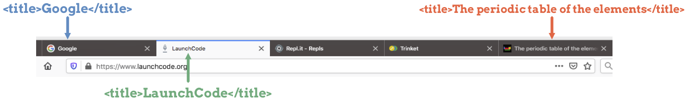

HTML Structure
==============

.. index:: ! head, ! title, ! html tag, ! doctype, ! body

To make sure their web pages work as planned, programmers should follow certain
rules about how to organize an HTML file. These rules, and the tags used within
the HTML structure, are vital to make sure all browsers render the page
correctly.

Structure Rules
---------------

For the overall structure of an HTML file, a programmer should follow 5 rules:

#. Every HTML file needs a ``DOCTYPE`` tag, which identifies the version of
   HTML to use. The syntax ``<!DOCTYPE html>`` selects the current version of
   HTML by default.

   .. admonition:: Note

      ``DOCTYPE`` is one of few tags that does not require a closing tag.

#. The ``<html>`` element marks the beginning and end of the HTML code written
   by the programmer.
#. The ``<head>`` element contains data about the web page. Most of this data
   will NOT be seen by visitors to the web page.
#. The ``<body>`` element contains everything that appears in the browser when
   the page is viewed.
#. The ``<title>`` element goes in the ``<head>`` of the document, and browsers
   require it. We see the ``title`` of a web page in its browser tab.

   The text in the ``title`` element appears in the browser tab.

Here is the structure for an HTML page that follows these rules:

.. sourcecode:: html
   :linenos:

   <!DOCTYPE html>
   <html>
      <head>
         <title>My Web Page</title>
         <!-- Page data elements... -->
      </head>
      <body>
         Page content...
      </body>
   </html>

Note the following:

#. An element can take up multiple lines in the editor. For example, the
   ``head`` and ``body`` elements are both nested inside the ``html`` element,
   which runs from lines 2 - 10.
#. While not necessary, using indentation to organize the start and end tags
   for different elements is a great idea.

   The following code works as an HTML document, but it is poorly organized and
   very hard to follow.

   .. sourcecode:: html
      :linenos:

      <!DOCTYPE html><html><head><title>My Web Page</title><!-- Page data elements... --></head><body>Page content...</body></html>

#. Adding whitespace in your HTML file helps other programmers read and
   understand your work!

Document Head
-------------

So other than the title, what goes in the ``head`` element?

The ``head`` includes links to support files and other data about the document.
For example, we can include some styling instructions in ``head`` to change
things like background color, font, or text size.

.. admonition:: Note

   *Style code* helps to make a web page beautiful. How to do add styles to
   ``head`` is covered in the next chapter on CSS.

Remember, browsers do not display the content in the ``head`` element.

Document Body
-------------

After finishing the ``head`` of the document, it is time to move on to the
``<body></body>`` element.

The body of the document contains the content that appears on the web page.
Within the ``body`` element, programmers use different HTML tags to add images,
text, videos, GIFs, and even samples of other code.

Content outside of the ``body`` element will not appear on the page.

Other Details
-------------

Adding ``<!-- Comments -->``
^^^^^^^^^^^^^^^^^^^^^^^^^^^^

To make our HTML more readable to other people, we can include comments in the
code. To add a comment, begin with ``<!--``, then type the message. End the
comment with ``-->``. The general syntax for an HTML comment is:

.. sourcecode:: html

   <!-- This is an important comment -->

We can place comments anywhere inside the HTML file.

.. sourcecode:: html
   :linenos:

   <!DOCTYPE html>
   <!-- This is an important comment -->
   <html>
      <head>
         <title>My Web Page</title>
         <!-- This is an important comment -->
      </head>
      <body>
         <!-- This is another important comment -->
      </body>
   </html>
   <!-- This is the final comment -->

Comments help us describe our code to others, and they do NOT appear on the web
page.

Tags Are Case-Insensitive
^^^^^^^^^^^^^^^^^^^^^^^^^

Using capital letters vs. lowercase letters in a tag name does not matter. For
example, the following statements all work, and they all produce the same
result on screen:

.. sourcecode:: html
   :linenos:

   <H1>Hello!</H1>
   <h1>Hello!</h1>
   <H1>Hello!</h1>

Even though case does not matter, developers usually stick with lowercase
letters for the tag names. We encourage you to follow this convention.

Check Your Understanding
------------------------

.. admonition:: Question

   Which HTML tag does NOT require a closing tag?

   .. raw:: html

      <ol type="a">
         <li><input type="radio" name="Q1" autocomplete="off" onclick="evaluateMC(name, false)"> title</li>
         <li><input type="radio" name="Q1" autocomplete="off" onclick="evaluateMC(name, false)"> body</li>
         <li><input type="radio" name="Q1" autocomplete="off" onclick="evaluateMC(name, false)"> head</li>
         <li><input type="radio" name="Q1" autocomplete="off" onclick="evaluateMC(name, true)"> DOCTYPE</li>
         <li><input type="radio" name="Q1" autocomplete="off" onclick="evaluateMC(name, false)"> html</li>
      </ol>
      

.. Answer = d

