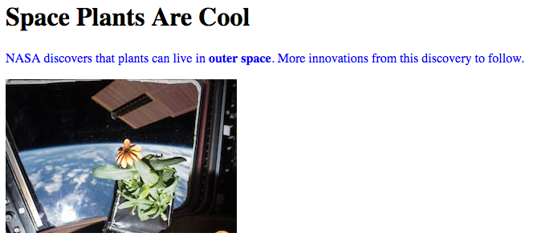

.. _html-tags:

HTML Tags
=========

Time to dive into all the different tags for organizing content! This page
contains a helpful table of tags for beginning programmers. *Tip*: Bookmark
this page!

This is NOT a complete list of all HTML tags, but it is a good place to start.
If you are interested in exploring other tags on your own,
`W3Schools <https://www.w3schools.com/tags/>`__ provides a longer, interactive
list.

Tags to Know
------------

.. list-table::
   :widths: auto
   :header-rows: 1

   * - Tag Name
     - Code
     - Definition
   * - Bold
     - ``<b>``
     - Makes text inside the tags **bold**.
   * - Break
     - ``<br>``
     - A single line break.
   * - Button
     - ``<button>``
     - Creates a clickable button.
   * - Division
     - ``<div>``
     - Defines an area of the page. Often used as a container to arrange other elements.
   * - Emphasis
     - ``<em>``
     - Makes text inside the tags *italic*.
   * - Form
     - ``<form>``
     - Creates a form for user input.
   * - Heading, Level One
     - ``<h1>``
     - Creates a heading in the text (see note below).
   * - Hyperlink
     - ``<a>``
     - Creates clickable links to other web pages.
   * - Image
     - ````
     - Adds an image and controls its appearance.
   * - Ordered List
     - ``<ol>``
     - Creates an ordered list. List items are given numbers, letters, etc. from top to bottom.
       (See the examples below this table).
   * - Unordered List
     - ``<ul>``
     - Creates an unordered list with bullet points for each item. (See the examples below this table).
   * - List element
     - ``<li>``
     - Indicates an element of a list. This tag is used for both ordered and unordered lists.
   * - Paragraph
     - ``<p>``
     - Creates a paragraph of text.
   * - Span
     - ``<span>``
     - Makes a section within a set of text.
   * - Table
     - ``<table>``
     - Creates a table of rows and columns on the page.
   * - Thematic Break
     - ``<hr>``
     - Adds a horizontal line between elements.

.. admonition:: Examples

   The ``ol`` and ``ul`` elements create a vertical list of items. We can also
   modify the appearance of the bullets.

   .. list-table:: List Examples
      :widths: auto
      :header-rows: 1

      * - Ordered
        - Ordered
        - Ordered
        - Unordered
        - Unordered
      * - .. raw:: html

              <ol>
                 <li>First list item</li>
                 <li>Second item</li> 
                 <li>Third item</li> 
              </ol>
        - .. raw:: html

              <ol type="A">
                 <li>First list item</li>
                 <li>Second item</li> 
                 <li>Third item</li> 
              </ol>
        - .. raw:: html

              <ol type="I">
                 <li>First list item</li>
                 <li>Second list item</li> 
                 <li>Third list item</li> 
              </ol>
        - .. raw:: html

              <ul>
                 <li>First list item</li>
                 <li>Second item</li> 
                 <li>Third item</li> 
              </ul>
        - .. raw:: html

              <ul style="list-style-type:circle">
                 <li>First list item</li>
                 <li>Second item</li> 
                 <li>Third item</li> 
              </ul>

.. admonition:: Note

   There are multiple headings in HTML going from ``h1`` to ``h6``. The
   headings get progressively smaller.
   
   A good rule of thumb is to have only one ``h1`` in a web page. Also, do not
   skip a level, since headings can always be resized.

Tag Example
-----------

Here is an example of a basic web page using three of the tags above.

.. sourcecode:: html
   :linenos:

   <!DOCTYPE html>
   <html>
      <head>
         <title>Plant-Loving Astronauts</title>
      </head>
      <body>
         <h1>Space Plants Are Cool</h1>
         <p>
            NASA discovers that plants can live in <b>outer space</b>.
            More innovations from this discovery to follow.
         </p>
         <!-- add images from NASA of these space plants -->
      </body>
    </html>

.. figure:: figures/plant-loving-astronauts.png
   :alt: A web page with the heading, Space Plants Are Cool, and the paragraph about NASA's discovery of space plants.
   :width: 80%

Inside the ``body`` element, the ``<h1>`` and ``<p>`` tags define a heading
and a paragraph element. Note that the ``p`` element also contains a set of
``<b>`` tags, which make the words "outer space" bold.

Attributes
----------

.. index:: ! attribute

In addition to the tag name, programmers can include extra information inside
an HTML start tag. Programmers add **attributes** to HTML tags to control and
adjust the element's appearance on the page.

Examples of attributes include:

#. The alignment of the element on the page (left, right, center, etc.).
#. The text style (color, size, font, etc.).
#. Alternate text for an image.
#. The web address that a link points to.

Place attributes inside the start tag, right after the tag name. The general
syntax is:

.. sourcecode:: html

   <tag_name attribute="value">content</tag_name>

We can add multiple attributes inside a tag, but they should be separated by
spaces.

.. _attributes-example:

Attributes Example
------------------

Here is the same basic web page we saw above, but with a new ```` tag.
Also, the ``<p>`` and ```` tags both include some attributes.

.. sourcecode:: html
   :linenos:

   <!DOCTYPE html>
   <html>
      <head>
         <title>Plant-Loving Astronauts</title>
      </head>
      <body>
         <h1>Space Plants Are Cool</h1>
         <p style="color:blue">
            NASA discovers that plants can live in <b>outer space</b>.
            More innovations from this discovery to follow.
         </p>
         
         <!-- This image was taken by NASA and is in the Public Domain -->
      </body>
    </html>



The ``<p>`` tag includes the ``style`` attribute, and the value in quotes sets
the color of the text to blue. ``style`` controls other properties as well,
including alignment, font, background color, text size, etc. We will study
styling in more detail next chapter.

The ```` tag has two attributes that we will see a lot. ``src`` (for
*source*) gives the location of the image being used, and ``alt`` gives
alternate text for anyone using a screen reader. For this reason, ``alt``
should provide a short description of what is going on in the image.

.. _block-vs-inline-elements:

Block vs. Inline Elements
-------------------------

.. index:: ! block-level, ! inline

Take another look at the screenshots for the basic web pages. Notice that the
sentence, ``NASA discovers that plants can live...``, is split over two lines
in the editor, but it appears on the same line on the web page. However, the
heading and paragraph elements appear on separate lines.

The reason behind this involves the default behavior of different HTML
elements. There are two display behaviors:

#. **Block-level elements** always begin on a new line, and they take up the
   full width available. Any content in these elements stretches out as far as
   possible before wrapping to the next line.
#. **Inline elements** do not start on a new line. They only take up as much
   width as necessary.

The ``h1`` and ``p`` elements are both block-level, so their content occupies a
dedicated space on the screen. This is why the heading and paragraph do not
appear side-by-side.

The ``b`` element is inline. Its content occupies only as much space as
necessary. This allows it to be nested inside the ``p`` element without
breaking the paragraph into separate lines.

.. admonition:: Example

   By playing with the background colors, we can see the difference in behavior
   for block-level vs. inline elements.

   .. sourcecode:: html
      :lineno-start: 6

      <body>
         <h2 style="background:orange">Here Is A Heading Element</h2>
         <p style="background:lightblue">This is a paragraph element.</p>
         <span style="background:lightgreen">These are</span>
         <span>three separate</span>
         <span style="background:violet">span elements.</span>
      </body>

   .. figure:: figures/block-vs-inline.png
      :alt: Background colors showing the widths of block-level vs. inline elements. 

   The ``h2`` and ``p`` elements stretch across the entire width of the screen,
   and they occupy their own, separate lines. Think of the orange and blue
   shaded areas as reserved space. If we add more text to the ``p`` element, it
   would fill in more of the empty blue area. However, only content for that
   element is allowed inside the space.
   
   Each ``span`` element only takes up as much space as the text requires, and
   all three elements can share the same line. ``span`` is an example of an
   inline element.

.. admonition:: Tip

   Nest inline elements inside block-level elements, not the other way around!

.. _tags-try-it:

Try It!
-------

In the editor below, practice using different HTML tags and attributes to
change the appearance of a web page.

**First steps**:

#. The ``<br>`` and ``<hr>`` elements do NOT need ending tags. Add a ``<br>``
   tag to the end of line 9. What happens to the text in the right panel?
#. Add ``<br>`` tags to the end of lines 10 & 11. What if you use two of the
   tags (``<br><br>``) instead of just one?
#. On line 14, add an ``<hr>`` tag. How does the web page change?
#. Add ``<em>``, ``<b>``, or ``<span>`` tags around some of the text in the
   first paragraph. Change the color of the wrapped text by including the
   ``style`` attribute.
#. Create an unordered list that contains at least three items. The syntax
   should look something like:
   
   .. sourcecode:: html
   
      <ul>
         <li>Item description...</li>
         <li>Item description...</li>
         <li>Item description...</li>
      </ul>

.. raw:: html

   <iframe src="https://trinket.io/embed/html/4f06a808a8" width="100%" height="600" frameborder="1" marginwidth="0" marginheight="0" allowfullscreen></iframe>

**Next steps**:

#. Change both ``<ul>`` tags to ``<ol>`` to make an ordered list.

   a. The ``type`` attribute sets the item labels. Add ``type="A"`` inside the
      ``<ol>`` tag. Try replacing ``"A"`` with ``"a"`` and ``"I"``.
   b. The ``start`` attribute identifies where the list should begin counting.
      Add ``start="5"`` inside the ``<ol>`` tag. Try other numbers as well.
      (Note that ``type`` and ``start`` can BOTH be in the tag at the same
      time).
   c. The ``reversed`` attribute flips the numbering to count down instead of
      up. It does not need an equals sign. Add ``reversed`` to the ``<ol>`` tag
      to see what happens.

#. Now let's add a link! The syntax for the hyperlink element is:

   .. sourcecode:: html

      <a href="Website URL">Link Text</a>

   The ``href`` attribute requires the *full* address of a website, beginning
   with ``https:``. ``Link Text`` will be the words that appear as the link on
   the page.

   Add ``<a href="https://www.launchcode.org/">LaunchCode</a>`` to the editor
   to see this in action. Feel free to use a different web address and link
   text.

   Because we are using an embedded code editor, clicking the link may not work
   quite right. Instead, right-click on the link text and choose *Open Link in
   New Tab* to see the results of your work.
#. On line 7, add an opening ``<div>`` tag. Put the closing ``</div>`` tag on
   line 20 (right after the second paragraph element). Nothing changes in the
   view, but you just made a separate *division* (section) inside the page. 

   Now add ``style="text-align:center"`` inside the ``<div>`` tag.
   Properly done, the text in the two paragraphs appears centered on the
   screen. Since the list and link elements are outside of the ``div`` element,
   their text does NOT get centered.

Check Your Understanding
------------------------

.. admonition:: Question

   Which tag is used to make text *italicized*?

   .. raw:: html

      <ol type="a">
         <li><input type="radio" name="Q1" autocomplete="off" onclick="evaluateMC(name, false)"> <span style="color:#419f6a; font-weight: bold">b</span></li>
         <li><input type="radio" name="Q1" autocomplete="off" onclick="evaluateMC(name, false)"> <span style="color:#419f6a; font-weight: bold">i</span></li>
         <li><input type="radio" name="Q1" autocomplete="off" onclick="evaluateMC(name, true)"> <span style="color:#419f6a; font-weight: bold">em</span></li>
         <li><input type="radio" name="Q1" autocomplete="off" onclick="evaluateMC(name, false)"> <span style="color:#419f6a; font-weight: bold">br</span></li>
      </ol>
      <p id="Q1"></p>

.. Answer = c

.. admonition:: Question

   Identify each of the following as a block-level or inline element. Click
   each option to check your thinking. *Hint*: Use the editor to test each
   element first!

   .. raw:: html

      <ol type="a">
         <li onclick="revealAnswer('resultA', 'block-level')"><span style="color:#419f6a; font-weight: bold">div</span> <span id="resultA"></span></li>
         <li onclick="revealAnswer('resultB', 'inline')"><span style="color:#419f6a; font-weight: bold">span</span> <span id="resultB"></span></li>
         <li onclick="revealAnswer('resultC', 'inline')"><span style="color:#419f6a; font-weight: bold">em</span> <span id="resultC"></span></li>
         <li onclick="revealAnswer('resultD', 'block-level')"><span style="color:#419f6a; font-weight: bold">ol</span> <span id="resultD"></span></li>
         <li onclick="revealAnswer('resultE', 'block-level')"><span style="color:#419f6a; font-weight: bold">ul</span> <span id="resultE"></span></li>
         <li onclick="revealAnswer('resultF', 'block-level')"><span style="color:#419f6a; font-weight: bold">li</span> <span id="resultF"></span></li>
         <li onclick="revealAnswer('resultG', 'inline')"><span style="color:#419f6a; font-weight: bold">img</span> <span id="resultG"></span></li>
         <li onclick="revealAnswer('resultH', 'block-level')"><span style="color:#419f6a; font-weight: bold">h1</span> <span id="resultH"></span></li>
      </ol>

.. Answers = block, inline, inline, block, block, block, inline, block

