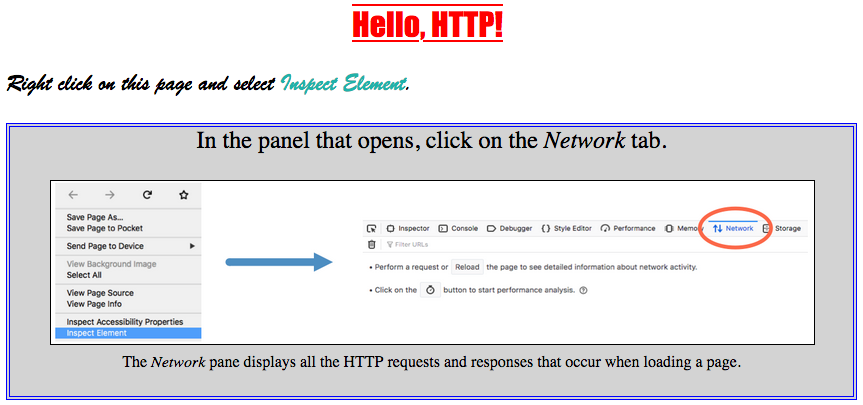

Exercises: HTTP In The Browser
==============================

While we looked at the HTTP concepts we need to know, we haven't actually
*seen* what they look like in real time. Requests and responses take place
behind the scenes. To to view them, we need to open up a new browser tool.

Viewing Requests and Responses
------------------------------

Let's start with a simple webpage similar to one of the CSS examples. The code
for the page is in the editor below.

   A simple webpage for HTTP viewing.

For these examples, you will need to open a couple of new tabs. Click the
*Open in replit* button to enter the Replit workspace. Next, *Fork* a copy of
the code to your own account. Finally, in the upper right corder of the output
panel, click the *Open in a new tab* icon.

.. raw:: HTML

   <iframe height="400px" width="100%" src="https://repl.it/@launchcode/HTTP-sample-page?lite=true" scrolling="no" frameborder="yes" allowtransparency="true" allowfullscreen="true" sandbox="allow-forms allow-pointer-lock allow-popups allow-same-origin allow-scripts allow-modals"></iframe>

In the new tab (titled ``HTTP in the browser``), you should see the sample
webpage. Now let's take a look at the requests and responses that occur when
the browser displays the page.

Try It!
^^^^^^^

.. admonition:: Note

   The images below were taken from Firefox. Other browsers will show similar
   results, but slight differences should be expected.

Make sure you are in the ``HTTP in the browser`` tab, then do the following:

#. Open your browser's developer tools and select the *Network* tab.

   a. *Method 1*: Firefox has a *Tools* menu. Select *Web Developer* and
      *Network* from the options.

      .. figure:: figures/open-dev-tools.png
         :alt: Use the menu to open Firefox's developer tools (Network option).
         :height: 300 px
      
   b. *Method 2*: Right click inside the page and select *Inspect Element*. In
      the panel that opens, click the *Network* tab.

      .. figure:: figures/open-dev-alt.png
         :alt: Right click on a page to open the developer tools (Inspect option).

#. The *Network* pane displays all the HTTP requests and responses that occur
   when loading a page. However, it only works if it is open during the
   request. To see some data appear in this panel, refresh the page.
#. Now you'll see something like this:

   .. figure:: figures/network-tab.png
      :alt: Firefox's developer tools, with several requests in the Network pane.

      The Network panel, showing four requests/responses.

#. Each entry gives information about a single HTTP request. The entries appear
   in the order in which the requests are made as the page loads.
#. Note the response codes that appear on the left side of each entry. Hover
   over one of these to see some status information about the request.
#. Click on one of the ``200`` entries. This opens up more details about the
   request and the response.

   .. figure:: figures/network-tab-details.png
      :alt: The details of an HTTP request, viewed in the Network pane.

   On the right, we can find the response headers and (scrolling down) the
   request headers. We can even view the response body by clicking on the
   *Response* label.

#. In the HTML code, change the ``<link>`` element in line 7 to:

   .. sourcecode:: HTML

      <link href="rutabaga.css" rel="stylesheet" type="text/css" />

#. Reload the page. What happens to the styling? Check the *Network* panel
   again. Notice that a new ``404`` error appears in the list. The browser
   requested the ``rutabaga.css`` file from the server, but no matching title
   is stored there. With no external CSS found, the HTML page keeps the default
   style properties.
#. Fix the name mismatch for the style sheet, then create a new mismatch with
   the image name. What happens to the appearance of the webpage and the
   results shown in the *Network* panel?

Browser Flow
------------

Looking in the *Network* pane, we see that loading this simple web page
involves more than one HTTP request. Each resource within the page (like the
image and CSS file) requires a separate request.

Let's examine the flow of loading this page, which used a ``GET`` request.

#. The browser requests the page from the server.
#. The browser receives a response containing the HTML page.
#. The browser issues a *new* HTTP request for the external CSS file.
#. Similarly, a separate HTTP request is made for the ``hello-http.png`` image.
#. As each new response is received, the browser processes the data or media
   and updates the page. In this case, it executes the HTML code before
   requesting and applying the CSS. Finally, it requests and then displays the
   image.

This flow explains why we sometimes load a webpage and see the content update
over a few seconds (or longer). In these cases, the HTTP requests for larger
data files (like high-resolution images) take more time to complete. This
produces a noticeable lag in the time it takes the browser to display the
complete page.

Imagine we slowed the loading process way down for the sample webpage. We would
first see the text from the plain HTML elements. Next, we would see
when the CSS rules finish loading, because we would notice the text and
background styles change. Finally, we would see the image fill into the middle
of the ``figure`` element.

Try Other Webpages
------------------

The sample webpage only needed four HTTP requests. Now open a new tab in your
browser and navigate to a page that includes more content. This can include
images, videos, buttons, links, areas that respond to your actions, etc.

Open the *Network* tab and see just how many requests/responses are necessary
to make your chosen webpage work.

.. admonitioN:: Tip

   Stuck choosing a good website? Try one of these options:

   #. `LaunchCode home page <https://www.launchcode.org/>`__
   #. `NASA's Artemis page <https://www.nasa.gov/specials/artemis/>`__, or its `home page <https://www.nasa.gov/>`__
   #. `LCHS Function Output page <https://education.launchcode.org/lchs/chapters/functions/function-output.html>`__

#. How many requests were required to load the page?
#. Try finding a ``POST`` request, then check what's in the request body and
   the response body.
#. Try finding a ``401`` or ``403`` error. What does the code mean?
#. Do you see any request types *besides* ``GET`` or ``POST``? (These are
   possible, but you might not see them for all pages).

Check Your Understanding
------------------------

Return to the ``HTTP in the browser`` tab. Open the *Network* panel and find
the request for the image. Use the information there to answer the following
questions.

.. admonition:: Question

   What is the approximate size of the image?

   .. raw:: html

      <ol type="a">
         <li><input type="radio" name="Q1" autocomplete="off" onclick="evaluateMC(name, true)"> 98 kB</li>
         <li><input type="radio" name="Q1" autocomplete="off" onclick="evaluateMC(name, false)"> 200 kB</li>
         <li><input type="radio" name="Q1" autocomplete="off" onclick="evaluateMC(name, false)"> 404 kB</li>
         <li><input type="radio" name="Q1" autocomplete="off" onclick="evaluateMC(name, false)"> Unknown</li>
      </ol>
      

.. Answer = a

.. admonition:: Question

   Check the *Request* and *Response* tabs. What are the dimensions for the
   image?

   .. raw:: html

      <ol type="a">
         <li><input type="radio" name="Q2" autocomplete="off" onclick="evaluateMC(name, false)"> 200 x 200</li>
         <li><input type="radio" name="Q2" autocomplete="off" onclick="evaluateMC(name, false)"> 800 x 600</li>
         <li><input type="radio" name="Q2" autocomplete="off" onclick="evaluateMC(name, true)"> 1248 x 266</li>
         <li><input type="radio" name="Q2" autocomplete="off" onclick="evaluateMC(name, false)"> 1440 x 900</li>
      </ol>
      

.. Answer = c
