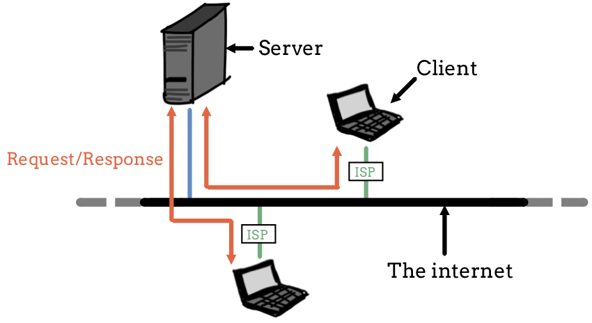
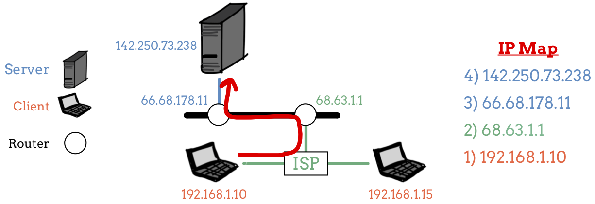
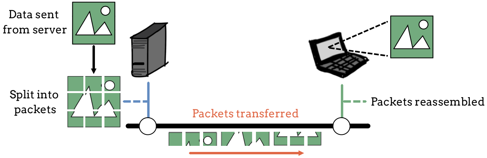

What's Connected to the Wire?
=============================

Back in the :ref:`HTML chapter <internet-vs-web>`, we used a wire to represent
the internet. Of course, it is a bit more involved, but the picture was a good
place to start. Now we're ready to take a deeper look at how the internet
works.

Most people use the internet without fully understanding what's going on behind
the scenes. It's fairly easy to open a browser, navigate to a site, and
interact with it. Knowing exactly *how* the internet works isn't really
necessary for most folks.

However, for web developers like us, understanding how information flows across
the internet is essential.

Servers and Clients
-------------------

.. index:: ! client-server model, ! client, server

The Internet uses the **client-server model**. A **server** is a machine that
provides resources to other devices. These resources include raw data, web
pages, images, etc. A **client** is an application or device that *requests*
resources from a server.

.. admonition:: Example

   Let's take a look at one type of client-server exchange. Imagine we are
   surfing the web on our computer or smartphone.

   #. The *client* is the web browser on our device.
   #. When we click on a link or type in an address and hit *Enter*, the client
      sends a request to a server.
   #. This *server* (which sits in a building somewhere out in the world)
      receives our request and sends back a response.
   #. The response contains some amount of data, which is written in HTML code.
   #. The client receives the response, executes the code, and displays the
      data in a way we can understand.

.. index:: ! internet service provider

Note that clients, like our smartphones and laptops, are not connected directly
to the internet. Instead, they interact with an **internet service provider**
(ISP), which provides a link between clients and the internet. Examples of ISPs
include Charter, Verizon, and AT&T.

To update our picture, let's connect some extra equipment to the wire.

   Two clients communicating with a server.

Addresses
---------

When we make a request inside our web browser, how does the client know where
to send it? Also, once it receives a request, how does the server know where to
send the data?

.. index:: ! IP address

Every device connected directly or indirectly to the internet has its own
numerical address, called an **IP address**. "IP" stands for *Internet
Protocol*. When we click a link on a webpage, our computer identifies the IP
address for the server we need to contact. Requests also include the address of
our device, which tells the server where to send the response.

Any time our request passes through a different device on its way to the server,
that device adds its own IP address to the request. Think of this like a trail
of breadcrumbs, or as a series of directions on a map. When the server responds
to our request, it sends the data through the same IP addresses, but in reverse
order.

   IP addresses provide a path for data to follow.

DNS
^^^

IP addresses look something like this: ``109.203.100.231``. When we surf the
web, however, these addresses are usually hidden. Instead, we see names like
``google.com``, which are easier to understand.

.. index:: ! DNS

**DNS** is the address book of the internet. It provides readable and memorable
names for servers, such as ``launchcode.org``. These are called
**domain names**, and they stand in for the actual server IP addresses.

.. admonition:: Example

   The domain names for ``104.25.127.113`` and ``172.217.8.5`` are
   ``launchcode.org`` and ``mail.google.com``, respectively.

.. admonition:: Try It!

   It's easy to look up the IP address of any domain name using some free
   online tools. 

   Use the popular site `MX Toolbox <https://mxtoolbox.com/DNSLookup.aspx>`__
   to look up the IP address for ``python.org``.

Protocols
---------

Once a client or server knows where to send a request/response, the actual data
needs to get transferred.

.. index::
   single: url; protocol

A **protocol** is a set of rules for communicating between computers. Most web
communication uses three protocols. We've looked at one already, DNS, and here
is a summary of the other two.

.. list-table:: Common Web Protocols
   :header-rows: 1

   * - Protocol
     - Full Name
     - Role
   * - HTTP
     - Hypertext Transfer Protocol
     - Used to transfer files and information, including:

       - HTML, CSS, and JavaScript files
       - Images and other media
       - Form submissions

   * - TCP/IP
     - Transmission Control Protocol / Internet Protocol
     - Used to transfer small chunks of raw data known as *packets*.
   * - DNS
     - Domain Name Service
     - Translates human-friendly names into server addresses.

A complete discussion for each of these protocols is beyond the scope of this
class. However, we should recognize how each one plays a role in making web
communication happen.

HTTP
^^^^

.. index:: ! HTTP, ! HTTPS

**HTTP** sets the structure for requesting common wed data, like HTML files or
images. It also provides the rules for how to format the responses. The details
of the request/response structure come later in this chapter. 

**HTTPS** adds a secure connection to HTTP. Any data sent is *encrypted* to
keep it from being read while in transit. The data is coded at one end of the
line (by the server or client), and then decoded at the other end.

TCP/IP
^^^^^^

.. index:: ! TCP/IP

**TCP/IP** is a standard that allows *raw data* to get from one place to
another on the internet.

When a server sends a file back to a client, that file moves across a series of
devices and hardware, like cables, routers, and switches. TCP/IP breaks the
file into *packets*, which are easier to manage. Packets are small chunks of
data of a standard size, and they get sent from one location to the next. When
they arrive at their final destination, the separate packets get put back
together.

   TCP/IP sends data across the internet as a series of packets.

Check Your Understanding
------------------------

.. admonition:: Question

   Which protocol is responsible for turning a name like ``launchcode.org``
   into an IP address?

   .. raw:: html

      <ol type="a">
         <li><input type="radio" name="Q1" autocomplete="off" onclick="evaluateMC(name, false)"> HTTP</li>
         <li><input type="radio" name="Q1" autocomplete="off" onclick="evaluateMC(name, false)"> HTTPS</li>
         <li><input type="radio" name="Q1" autocomplete="off" onclick="evaluateMC(name, false)"> TCP/IP</li>
         <li><input type="radio" name="Q1" autocomplete="off" onclick="evaluateMC(name, true)"> DNS</li>
      </ol>
      

.. Answer = d
