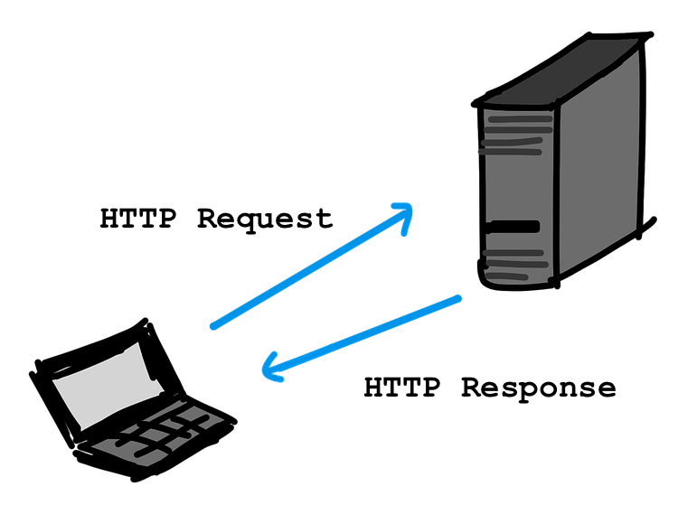
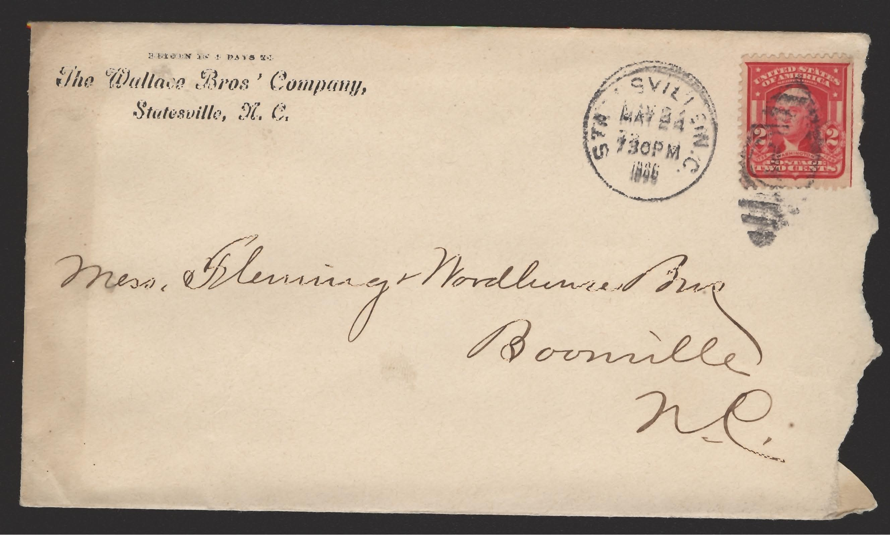

HTTP At a Glance
================

While we can get away with knowing only a few details about TCP/IP and DNS,
HTTP is a different story. We must understand HTTP much more deeply.

Let's start with a high-level view.

.. _request-response:

Requests and Responses
----------------------

.. index::
   single: HTTP; request
   single: HTTP; response

The fundamental units of HTTP are **requests** and **responses**. A client
(usually a web browser) makes a request to a server. Based on the details of
the request, the server builds and sends a response. The client receives the
response, executes the code, and displays the result.

As long as the server is available, *every* request receives a single response. 

Requests contain several types of data, including:

#. The URL for the server.
#. The action the client needs the browser to take.
#. Information like the browser involved and the type of data the client needs
   in return.
#. An optional request message.

Responses include:

#. The status of the response, including reasons about success or failure.
#. Information about the format of the response and the size of the data sent.
#. An optional response message.

The Postal Service of the Internet
----------------------------------

Imagine you send graduation invitations to your friends and family, and you
want to ask each person whether or not they will attend the ceremony. You print
the invite and question on a piece of paper and stuff it into an envelope. On
each one, you include an address, a return address, and you place a stamp in
the top-right corner.

   
   Image is in the public domain

The address, return address, and stamp are all required for a letter to be
delivered. Once we drop it into a mailbox, it travels from one post office
to another, by land, air, and maybe even sea. As long as we follow the rules,
the United States Postal Service gets a letter where it needs to go.

HTTP requests work in a similar way to the postal service. The *letter* is the
request message. The *envelope* includes the URL and any other data needed for
the request to reach the server.

We don't need to know *how* our HTTP request gets to the server. As long as we
use the correct format, it *will* be delivered.

Just like your friends and family will respond with notes telling you they will
absolutely attend your graduation, an HTTP request will receive a response from
the server. 

As we dive deeper into the details of HTTP, keep the Postal Service model in
mind. It will help make the concepts more concrete.

Check Your Understanding
------------------------

.. admonition:: Question

   Answer True or False for each of the following statements.

   .. raw:: html

      <ol type="a">
         <li onclick="revealTrueFalse('resultA', true)">A successful HTTP request receives a single response from the server. </li>
         <li onclick="revealTrueFalse('resultB', false)">The postal service will deliver your HTTP requests, if you ask nicely. </li>
         <li onclick="revealTrueFalse('resultC', false)">An HTTP request must include the IP addresses for every connection and device between the client and the server. </li>
         <li onclick="revealTrueFalse('resultD', true)">The postal service is a good analogy for HTTP. </li>
      </ol>

.. Answers = True, False, False, True
