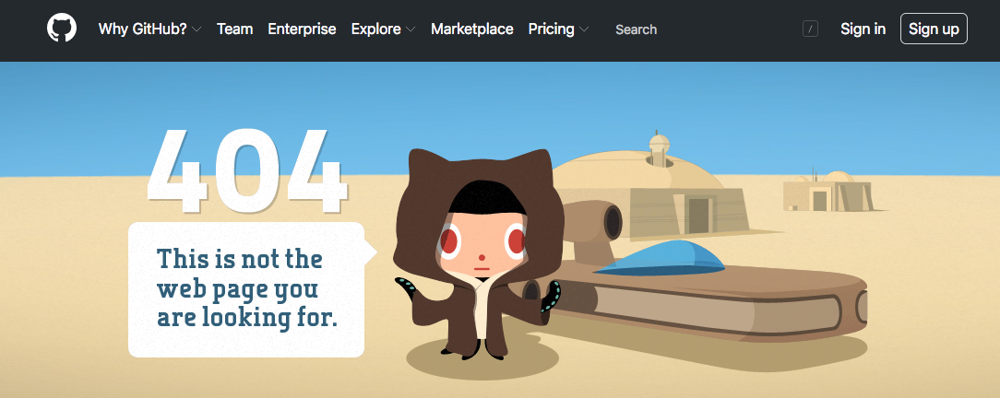

Responses
=========

.. index::
   single: HTTP; response

Every time a web server receives an HTTP request, it sends an HTTP response
back to the client.

A generic HTTP response looks like this:

::

   HTTP/2.0 200 OK
   Date: Wed, 22 May 2020 17:36:50 GMT
   Content-Type: text/html; charset=UTF-8
   Content-Length: 8050
   Last-Modified: Wed, 22 May 2020 17:33:45 GMT

   <!DOCTYPE html>
   <html>
   <head>
   <meta charset="UTF-8">
   <!--Rest of HTML page -->
   </html>

The structure has these components:

.. index::
   single: HTTP; response code
   single: HTTP; response headers
   single: HTTP; response line

#. **Response line:** The first line of the response contains status
   information like the **response code**. In this example, the response code
   is ``200``, which indicates the request was successfully fulfilled.
#. **Response headers:** Below the response line are the **response headers**.
   Similar to request headers, these are key-value pairs that contain data
   about the response. In the example above, these include information about
   the date and time, the data being sent (text and HTML), the size of the
   response body, and when it was last modified.
#. **Blank line:** This marks the end of the response headers.
#. **Response body (Optional):** Below the blank line, the response body takes
   up the rest of the HTTP response. This usually includes the HTML and CSS for
   the requested webpage.

Response Codes
--------------

We've all gotten a ``404 File Not Found`` error code at some point when we've
surfed the web.

   Did we make a mistake when typing the URL?

While ``404`` is the most common error we see when clicking links or
typing in URLs, other codes exist as well.

.. index::
   single: HTTP; response code

Servers use HTTP **response codes** to report the result when they try to
answer a client's request. The codes are always three-digit numbers, and they
fall into one of five categories:

#. **Information**: (1xx) The request was received, but the server is still
   working on the response.
#. **Success**: (2xx) The request was valid and the server successfully
   responded.
#. **Redirect**: (3xx) The request is incomplete. The client must take
   additional action, such as sending the request to a different server, before
   a response can be returned.
#. **Client Error**: (4xx) There was a problem with the client's request.
#. **Server Error**: (5xx) The request was valid, but the server hit a problem
   when trying to respond to it.

Specific codes will have all 3 digits specified, such as ``201`` (request
fulfilled), ``303`` (see other URL), or ``403`` (forbidden). Each code has a
specific meaning. For example, a ``404`` response code means that the requested
data does not exist on the server. This can occur if we make a mistake when
typing a URL into the address bar. Going back to the post office model, imagine
sending Aunt Linda's invitation to the wrong address. The letter would be
delivered to a house where she doesn't live. The *request* arrives, but a
response from her is impossible.

.. admonition:: Tip

   We don't need to memorize all of the response codes, because we can always
   look them up when necessary!

   `List of HTTP Status Codes. <https://en.wikipedia.org/wiki/List_of_HTTP_status_codes>`__

Response Headers
----------------

There are `lots of response headers <https://en.wikipedia.org/wiki/List_of_HTTP_header_fields#Response_fields>`__,
but only a few will be useful to us.

.. list-table:: Common HTTP Response Headers
   :header-rows: 1

   * - Header
     - Purpose
     - Example
   * - ``Content-Type``
     - The type of data included in the response body.
     - ``text/html``, ``text/css``, ``image/jpg``
   * - ``Content-Length``
     - The size of the response body in bytes.
     - ``348``
   * - ``Location``
     - The URL that the client should visit to find a relocated resource.
     - ``https://www.launchcode.org/new-blog/``

Response Body
-------------

While requests often don't have a body, responses almost *always* have one. The
response body contains the data that the client requested. It can contain HTML,
CSS, JavaScript, or image data.

When a browser receives a response from a server, it loads the body into its
memory. For HTML files, the browser executes the code and renders it into a
webpage. For CSS files, the style rules and applied to the given HTML page.

Check Your Understanding
------------------------

.. admonition:: Question

   A ``404`` response indicates that:

   .. raw:: html

      <ol type="a">
         <li><input type="radio" name="Q1" autocomplete="off" onclick="evaluateMC(name, false)"> The server is offline.</li>
         <li><input type="radio" name="Q1" autocomplete="off" onclick="evaluateMC(name, false)"> The user needs to log in first.</li>
         <li><input type="radio" name="Q1" autocomplete="off" onclick="evaluateMC(name, true)"> The requested data does not exist on the server.</li>
         <li><input type="radio" name="Q1" autocomplete="off" onclick="evaluateMC(name, false)"> The server crashed.</li>
      </ol>
      

.. Answer = c

.. admonition:: Question

   Which of the following response codes might indicate that the server is down
   for maintenance?

   .. raw:: html

      <ol type="a">
         <li><input type="radio" name="Q2" autocomplete="off" onclick="evaluateMC(name, false)"> 102</li>
         <li><input type="radio" name="Q2" autocomplete="off" onclick="evaluateMC(name, false)"> 204</li>
         <li><input type="radio" name="Q2" autocomplete="off" onclick="evaluateMC(name, false)"> 303</li>
         <li><input type="radio" name="Q2" autocomplete="off" onclick="evaluateMC(name, false)"> 403</li>
         <li><input type="radio" name="Q2" autocomplete="off" onclick="evaluateMC(name, true)"> 503</li>
      </ol>
      

.. Answer = e
