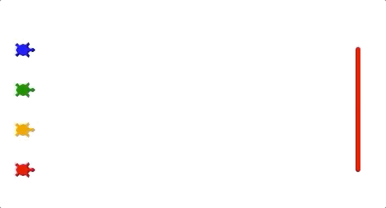
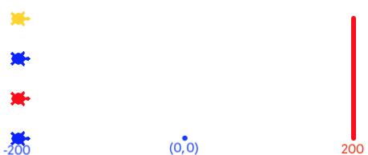

.. _turtle-races:

Project: Local Turtle Races
===========================

Hopefully, by the end of this project you will have a program that you just
can't resist running over and over again.

   On your mark, get set, go!

You are going to make turtles race across a straight track that is 400 pixels
long. The first one to the finish line wins!

Part A: Drawing Space Setup
---------------------------

Open Visual Studio Code and create a new project directory and a
``turtle_race.py`` file.

#. In ``turtle_race.py``, import the ``turtle`` and ``random`` modules.
#. Define a ``main()`` function and create a new ``Screen()`` object.
#. Use the ``.title()`` and ``.setup()`` methods on the object to give the
   drawing window a title and a size of 600 x 600 pixels.
#. The last statement in ``main()`` should call the ``.exitonclick()`` method
   on the object.

Run your program to test your window features.

Part B: Create Turtles
----------------------

Define a function called ``create_racing_turtle()`` that:

#. Takes two parameters, one for color and one for shape. Assign the default
   values ``'black'`` and ``'turtle'`` for these variables.
#. Creates a new turtle object and assigns it the color and shape values.
#. Assigns every turtle the same ``pensize`` and ``speed`` (``3`` and ``8`` are
   good choices).
#. Returns the new turtle object.

In ``main()``, call the ``create_racing_turtle`` function and assign the
returned object to a variable. Verify that the function works by drawing a
single line with ``variable_name.forward(100)``.

Once the function works, use it to create at least 4 turtle objects. Put each
of these into a list called ``racers``.

Part C: Start & Finish Lines
----------------------------

Now that you've created some racing turtles, you need to draw the finish line
and put the objects in their starting positions.

Draw the Finish Line
^^^^^^^^^^^^^^^^^^^^

To mark the finish line, you will use an *invisible* turtle to draw it.

.. admonition:: Note

   Some of the methods on this page may be unfamiliar to you. That's OK. We
   provide directions for how to use each one, and you can always check the
   `Python documentation <https://docs.python.org/3/library/turtle.html>`__ for
   more details.

Define a function called ``draw_finish()`` that:

#. Takes the length of the ``racers`` list as the parameter.
#. Creates a new ``Turtle`` object and assigns it to a variable.
#. Calls the ``.hideturtle()`` method on the object. Lines will still show up
   in the drawing space, but the turtle shape will remain invisible. The method
   requires no arguments inside the parentheses ``()``.
#. Sets the ``pensize``, the ``speed``, and ``color`` for the turtle. Feel free
   to choose any values for these properties you want.
#. Uses the ``penup``, ``pendown`` and movement methods to move the turtle
   forward 200 pixels and then draw a vertical line up towards the top of the
   screen. The length of the line should depend on how many turtles are in the
   ``racers`` list.

   .. list-table:: Finish Line Length
      :widths: auto
      :header-rows: 1

      * - Number of Turtle Racers
        - Length in Pixels
      * - 2
        - 50
      * - 3
        - 100
      * - 4
        - 150
      * - 5
        - 200

#. ``draw_finish`` does not return any value.

In ``main()``, call ``draw_finish`` several times, using different integers for
the argument.

Place Turtles at Start
^^^^^^^^^^^^^^^^^^^^^^

With four racing turtles, you need to make a starting lineup that looks
something like the figure below. Turtle shapes and colors may vary. The numbers
show the object positions compared to the center of the screen.

   Turtles start 200 pixels to the right of the center of the screen. The finish line is 200 pixels to the left.

By default, all new ``Turtle`` objects start in the center of the drawing
space, which has the coordinates ``(0, 0)``. This means each new turtle gets
stacked on top of all the others. We need to spread them out before they can
race!

Define a function called ``start_positions()`` that:

#. Takes the ``racers`` list as a parameter.
#. Includes a loop to iterate through the list. For each turtle object, use the
   ``.goto(x_value, y_value)`` method to move the turtle to its starting
   point. ``goto()`` places the turtle at a specific spot on the screen.
   ``x_value`` represents the left-right position, and each turtle will use
   ``-200`` for this.

   ``y_value`` represents the up-down position. The first turtle in the list
   will have a ``y_value`` of ``0``. The second will be ``50``. The third
   ``100``, etc.

   .. admonition:: Tip

      Use variables to calculate ``y_value`` instead of typing in specific
      numbers! *Hint*: Maybe you can relate ``y_value`` to an ``index`` in the
      ``racers`` list...

#. Returns no value.

In ``main()``, call ``start_positions`` several times, placing two or more
turtles in the ``racers`` list. No matter how many objects are in ``racers``,
the start and finish lines should always match in length.

Part D: Run the Race
--------------------

The statements to control the turtle race go inside the ``main()`` function.
After setting up the drawing window, your code should:

#. Create the turtles and put the objects in the ``racers`` list.
#. Call the ``draw_finish``  and ``start_position`` functions.
#. Use nested loops to move the turtles:

   a. Every turn, each turtle moves forward a random distance. Values in the
      range of 5 - 20 pixels are a good place to start, but you can adjust the
      end points as you wish.
   b. Include a conditional to check each turtle after it moves. The objects
      all start at ``-200`` and move toward ``200``. How can you determine if
      the turtle crossed the finish line? (There are multiple correct ways to
      do this).
   c. When a turtle crosses the finish line, use the ``.write()`` method to
      display a victory message on the screen!

      .. sourcecode:: python

            turtle_name.write("I win!\t", align='right')

#. Ties are possible! When a turtle crosses the finish line, the racing loops
   should stop. However, they should end AFTER all of the turtles in the list
   get a chance to move. This means multiple turtles can cross the finish line
   on the same turn. 
   
   Without this condition, the turtle at index 0 gets a big advantage in the
   race, since it moves first.

.. figure:: figures/turtle-tie.png
   :alt: A 3-way tie for first place!

   Turtles that reach or move past the finish line in the same turn tie.

Run your program several times to make sure that the same turtle doesn't always
win the race! The results are supposed to be random.

Part E: Bonus Missions
----------------------

Once you get your four turtles racing, try adding one of these enhanced
features:

#. Assign a random color or shape to each turtle.
#. Randomly select the number of turtles to race. Use a loop to create the
   objects and append them into ``racers``.
#. Add a *Replay* option to your code to ask the user if they want to run
   another race.

.. list-table:: Enhanced Turtle Racing

   * - .. figure:: figures/two-turtle-race.gif
          :alt: A two-turtle race  gif.
     - .. figure:: figures/three-turtle-race.gif
          :alt: A three-turtle race  gif.
     - .. figure:: figures/five-turtle-race.gif
          :alt: A five-turtle race  gif.
