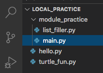
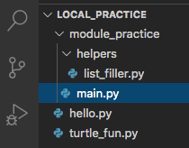
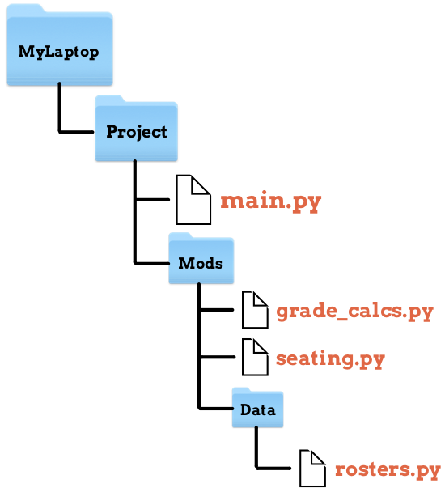

Importing Our Own Modules
=========================

On the previous page, we imported the ``turtle`` module into our
``turtle_fun.py`` program. We can do something similar with any of the
ready-made Python modules.

.. sourcecode:: Python
   :linenos:

   import turtle
   import string
   from random import randint

We just need to know the names of the modules we want. We do not need to tell
VS Code where the files are stored. Since they are installed with Python, the
application knows where to find them.

If we code our own modules, like we did in the :ref:`Creating Modules <module-location>`
section, then we must be a little more careful with the ``import`` syntax.

Setup
-----

In VS Code, do the following:

#. Create a new directory called ``module_practice``.
#. Inside ``module_practice``, create a new file called ``main.py``.
#. Also in ``module_practice``, create a file called ``list_filler.py``.

Our file tree should look something like this:

   The ``local_practice`` directory tree.

Now paste this code into ``main.py``:

.. sourcecode:: Python
   :linenos:

   # Keep line 1 empty for now.

   def main():
      entries = 10
      range_start = 15
      range_end = 75

      for turn in range(5):
         numbers = list_filler.unique_num_list(entries, range_start, range_end)
         numbers.sort()
         print(f"{turn+1}) Numbers list = {numbers}")

   if __name__ == '__main__':
      main()

Line 9 calls the function ``unique_num_list``, but it's not defined in the
``main.py`` code. We'll fix this in a moment.

Paste the following statements into ``list_filler.py``:

.. sourcecode:: Python
   :linenos:

   import random

   # Generate a list of random numbers in the range start-end.
   # Repeats of the same number are possible.
   def make_num_list(num_entries, start = 1, end = 10):
      num_list = []
      for num in range(num_entries):
         num_list.append(random.randint(start, end))
      
      return num_list

   # Generate a list of random numbers in the range start-end.
   # No repeated numbers occur in the list.
   def unique_num_list(num_entries, start = 1, end = 100):
      num_list = []
      if num_entries > (end - start + 1):
         num_entries = end - start + 1
      while len(num_list) < num_entries:
         new_num = random.randint(start, end)
         if new_num not in num_list:
            num_list.append(new_num)
      
      return num_list

Now we are getting somewhere! The ``unique_num_list`` function is defined in
lines 14 - 23. The next step is to import ``list_filler.py`` into ``main.py``.

Import From the Same Directory
------------------------------

When we create a module, we save the code into its own ``.py`` file. The most
convenient way to import our new module is to put that file in the same
directory as our main program. Fortunately, this is exactly what we did in the
*Setup* section.

   The ``local_practice`` directory tree.

When we follow this structure, the ``import`` syntax is the same as before.

.. admonition:: Try It!

   #. On line 1 in ``main.py``, add the statement ``import list_filler``.
   #. Run ``main.py`` to see the results.

      **Sample Output:**

      ::

         $ python main.py
         1) Numbers list = [22, 27, 33, 36, 40, 42, 45, 56, 66, 71]
         2) Numbers list = [16, 23, 39, 43, 47, 49, 51, 53, 64, 68]
         3) Numbers list = [18, 20, 26, 43, 45, 49, 52, 59, 60, 61]
         4) Numbers list = [15, 31, 36, 37, 43, 46, 52, 56, 57, 59]
         5) Numbers list = [21, 23, 28, 30, 51, 56, 58, 60, 62, 72]

   #. Note the use of *dot-notation* in line 9 of ``main.py``. The syntax
      ``list_filler.unique_num_list`` calls the ``unique_num_list`` function
      from the ``list_filler`` module.
   #. Use a ``for`` loop to generate another five lists of random numbers. This
      time, however, use the ``make_num_list`` function, and only send in one
      argument.

Think of any program as a set of smaller tasks joined together. Instead of
writing one large ``main.py`` file with hundreds or thousands of lines of code,
we can split our program into smaller modules. Each one has a specific focus
and purpose. The job of ``main.py`` is to pull them together and manage how
their classes and functions get used.

By splitting our projects into smaller pieces, we make updating and debugging
our code much easier.

With this picture in mind, it makes a lot of sense to keep the modules we need
in the same directory with the main program.

Import From a Different Directory
---------------------------------

If we create a large number of modules, we might want to add some subfolders to
help keep the files organized. Let's explore this with a simple example.

   ``helpers`` is a subdirectory of ``module_practice``.

In this case, ``main.py`` still sits in the ``module_practice`` directory.
However, we moved ``list_filler.py`` into the ``helpers`` subfolder.

.. admonition:: Try It!

   #. In VS Code, use the *New Folder* button in the File Explorer to create
      the ``helpers`` directory inside ``module_practice``.
   #. Drag-and-drop the ``list_filler.py`` file into the new folder.
   #. Run the program again and examine the error message.

   **Console Output**

   ::

      Traceback (most recent call last):
      File "main.py", line 1, in <module>
         import list_filler
      ModuleNotFoundError: No module named 'list_filler'

When the ``import list_filler`` statement runs, Python follows a specific set
of steps to find the file. We won't detail the entire process here. However,
the short version is:

#. Check if ``list_filler`` is one of the standard Python modules. If so,
   import it (the locations of these modules are known).
#. Check the current directory for ``list_filler``. If found, import it.
#. Throw an error if ``list_filler`` can't be found.

By moving ``list_filler.py`` into the ``helpers`` directory, Python can no
longer find the file to import it! This causes the ``ModuleNotFoundError``.

Fortunately, we can fix the ``import`` syntax and provide a path to where we
stored our module. The key is to include the ``from`` keyword. The general
syntax is:

.. sourcecode:: Python

   from directory_name import module_name

IMPORTANT: ``directory_name`` must be in the same folder as the main program.

.. admonition:: Try It!

   #. In ``main.py``, change line 1 to ``from helpers import list_filler``.
   #. Run the program again.
   #. Ta da!

Other Import Details
^^^^^^^^^^^^^^^^^^^^

As long as the modules we need are stored in directories below ``main.py``, we
can extend the chain of directory names as far as necessary with our ``import`` statement. To move down multiple
levels from ``main.py``, we use dot-notation to include the different directory
names.

.. admonition:: Example

   Let's take a look at a three level file tree:

   .. figure:: figures/layers-deep.png
      :alt: A three level file tree.

      The module ``gradebook.py`` is two levels below ``main.py``.

   The indentation in the file tree gives us clues about how things are
   organized.
   
   #. ``main.py`` is in the folder ``my_project`` along with the ``subdir1``
      directory.
   #. ``subdir1`` contains the ``grade_stats.py`` file and the next subfolder,
      ``subdir2``.
   #. Finally, we see that the ``gradebook.py`` file is buried deepest in this
      tree. 

   To import the ``gradebook`` module, line 1 in ``main.py`` would be:

   .. sourcecode:: Python

      from subdir1.subdir2 import gradebook

We can also import a specific function (or class) from a module stored in a
subdirectory. In this case, we include the module name in our dot-notation.

.. admonition:: Example

   Assume we only need the ``average_grades`` function from the ``grade_stats``
   module. The syntax would be:

   .. sourcecode:: Python

      from subdir1.grade_stats import average_grades
   
   This statement tells Python, *Look in the subdir1 directory and find the
   grade_stats file, then import the average_grades function*.

Importing From a Parent Directory
---------------------------------

While it is possible to force Python to search upwards through your file system,
this isn't recommended. To do so requires a work-around, and that process can
go wrong in lots of ways.

If the Python developers thought it would be useful to search upwards in the
file system, then they would have made it easy. They didn't, so it isn't.

This just reinforces a GREAT idea for making local programs and projects: Keep
related content together. This keeps our work organized, and it also helps any other
programmer who might inherit our work.

Whenever you create a module to support your program, follow these guidelines
on where to store the file:

#. *Put it in the same directory as the main program*!
#. Put it in a subdirectory below the main program.
#. See point 1.

Check Your Understanding
------------------------

Use the file tree shown below to answer the questions.

.. admonition:: Question

   Which statement should we add to ``seating.py`` to import the ``rosters.py``
   module?

   .. raw:: html

      <ol type="a">
         <li><input type="radio" name="Q1" autocomplete="off" onclick="evaluateMC(name, false)"> import rosters</li>
         <li><input type="radio" name="Q1" autocomplete="off" onclick="evaluateMC(name, false)"> from seating import rosters</li>
         <li><input type="radio" name="Q1" autocomplete="off" onclick="evaluateMC(name, false)"> from Mods import rosters</li>
         <li><input type="radio" name="Q1" autocomplete="off" onclick="evaluateMC(name, false)"> from Mods.Data import rosters</li>
         <li><input type="radio" name="Q1" autocomplete="off" onclick="evaluateMC(name, true)"> from Data import rosters</li>
      </ol>
      

.. Answer = e.

.. admonition:: Question

   What should we do if we want to import ``grade_calcs.py`` into
   ``rosters.py``?

   .. raw:: html

      <ol type="a">
         <li><input type="radio" name="Q2" autocomplete="off" onclick="evaluateMC(name, true)"> Move both files into the same directory.</li>
         <li><input type="radio" name="Q2" autocomplete="off" onclick="evaluateMC(name, false)"> Play around with the from ... import ... syntax until we get the import to work.</li>
         <li><input type="radio" name="Q2" autocomplete="off" onclick="evaluateMC(name, false)"> Use Google to find out how to import from a parent directory.</li>
         <li><input type="radio" name="Q2" autocomplete="off" onclick="evaluateMC(name, false)"> Cry.</li>
      </ol>
      

.. Answer = a.
