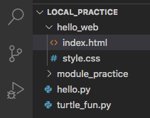
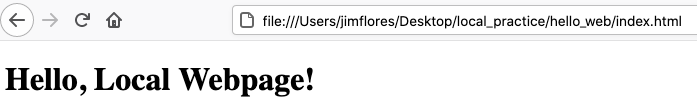

Local HTML/CSS Files
====================

Visual Studio Code recognizes many different programming languages. We can use
the application for our Python projects and our HTML/CSS work.

Let's build a simple webpage just like we did in the :ref:`HTML <html-chapter>`
and :ref:`CSS <css-index>` chapters. However, this time we will do it locally.

Hello, Web
----------

Add a new directory to ``local_practice`` called ``hello_web``. Next, create
two files in the directory called ``index.html`` and ``style.css``.

Our file tree should look something like this:

   The ``hello_web`` directory tree.

Notice that VS Code displays different symbols next to the files. It uses the
``.html``, ``.css``, and ``.py`` extensions to identify the programming
language they contain.

Paste this code into ``index.html``:

.. sourcecode:: html
   :linenos:

   <!DOCTYPE html>
   <html>
      <head>
         <meta charset="utf-8">
         <meta name="viewport" content="width=device-width">
         <title>Hello, Web!</title>

      </head>
      <body>
         <h1>Hello, Local Webpage!</h1>
      </body>
   </html>

Even though the code only contains a single ``h1`` element inside the
``<body>`` tags, it is still a fully functional HTML file. Let's see what it
looks like in a browser!

.. _view-local-html:

Viewing Local Files in a Browser
--------------------------------

There are two ways to view our local HTML file in a browser.

#. **Option 1:** Open a web browser. Click on *File --> Open File* from the
   menu options. In the box that pops up, navigate to the ``.html`` file we
   want. Click *Open*.

   .. figure:: figures/open-html-file.png
      :alt: File menu and dialog box for opening a local file in a browser.

#. **Option 2:** In VS Code, right-click on the tab of the file we want. Choose
   the *Copy Path* option. Next, open a web browser and paste the path into the
   address bar.

   .. figure:: figures/copy-path.png
      :alt: Menu options that appear after right-clicking a file tab in VS Code. "Copy Path" is highlighted.
      :width: 30%

Ta da! Our webpage appears. Notice the path in the address bar. It looks very
similar to the result we would see from the ``pwd`` command in the terminal.
The copied path changes depending on the file chosen.

Add More Elements
^^^^^^^^^^^^^^^^^

#. Return to VS Code and add a few more elements to the ``index.html``
   document. Be sure to use some of the :ref:`semantic HTML <semantic-tag-list>`
   we learned earlier.
#. Save your work.
#. Go back into the browser and refresh the tab for your HTML file. You should
   see the results of your changes.

.. admonition:: Tip

   VS Code has a nice feature to let us know if we have saved our work
   recently! In the editor tabs, if we see a solid dot (``•``) next to a
   filename, that means we have unsaved changes in our code. If we see an
   ``X`` instead, then all of the code in the file has been saved.

   .. figure:: figures/save-dot.png
      :alt: Two tabs, one marked with a dot to indicate unsaved changes.
      :width: 70%

For Your Eyes Only
^^^^^^^^^^^^^^^^^^

Only you can see your local webpage. Looking at the address bar tells us this.
Instead of ``https://www.etc.``, we see the ``file://`` prefix. This indicates
that the browser opened a file on your personal machine. No one else in the
world can view your page unless they are looking over your shoulder right now
(or hacked into your device).

Much later in this course, we will learn how to *deploy* a website and make it
visible to anyone who accesses the web.

Adding CSS
----------

Since the ``index.html`` and ``style.css`` files are in the same directory, we
can link them together by adding one statement to our ``head`` element:

.. sourcecode:: html
   :lineno-start: 3

   <head>
      <meta charset="utf-8">
      <meta name="viewport" content="width=device-width">
      <title>Hello, Web!</title>
      <link rel="stylesheet" type="text/css" href="style.css">
   </head>

Line 7 uses the identical format to what we learned in the
:ref:`Linking CSS to HTML <link-external-css>` section.

Try It!
^^^^^^^

#. Paste this code into the ``style.css`` file:

   .. sourcecode:: html
      :linenos:

      h1 {
         color: purple;
         text-align: center;
         text-decoration: underline overline wavy;
         font-family: impact, helvetica;
      }

      section {
         background-color: lightgreen;
         text-align: center;
         font-size: 36px;
         border: solid 2px;
         width: 50%;
      }

      .shadow {
         color: green;
         text-shadow: 3px 3px 4px blue;
      }

#. Save your work in both the ``index.html`` and ``style.css`` files. Return to
   the browser and refresh the tab. Properly done, the ``Hello, Local Webpage!``
   heading changed appearance. Also, if you added any ``<section>`` elements on
   the page, they will also look different.

   .. figure:: figures/styled-local-page.png
      :alt: The local webpage with CSS style rules applied.

      A styled local webpage.

#. Notice that the CSS code defines a class called ``shadow``. Add this class
   inside one of your HTML tags and save your work. Refresh the page in your
   browser to see the result.
#. Add other style rules to the CSS file to change the appearance of other
   elements in your webpage. Be sure to practice using
   :ref:`element, class, and id selectors <css-selectors>`.

``style.css`` in a Different Directory
^^^^^^^^^^^^^^^^^^^^^^^^^^^^^^^^^^^^^^

If the CSS file is located in a different directory from the HTML page that
uses it, we need to add the proper path inside the ``<link>`` tag. Let's take a
look at three possible cases:

.. admonition:: Example

   .. figure:: figures/css-level-down.png
      :alt: File tree for hello_web showing style.css in a subfolder.

      ``style.css`` is inside the subfolder ``the_styles``.

   When the stylesheet is one level down from our HTML file, update the
   ``href`` attribute by adding a relative path that points to the CSS file.

   .. sourcecode:: html

      <link rel="stylesheet" type="text/css" href="./the_styles/style.css">

   The path ``./the_styles/style.css`` tells VS Code, *From the current
   directory, find the folder called the_styles. Move into that folder and find
   the file called style.css*.

.. admonition:: Example

   .. figure:: figures/css-level-up.png
      :alt: File tree for local_practice showing style.css one level above index.html.

      ``style.css`` is inside the parent directory of ``hello_web``.

   When the stylesheet is one level up from our HTML file, use the ``..``
   shortcut in the relative path.

   .. sourcecode:: html

      <link rel="stylesheet" type="text/css" href="../style.css">
   
   The path ``../style.css`` tells VS Code, *From the current directory, move
   up one level into the parent folder. Find the file called style.css*.

.. admonition:: Example

   If we pull a stylesheet from a website (like `Bootstrap <https://getbootstrap.com/docs/4.5/getting-started/introduction/>`__),
   use the web address for the ``href`` attribute.

   .. sourcecode:: html

      <link rel="stylesheet" href="https://websiteURL">

   Notice that the external link does not include the ``type`` attribute.

Finally, we can always use the full path to the stylesheet. Right click on the
``style.css`` tab and choose the *Copy Path* option. Paste the path inside the
quotes for the ``href`` attribute.

Local Project
-------------

#. In the :ref:`HTML Me Something <html-me-something>` assignment, you built
   and styled your own webpage in repl.it or Trinket. Login to your account now
   and open up that project.
#. In VS Code, create a new directory called ``html_me``.
#. Inside this directory, create an ``index.html`` file.
#. Copy your HTML code from your repl.it/Trinket project and paste it into VS
   Code.
#. Repeat this copy/paste process for the ``style.css`` file.
#. If your repl.it/Trinket project contains any other files (like images, gifs,
   etc.), drag and drop copies of these files into the ``html_me`` directory.
#. Open your new ``index.html`` file in a browser. Properly done, you should
   see your awesome webpage! However, now you have it saved on your personal
   device.

Check Your Understanding
------------------------

.. admonition:: Question

   Visual Studio Code automatically saves our work.

   .. raw:: html

      <ol type="a">
         <li><input type="radio" name="Q1" autocomplete="off" onclick="evaluateMC(name, false)"> True</li>
         <li><input type="radio" name="Q1" autocomplete="off" onclick="evaluateMC(name, true)"> False</li>
      </ol>
      

.. Answer = b

.. admonition:: Question

   Visual Studio Code works with other languages besides Python, HTML, and CSS.

   .. raw:: html

      <ol type="a">
         <li><input type="radio" name="Q2" autocomplete="off" onclick="evaluateMC(name, true)"> True</li>
         <li><input type="radio" name="Q2" autocomplete="off" onclick="evaluateMC(name, false)"> False</li>
      </ol>
      

.. Answer = a

.. admonition:: Question

   After making a change in our HTML or CSS code, how do we see those updates
   in a web browser?

   .. raw:: html

      <ol type="a">
         <li><input type="radio" name="Q3" autocomplete="off" onclick="evaluateMC(name, false)"> Refresh the tab in the browser.</li>
         <li><input type="radio" name="Q3" autocomplete="off" onclick="evaluateMC(name, false)"> Save our work in VS Code.</li>
         <li><input type="radio" name="Q3" autocomplete="off" onclick="evaluateMC(name, true)"> Save our work in VS Code, then refresh the tab in the browser.</li>
         <li><input type="radio" name="Q3" autocomplete="off" onclick="evaluateMC(name, false)"> Refresh the tab in the browser, then save our work in VS Code.</li>
      </ol>
      

.. Answer = c

