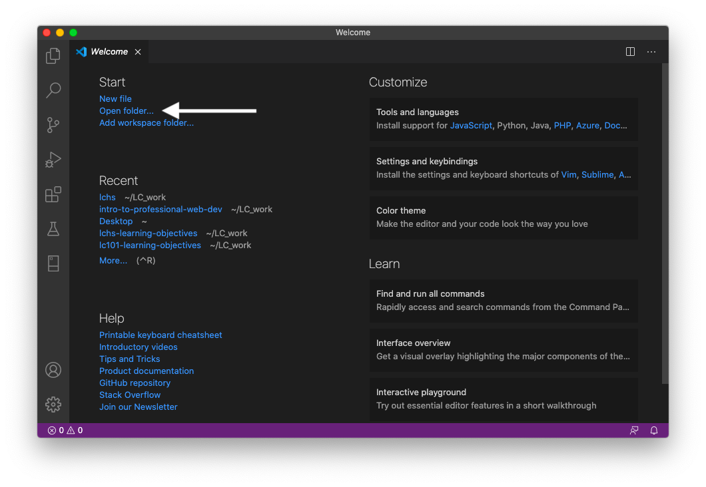
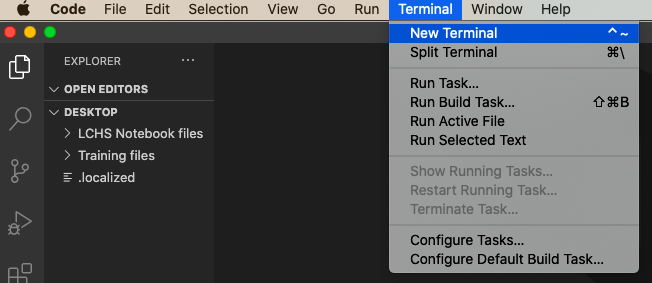
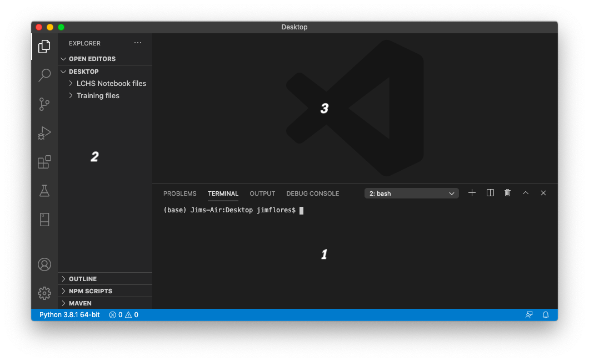

Visual Studio Code
==================

Before we dive into coding our first local program, let's take a moment to get
used to our new code editor.

Open the Visual Studio Code program and take a look around.

Welcome Screen
--------------

The first time we run VS Code, the program displays the Welcome screen to get us
started. Go ahead and click the *Open Folder* option and then select the
*Desktop* directory. (Opening any directory activates the workspace, but for
now we will practice on the Desktop).

.. admonition:: Note

   When we launch VS Code, it tries to open the last project we worked on. If
   this happens now, don't worry. Select *New Window* from the *File* menu to
   bring up the Welcome screen.

   Welcome to Visual Studio Code!

Next, click on the *Terminal* menu and select *New Terminal*.

   Open the terminal inside VS Code.

We now have several different panels, buttons, and menus that allow us to edit,
debug, and run our code.

The Workspace
-------------

The workspace in Visual Studio Code consists of three main panels:

   The VS Code workspace.

#. **Terminal Panel**: VS Code allows us to run our terminal application inside
   the workspace. All of the actions we practiced in the
   :ref:`Terminal chapter <terminal-chapter>` will work here.
#. **Activity Bar and File Tree**: This panel lets us navigate the file system,
   perform searches, install extensions, update the software, etc.
#. **Editor Panel**: Our code goes here! VS Code recognizes most major
   programming languages.

.. _local-practice:

Terminal Panel
--------------

Let's run a couple of terminal commands just to see where we are:

.. sourcecode:: bash
   :linenos:

   Jims-Air:Desktop jimflores$ pwd
   /Users/jimflores/Desktop
   Jims-Air:Desktop jimflores$ ls
   LCHS Notebook files     Training files

Take a look at the file path returned by ``pwd``. By opening the Desktop folder
from the Welcome screen, VS Code automatically put us in that directory when we
opened the terminal.

The ``ls`` command displays the files and folders currently in ``Desktop``.
Notice how the same items appear in the file tree on the left side of the
workspace.

Now use the terminal to create a new directory in the Desktop:

.. sourcecode:: bash
   :linenos:

   Jims-Air:Desktop jimflores$ mkdir local_practice
   Jims-Air:Desktop jimflores$ ls
   LCHS Notebook files     Training files          local_practice

Check your computer to see that a ``local_practice`` folder appeared on the
Desktop.

When we write our first local Python program, we will use the terminal to run
that code.

Activity Bar and File Tree
--------------------------

The Activity Bar on the left side of the workspace contains several buttons, but we
will only look at three of them right now.

#. **File Explorer**: Clicking on the top icon hides/reveals the file tree for
   the current directory.

   .. figure:: figures/vscode-file-tree.png
      :alt: The file tree for the Desktop directory.

   a. Clicking on the ``>`` symbol next to a folder displays the contents of
      that directory.
   b. Clicking on a file name opens that file in the editor.
   c. The file tree includes buttons for adding new files and folders to the
      current directory.

#. **Settings**: Clicking on the gear icon at the bottom of the toolbar brings
   up options for customizing the workspace. For example, if you don't like the
   default theme (dark background with light text), you can change it!
#. **Extensions**: We can install, update, or uninstall extensions for VS Code.
   Click on the fifth icon from the top to make sure that extensions for Python
   and HTML/CSS are installed. If not, follow the instructions in the
   :ref:`Setting Up VS Code <vscode-extensions>` appendix to add them.

Add a New File
^^^^^^^^^^^^^^

#. Click on the *File Explorer* icon to display the file tree.
#. Select the ``local_practice`` directory, which is currently empty.
#. Click on the *New File* button.

   .. figure:: figures/new-file-button.png
      :alt: The New File button appears next to the directory name.

#. Notice that a space opens under the ``local_practice`` directory where we
   can enter a filename. Type ``hello.py`` and hit *Enter*.
#. A ``hello.py`` tab appears in the editor panel. We will add some code to
   this file soon.

.. admonition:: Note

   The ``.py`` extension indicates that the file contains Python code. Remember
   to add this extension to all of your Python programs!

Editor Panel
------------

This is where we will do most of our work in VS Code. From our practice in
`repl.it <https://repl.it/login>`__ and `Trinket <https://trinket.io/login>`__,
we are familiar with the features of a code editor.

.. admonition:: Fun Fact

   The developers behind repl.it modeled their editor on the look of Visual
   Studio Code!

Now let's do some local coding!

Check Your Understanding
------------------------

.. admonition:: Question

   In VS Code, how do we add a new file to a directory? Select ALL correct
   options.

   .. raw:: html
      
      <ol type="a">
         <li>Click on the directory in the file tree and press the <em>New File</em> button.</li>
         <li>Click on the directory in the file tree and press the <em>New Folder</em> button.</li>
         <li>In the terminal, navigate to the directory and use <em>touch new_filename</em>.</li>
         <li>In the terminal, navigate to the directory and use <em>mkdir new_filename</em>.</li>
      </ol>

.. Answers = a & c.

