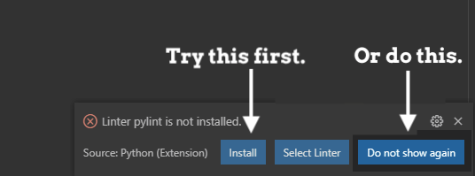
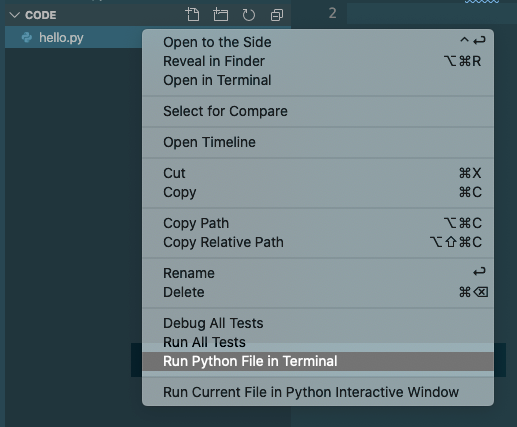
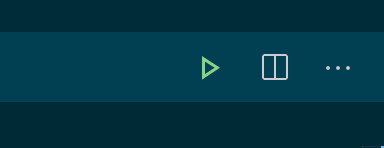

Python in VS Code
=================

Now that we have installed all the tools we need, we are almost ready to write
our first local Python program. We just need to run one last check.

.. admonition:: Note

   The steps on this page are ALMOST the same for both Windows and Mac. If the
   screenshots differ slightly from what you see, it’s because the images were
   taken on a different operating system than yours. However, the menus, steps,
   etc. are the same.

   **Mac users**: Whenever we ask you to type the ``python`` command, you
   should use ``python3`` instead. macOS comes pre-installed with a 2.x version
   of Python. This version runs if you use ``python``. To make sure you’re
   running the latest version, use ``python3``.

Checking Python Version
-----------------------

Open VS Code and a terminal pane (if it isn’t already open). In the terminal,
type ``python -V`` (note the capital ``-V``). You should see something similar
to:

::

   Mac:
      $ python3 -V
      Python 3.8.3
   
   Windows:
      $ python -V
      Python 3.8.3

This command prints out the version of Python installed on your machine. If
your version differs slightly from what’s shown, that’s okay, as long as you
have a 3.x version. If you see 2.x or an error message, go back through the
:ref:`Setting Up Python <python-install>` directions in the appendix.

First Local Program
-------------------

.. admonition:: Note

   If you did not create the ``local_practice`` directory and ``hello.py`` file
   described on the :ref:`previous page <local-practice>`, go back and do that
   now.

#. If it's not already open, launch Visual Studio Code.
#. From the *File* menu, select *Open*. Choose the ``local_practice`` folder.
   The file tree should update to look something like this:

   .. figure:: figures/local-hello-tree.png
      :alt: File tree for the local_practice directory. It only contains hello.py.
   
#. Double-click on ``hello.py`` from the file tree to open it in the editor.
#. On line 1, type ``print("Hello, Local World!")``.
#. Save your changes by using *File --> Save* or a keyboard shortcut.

Linting
^^^^^^^

When you type in your first Python statement, VS Code may ask you to install a
**linter**. This is a feature that provides some extra assistance while you
code. For example, the linter flags syntax errors, undefined variables, etc. 

Go ahead and click *Install* if you see this popup. If it works, great! If
not, don't worry about it. VS Code provides a basic level of linting by default. 

   Try to install the linter, or choose not to be bothered by the popup.

Running a Local Program
-----------------------

We have several options for running a program locally. Be sure to try out each
one to see how they all work! 

Terminal
^^^^^^^^

To launch a Python program from the terminal, the general syntax is:

::

   python filename.py

This works if we are in the directory that holds ``filename.py``. If we are in
a different directory, then we can include a path to tell the computer where to
find our program (e.g. ``python /Users/username/directory_name/filename.py``).

From the terminal, run ``hello.py``. The output should look something like:

::

   $ python hello.py
   Hello, Local World!

*Mac users*: Remember to use ``python3`` instead of ``python``.

Right-Click
^^^^^^^^^^^

From the file tree, right-click on the file and choose *Run Python File in
Terminal*.

   Run by right-clicking!

If all goes well, you’ll see ``Hello, Local World!`` appear in the terminal
pane.

Run Button
^^^^^^^^^^

The Python extension for VS Code adds a green *Run* button at the top right of
the workspace.

   Yep, we have a Run button!

Clicking the button runs the code in the currently open tab. Try this with
``hello.py``. 

Try It!
-------

.. admonition:: Tip

   Be sure to save your work after you change your code! If you forget to do
   this, VS Code will run the last saved version of your program instead of
   the newer one.

#. Now that you've got the classic ``Hello, World`` program under your belt,
   add a loop and a conditional to your program. Save your work, then run
   ``hello.py`` again to see the change.
#. Create a new Python file in the ``local_practice`` folder. Be sure to
   include the ``.py`` extension.
#. Your new file should open into its own tab in VS Code. If it does not, click
   on its name in the file tree.
#. Log into `repl.it <https://repl.it/login>`__ or `Trinket <https://trinket.io/login>`__
   and find one of your favorite exercises, activities, or assignments.
   Copy your code from there and paste it into VS Code. Some nice options
   include:

   a. The *Choose Your Own Adventure* activity that your teacher may have assigned back in chapter 5.
   b. Your :ref:`Candidate Quiz <candidate-quiz>` assignment.
   c. Anything from the :ref:`Functions chapter project <functions-project>`.
   
   .. admonition:: Note

      Steer clear of turtle programs for now. They require a little extra
      attention to get them working in VS Code. We will take a closer look at
      Python turtles on the next page.

#. Check to see if VS Code flags any errors in your code. Fix these first, then
   run your program. If it works, great! If not, debug your code and get it
   running.
#. Practice renaming your program file. Right-click on its name in the file
   tree and choose *Rename*. Type in a new option and hit *Enter*. Be sure to
   keep the ``.py`` extension!

Naming Python Files
-------------------

We learned the naming rules for Python files in the
:ref:`Modules chapter <custom-modules>`. Just as a reminder, here they are
again.

Python file names should:

#. Begin with a letter and contain only lowercase letters.
#. Be as short as possible, but still descriptive.
#. Separate words with an underscore ``_``.
#. End with the extension ``.py``.
