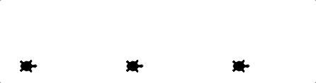
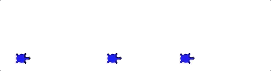
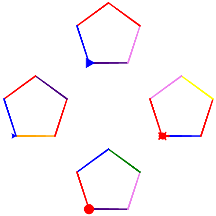
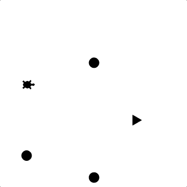

Project: Collaborative Turtles Activity
=======================================

Introduction
------------

Functions and modules allow programmers to work on separate sections of code
and then combine them together to create a finished project. In this activity,
your class will split into teams, and each team will contain 4 groups.

Each group will create a function (or module) that performs a specific job.
When all groups are ready, your team will combine all of the functions to
assemble a working program.

Goal
----

If you define several turtle objects and call a ``draw_polygon`` function for
each one, the turtles will draw their shapes *sequentially* (one after the
other).

   Drawing three triangles sequentially.

In this project, your team will make four turtles draw their shapes
*simultaneously*. They will take turns drawing each side of their shapes.

   Taking turns drawing the sides of a square.

Your team will also add some ``random`` features to make the final drawing more
eye-catching.

   Random side colors and turtle shapes.

Starter Code
------------

If your teacher added you to a :ref:`Trinket course <trinket-course-assignments>`,
complete this project there.

If you are NOT enrolled in a Trinket course, use one of the following links to
copy the starter code:

#. `Trinket project starter code <https://trinket.io/python/c99c3612a9>`__
#. `repl.it project starter code <https://replit.com/@launchcode/LCHS-Collaborative-Turtles-Project>`__

*Each group needs their own copy of the code*.

Activity
--------

#. Each team requires 4 groups, and each group should contain 2 - 4 coders (the
   *ideal* number in each group = *3*). Your teacher will split the class into
   the teams, and you must decide which group to join.
#. Once you join a group, decide who will be the *driver*, and who will be the
   *navigators*.

   a. The *driver* types code into the editor. However, the ideas for the code
      MUST come from the navigators. The driver is NOT the boss. They receive
      directions and enter code to make the ideas work.
   b. The *navigators* give ideas and instructions to the driver. However, they
      cannot type anything into the code editor themselves. The navigators are
      NOT the boss. They give suggestions for making the function work.

   .. admonition:: Note
   
      Your team will only finish on time if everyone does their job.

      #. *Everyone* needs to practice, so let everyone contribute.
      #. You learn to code by *coding*, not watching.

#. **Tasks for each group**:

   a. *Group 1* codes a function to randomly assign a shape to a turtle
      (arrow, circle, classic, square, triangle, turtle).
   b. *Group 2* codes a function to assign a random color to a turtle. Group
      members can use any colors they want, but there should be at least 7
      choices in a list (Ex: red, orange, yellow, green, blue, indigo, violet).
   c. *Group 3* codes a function to assign a speed to a turtle. Include a
      default speed value just in case the function call does not include that
      argument.
   d. *Group 4* updates a function to make a list of turtles draw their shapes
      simultaneously instead of sequentially. The function is already in the
      starter code, but it does not quite work yet.

   .. admonition:: Tip

      #. Each function requires a parameter for a turtle object, and each
         function call must include a turtle as an argument.
      #. Each function *might* require other parameters as well. Consider the
         job your function must do, and decide in your group what other data
         will be needed.
      #. For now, there is no need to include a ``return`` statement in any of
         the functions.
      #. Communicate with your team about the name you give your function.

#. Your teacher will demonstrate a ``place_turtles`` function that starts
   different turtles at different spots on the screen.

   a. ``place_turtles`` takes a list of turtles as one of the parameters, but
      it needs to be modified to make it better.
   b. Your teacher will walk through how to improve the code, and your team
      will use the final ``place_turtles`` code.

#. Once each group in your team finishes their code, combine the separate
   functions into a single, shared file. Run the code to find and fix any bugs.
#. Demonstrate your finished project to your teacher.

Submit Your Work
----------------

Save your final code, then follow the instructions given by your teacher to
turn in your work.

Bonus Task
----------

#. Decide which functions can be saved in one or more separate modules.
#. Move those functions into the modules, then import them into the main
   program file.
#. Add a ``main()`` function to the ``main.py`` file to hold any loose code.
   Also, add a function call to run ``main()``.
#. As you add the module(s) and ``main()``, update your program as necessary to
   keep it running.

