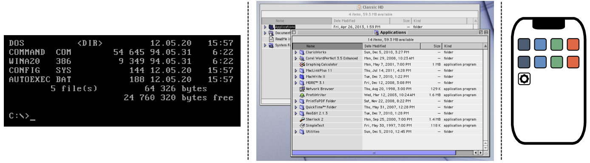
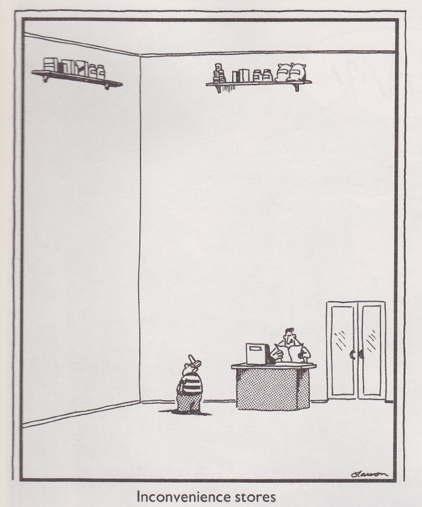
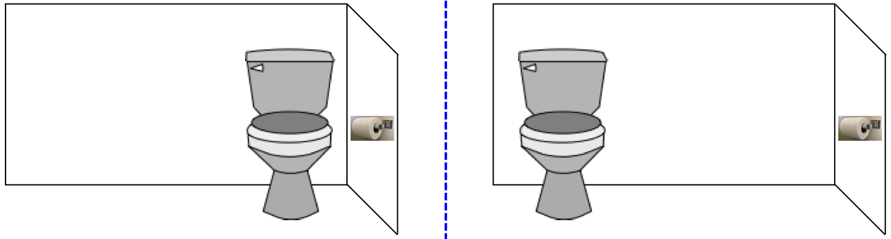

The User Experience
===================

.. index:: ! UI, ! UX

The term **user interface** (UI) refers to the buttons, windows, icons, etc.
that a human interacts with when they use a device.

   Three UI examples: a command line prompt, a clickable file tree, and a touch-sensitive home screen.

**User experience** (UX) refers to the emotions a person feels as they interact
with an application or device. The better the experience, the more likely they
are to keep using it.

   https://www.thefarside.com/

Good developers pay close attention to both UI and UX. Often, the two ideas go
hand in hand. However, they are NOT the same thing. For example, here's a
relatively simple user interface:

   The UI controls how the user interacts with the device.

This design is efficient, easy to understand, and effective. Now, take that
same UI and apply it in two slightly different ways. This gets us to the user
experience. Can you identify which setup provides the better UX?

   UX deals with how the user feels when interacting with the device.

Flask gives us the tools to make a decent UI, like the navigation menu we
created on a :ref:`previous page <page-navigation>`. However, besides making
sure that the links all work, we must also think about the placement of the
menu on the page. Right now, the menu appears below any HTML inserted into the
base template. Since each page has a different amount of content, the location
of the menu changes after we click a link. This weakens our UI design, which
affects the UX.

.. admonition:: Try It!

   What steps can we take to improve the users' experience with the navigation
   menu? Try out a few ideas, then demo your favorite for your teacher and/or
   classmates.

Explore UX
----------

A poor interface often leads directly to a bad user experience.

   Three examples of a poor user interface.

On the other hand, a good UI may lead to an excellent, average, or poor UX. For
example, the `Netflix <https://www.netflix.com/>`__ streaming service includes
an autoplay feature. When users hover over a title in a list of movies, after a
moment a trailer starts to play. Some people like this feature, but others find
it incredibly annoying. Users who just want to read the description for a movie
might find the preview distracting (or too noisy if they're in school or at
work).

.. admonition:: Try It!

   Follow each of the links below, and try to complete the task described.
   As you explore, evaluate your own user experience. Consider:
   
   - Does the user interface work? Is it easy to use?
   - Is the design of the webpage appealing?
   - Were you able to complete the task? How long did it take?
   - Would you use the website again, or would you look for a different option?
   - What features on the website do you like? Does anything annoy you?

   **Links**:

   #. `IRS website <https://www.irs.gov/>`__: After buying an electric car,
      some owners can receive a break on their taxes. Find the form required to
      claim this tax credit (PDF format).
   #. `Chocolate Cake (Cafe Delites) <https://cafedelites.com/chocolate-cake/>`__
      vs. `One Bowl Chocolate Cake (Allrecipes) <https://www.allrecipes.com/recipe/17981/one-bowl-chocolate-cake-iii/>`__:
      Find the list of ingredients and the steps required to bake each cake.
   #. `Wikipedia <https://en.wikipedia.org/wiki/Main_Page>`__: Find the date of
      the last manned moon landing.

Other Reading
-------------

For those interested in a deeper look at UI and UX, here are two articles and
a video to get you started.

#. `What are the Similarities & Differences Between UI Design & UX Design? <https://xd.adobe.com/ideas/process/ui-design/ui-vs-ux-design-understanding-similarities-and-differences/>`__
#. `UI, UX: Who Does What? A Designer’s Guide To The Tech Industry <https://www.fastcompany.com/3032719/ui-ux-who-does-what-a-designers-guide-to-the-tech-industry>`__
#. `How Much Code Should A UX Designer Write? <https://www.youtube.com/watch?v=BRWh7Nc0lbk&feature=emb_logo>`__

Check Your Understanding
------------------------

.. admonition:: Question

   Imagine you and your friend invent a new electronic gadget. The two of you
   build lots of copies in your garage and start sending them to customers.
   Then you get into an argument. Your friend wants to ship the devices with
   empty batteries. However, you insist that they should arrive fully charged.

   Is this argument about UI or UX?

   .. raw:: html

      <ol type="a">
         <li><input type="radio" name="Q1" autocomplete="off" onclick="evaluateMC(name, true)"> UX</li>
         <li><input type="radio" name="Q1" autocomplete="off" onclick="evaluateMC(name, false)"> UI</li>
         <li><input type="radio" name="Q1" autocomplete="off" onclick="evaluateMC(name, false)"> Both</li>
      </ol>
      

.. Answer: a

.. admonition:: Question

   Imagine you are building a webpage for your company and need to decide on
   the color and placement of three buttons.

   Is this a UI or UX decision?

   .. raw:: html

      <ol type="a">
         <li><input type="radio" name="Q2" autocomplete="off" onclick="evaluateMC(name, false)"> UX</li>
         <li><input type="radio" name="Q2" autocomplete="off" onclick="evaluateMC(name, false)"> UI</li>
         <li><input type="radio" name="Q2" autocomplete="off" onclick="evaluateMC(name, true)"> Both</li>
      </ol>
      

.. Answer: c
