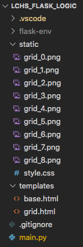

Exercises: Logic In Templates
=============================

In this set of exercises, you will add logic to a Jinja3 template. You will
begin by cloning some starter code from a GitHub repository. This will include
a ``main.py`` program, but you won't need to modify the Python code to complete
any of the tasks. However, after you finish the exercises, feel free to explore
``main.py`` to figure out what its doing!

.. _more-flask-exercises-setup:

Setup
-----

#. Open a new window in Visual Studio Code.
#. Use the *File* menu to open your ``local_practice`` directory.
#. In your browser, navigate to this `GitHub repository <https://github.com/LaunchCodeEducation/LCHS_flask_logic>`__.
   Click the green *Code* button and copy the URL shown in the dialog box.

   .. figure:: figures/clone-starter-code.png
      :alt: Clicking the Code button reveals the URL for the repository.

#. In the terminal, enter the command ``git clone repo_address``. Be sure to
   replace ``repo_address`` with the URL you copied in step 3.
#. Return to the *File* menu and open the ``LCHS_flask_logic`` folder you just
   cloned.
#. In the terminal panel, create a new virtual environment for the project,
   then activate it. You can name your virtual environment whatever you want,
   but the example below uses ``flask-env``.

   .. sourcecode:: bash

      Mac:
      $ python3 -m venv flask-env
      $ . flask-env/bin/activate

      Windows:
      $ py -3 -m venv flask-env
      $ . flask-env/Scripts/activate

#. Finally, install the Flask module.

   ::

      (flask-env) $ pip install flask

Properly done, you should wind up with this file tree:

   The file tree required for the start of the exercises.

Part A: Extend from ``base.html``
---------------------------------

Open the ``main.py`` file in VS Code and examine the ``show_grid()`` function.
Notice that on line 47, ``render_template()`` points to the ``grid.html``
template.

Let's run the web application and see what this template looks like:

#. Make sure ``flask-env`` is active, then launch ``main.py``.
#. Open the web application in the browser. The home page looks pretty bad
   right now:

   .. figure:: figures/exercises-start.png
      :alt: Disorganized webpage produced by the starter code.
      :width: 60%

#. Open ``grid.html`` in VS Code. The file is missing some boilerplate code
   and a link to the CSS stylesheet. No wonder the page looks so disorganized!
#. The missing code is saved in ``base.html``. Add the three required Jinja3
   statements to ``grid.html`` to :ref:`extend the base template <extend-base>`.
#. Save your work, then refresh the tab in the browser. The page should look
   much better now.

   .. figure:: figures/exercise-base-applied.png
      :alt: Webpage produced after extending the base template.
      :width: 80%

#. Finally, replace ``Heading Text Here`` with something more descriptive.

Before you move on, use ``git status/git add ./git commit -m`` to commit your
work.

Part B: Add a Loop
------------------

For this web application, users choose directions with the form on the right
side of the page. After every choice, the box highlighted in the diagram
changes. Unfortunately, the form does not work yet.

Click the *Refresh* button a few times in the browser. Notice that the
highlighted box in the image changes. However, the choices in the form always
remain ``Left``, ``Right``, ``Up``, and ``Down``. Your next task is to update
``grid.html`` to make the options fit the selected box. For example, if box
``0`` is highlighted, the form should only show choices for ``Right`` and
``Down``. For box ``8``, the options should be ``Left`` and ``Up``. For box
``1``, all four directions should appear, etc.

The ``choices`` Dictionary
^^^^^^^^^^^^^^^^^^^^^^^^^^

The ``main.py`` file contains a function called ``fill_choices()``. It
determines the correct direction choices for any box in the grid. Take a
moment to explore the statements in ``fill_choices()``. You don't need to
change anything, but note how the code is organized.

#. The ``box_num`` parameter receives an integer value. This will be the number
   for the highlighted box in the grid.
#. The ``options`` dictionary stores the direction choices allowed for the box.
   Each key in the dictionary matches a possible direction (``Left``,
   ``Right``, ``Up``, or ``Down``). The value for a key is the number of the
   next box in that direction.
#. The four ``if`` blocks in lines 12-23 determine which key/value pairs are
   added to the dictionary.

``fill_choices()`` returns the completed dictionary. This gets assigned to the
``choices`` variable inside the ``show_grid()`` function. ``choices`` then gets
passed as an argument inside ``render_template()``.

Update ``grid.html``
^^^^^^^^^^^^^^^^^^^^

Return to ``grid.html`` in VS Code.

#. Remove three of the four ``label`` elements in the form.
#. In the one that remains, use placeholders for the label text and the
   ``value`` attribute. Also, include the ``required`` attribute to prevent the
   users from submitting an empty form.

   .. sourcecode:: html
      :lineno-start: 13

      <label><input type="radio" name="choice" value={{value}} required />{{direction}}</label>

#. Remember the format for the ``choices`` dictionary. Each *key* is the
   direction label for a radio button. Each *value* is the number of the box in
   that direction.
#. Add a ``for`` loop that :ref:`iterates over the key/value pairs <jinja3-dictionary-iteration>`
   in the ``choices`` dictionary. The ``label/input`` code should be the only
   thing inside the body of the loop.
#. Save your work, then reload the page in the browser.
#. Test your work!

   a. Refresh the page several times. Make sure that the options displayed in
      the form are correct for the highlighted box.
   b. Select an option in the form and submit it. Do this several times. As
      long as you didn't change anything in ``main.py``, this should work. If
      an error occurs, check your code in ``grid.html``.
   c. Notice that below the image, the ``Path followed`` text updates each time
      you submit the form.

Before you move on, take a moment to save and commit your work.

Part C: Add a Conditional
-------------------------

Each time a user submits the form, a step gets added to the ``Path followed``
text. Right now, there is no limit to how long this path can grow. However, by
adding a conditional to the ``grid.html`` template, you can require users to
restart after taking a certain number of steps. The instructions below set the
limit at five steps, but you can choose any number you want.

.. admonition:: Note

   The steps below describe ONE way to accomplish the task, not the ONLY way.
   Feel free to explore different methods to reset the page. For example, you
   could use a link element (````) to restore the page instead of a
   ``form``.

#. After the user submits the form five times, the webpage should display a
   different form next to the image:

   .. sourcecode:: html

      
You've taken five steps. Time to start over!

      <form action="/" method="GET">
         <button class="restart">Restart!</button>
      </form>

   Clicking the *Restart* button will cause the page to reset.
#. Add an ``if/else`` block to the template:

   .. sourcecode:: html
      :lineno-start: 9

      <section class="choice_form">
         <h2>Heading Text Here</h2>
         
            <!-- Restart form... -->
         
            <!-- Direction form... -->
         
      </section>

   a. ``condition`` is the boolean expression that checks how many steps the
      user has taken so far.
   b. The code block for ``<!-- Direction form... -->`` is the HTML you created
      in Part B.
   c. The code block for ``<!-- Restart form... -->`` is the HTML shown in step
      1.

   .. admonition:: Tip

      To keep track of the number of steps, use the string assigned to the the
      ``steps`` variable. A five-step sequence will look something like
      ``6-3-5-2-5``. There are many ways to check if the string shows 5 or more
      steps. We'll leave it to you to decide how to do this in line 11.

#. Save your work, then refresh the page in your browser. Test your code by
   submitting the form several times. When you reach the step limit, the
   content on the screen should change.

   .. figure:: figures/step-limit.png
      :alt: Display an alternate form after 5 steps.
      :width: 80%
   
      After 5 steps, a different form renders on the page.

When done, remember to save and commit your work.
