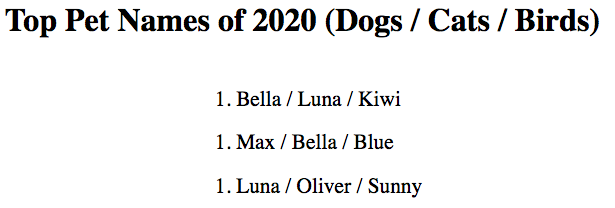

Adding Logic to Templates
=========================

Imagine we want to display the top three pet names for a particular year. We
could easily create a list in Python to store these names, then pass that data
to a template.

.. admonition:: Example

   Yes, we can sends lists to our HTML template! Dictionaries and objects are
   allowed as well.

   .. sourcecode:: Python
      :linenos:

      @app.route('/popular_pet_names')
      def pet_names():
         year = 2020
         dogs = ['Bella', 'Max', 'Luna']
         cats = [ 'Luna', 'Bella', 'Oliver']
         birds = ['Kiwi', 'Blue', 'Sunny']
         return render_template('...', year = year, dogs = dogs, cats = cats, birds = birds)

The template code might look something like this:

.. sourcecode:: html
   :linenos:

   <h1>Top Pet Names of {{year}}</h1>
   <ol>
      <li>{{dog[0]}} / {{cat[0]}} / {{bird[0]}}</li>
      <li>{{dog[1]}} / {{cat[1]}} / {{bird[1]}}</li>
      <li>{{dog[2]}} / {{cat[2]}} / {{bird[2]}}</li>
   </ol>

While tedious, it doesn't take that long to type the HTML for a list with only
three rows.

Now imagine we want to extend the list to the top 10, 20, 100, or 200 pet
names. Typing the HTML for *that* task doesn't sound fun at all! Also, we would
probably make several mistakes, so we should plan for some debugging time.

Fortunately, there is a better way.

Loops in Templates
------------------

For now, let's just focus on the names for the dogs. With Python, we can easily
add or remove names to the ``dogs`` list. If we want to print these to the
console, we use a simple ``for`` loop.

.. sourcecode:: Python
   :linenos:

   for dog in dogs:
      print(dog)

Jinja3 allows us to do something similar inside a webpage. The general syntax
for a loop is:

::

   
      {{item}}
   

The symbols ```` surround code statements, and they show where the loop
begins and ends. Each time the loop repeats, ``item`` takes the value of the
next element in ``collection_name``. The code does NOT appear on the webpage,
and the value for ``item`` gets inserted for the placeholder.

For the pet name template, the ``for`` loop would look like this. Note how line
3 looks just like the Python syntax, only without the ending colon, ``:``.

.. sourcecode:: html
   :linenos:

   <h1>Top Dog Names of {{year}}</h1>
   <ol>
      
         <li>{{dog}}</li>
      
   </ol>

Set up this way, the Jinja3 engine creates one ``<li></li>`` element for each
entry in ``dogs``. If we use our Python function to add or remove names, the
template responds by resizing the list in the browser.

.. admonition:: Note

   The purpose of loops in Jinja3 is *for display only*. They are NOT used to
   perform calculations or process data. That type of logic belongs in our
   Python code. 

Loops allow us to automatically create multiple HTML elements on a page. We
provide the tags, attributes, and placeholders for a single entry. The
iteration copies that format and inserts different values each time the loop
repeats.

Using Index Values
^^^^^^^^^^^^^^^^^^

If we want to loop through a collection by index instead of by item, the syntax
for Python is:

.. sourcecode:: Python

   for index in range(len(collection)):

For Jinja3, the syntax replaces the ``len`` function with ``|length``.

.. sourcecode:: html

   

In both cases, ``index`` takes the values ``0, 1, 2...``

.. admonition:: Example

   We can use index values to complete our pet name list.

   .. sourcecode:: html
      :linenos:

      <h1>Top Pet Names of {{year}} (Dogs / Cats / Birds)</h1>
      <ol>
         
            <li>{{dogs[index]}} / {{cats[index]}} / {{birds[index]}}</li>
         
      </ol>

   Even if the lists for ``dogs``, ``cats``, and ``birds`` are not the same
   length, Jinja3 won't throw an *index out of range* error. Instead, the
   placeholders for the missing values show up as empty spots on the page.

   .. figure:: figures/animal-name-list.png
      :alt: Heading and a list showing the top 3 pet names for dogs, cats, and birds (2020).
      :width: 80%

      The 5th most popular bird name of 2020 was "Chicken".

These 6 lines of code only produce 4 lines of text on the webpage. However,
they would add more if we expand the list of pet names.

Placement Matters
^^^^^^^^^^^^^^^^^

```` and ```` repeat every element placed between them.
A small shift in the code can make a big difference in how the page renders.
For example, let's bring the ``<ol>`` tags inside the loop.

.. sourcecode:: html
   :linenos:

   <h1>Top Pet Names of {{year}} (Dogs / Cats / Birds)</h1>
   
      <ol>
         <li>{{dogs[index]}} / {{cats[index]}} / {{birds[index]}}</li>
      </ol>
   

Instead of one list with three different entries, this version of the code
produces three separate lists, each with only one element.

What do you think would happen if we moved the ``h1`` element inside the loop
as well?

Try It!
-------

Loops really come in handy whenever we need to build checkbox or radio inputs!
Instead of having to code every single element, we can set up the template to
build the form automatically.

#. In ``main.py``, paste in this starter code:

   .. sourcecode:: Python
      :linenos:

      from flask import Flask, render_template, request

      app = Flask(__name__)
      app.config['DEBUG'] = True

      @app.route('/', methods=['GET', 'POST'])
      def checkbox_form():

         return render_template('checkbox_form.html')

      if __name__ == '__main__':
         app.run()

#. On line 8, define a ``pizza_toppings`` variable. Assign it a list that
   contains at least five options. (It's OK to have pineapple and pepperoni in
   the same list!)
#. Inside ``render_template()``, pass the list of toppings to the HTML file.
#. Open ``checkbox_form.html`` in the workspace. Paste in this starter code:

   .. sourcecode:: html
      :linenos:

      <!DOCTYPE html>
      <html>
         <head>
            <meta charset="UTF-8">
            <meta name="viewport" content="width=device-width">
            <title>Checkbox Logic</title>
            <link rel="stylesheet" type="text/css" href="{{ url_for('static', filename='style.css') }}">
         </head>
         <body>
            <h1>Checkbox Logic</h1>
            <h2>Select Your Pizza Toppings</h2>
            <form action="/" method="POST">

               <!-- Your form code goes here. -->

            </form>
         </body>
      </html>

#. Launch ``main.py`` and make sure ``checkbox_form`` renders. Add a
   ``{{pizza_toppings}}`` placeholder to the page just to make sure your list
   is being sent to the template. (You can remove the placeholder after that).

   .. figure:: figures/pizza-form-start.png
      :alt: A webpage with a heading and a pizza toppings list.
      :width: 80%

      Successfully sending a Python list to the webpage.

#. On line 14, add a ``label`` and ``input`` element for one checkbox. Include
   a ``{{topping}}`` placeholder for the label text and the ``value``.

   .. sourcecode:: html

      <label><input type="checkbox" name="toppings" value="{{topping}}"/> {{topping}}</label> 

#. On lines 13 and 15, add the statements
   ```` and ````. Save your work
   and refresh the page in your browser. 
#. *Buona pizza*!

   .. figure:: figures/pizza-form-mid.png
      :alt: A form with checkboxes to select pizza toppings.

      The hex code for one pizza crust color is ``#d79914``.

Bonus Try It!
^^^^^^^^^^^^^

Convert the form to a radio button group!

#. Instead of using ``type="checkbox"`` inside the input tag, replace it with a
   placeholder. In ``main.py``, use ``render_template()`` to send the string
   ``'radio'`` to the template. Switch the inputs back by sending
   ``'checkbox'``.
#. Be sure to update the ``title`` and ``h1`` as well.
#. Can you make this happen?

   .. figure:: figures/pizza-form-final.gif
      :alt: A form that can switch dynamically between radio and checkbox inputs.
      :width: 50%

      Adding a loop to a template allows us to make dynamic changes to the structure of the page.

Check Your Understanding
------------------------

The following questions refer to this code sample:

.. sourcecode:: html
   :linenos:

   <section>
      <h3>My Pets</h3>
      <ul>
         <li>{{pet}}</li>
      </ul>
   </section>

Assume that we define a ``pets`` list that contains 4 animals.

.. admonition:: Question

   Adding ```` and ```` around the ``<li>`` tag
   produces:

   .. raw:: html

      <ol type="a">
         <li><input type="radio" name="Q1" autocomplete="off" onclick="evaluateMC(name, false)"> 4 headings</li>
         <li><input type="radio" name="Q1" autocomplete="off" onclick="evaluateMC(name, false)"> 4 unordered lists</li>
         <li><input type="radio" name="Q1" autocomplete="off" onclick="evaluateMC(name, true)"> 4 list items</li>
         <li><input type="radio" name="Q1" autocomplete="off" onclick="evaluateMC(name, false)"> 4 headings each with 4 list items</li>
      </ol>
      

.. Answer = c

.. admonition:: Question

   Moving ```` and ```` above and below the
   ``<section>`` tags produces:

   .. raw:: html

      <ol type="a">
         <li><input type="radio" name="Q2" autocomplete="off" onclick="evaluateMC(name, false)"> 1 heading and 4 unordered lists with 4 pets each</li>
         <li><input type="radio" name="Q2" autocomplete="off" onclick="evaluateMC(name, false)"> 4 headings and 4 unordered lists with 4 pets each</li>
         <li><input type="radio" name="Q2" autocomplete="off" onclick="evaluateMC(name, false)"> 1 heading and 4 unordered lists with 1 pet each</li>
         <li><input type="radio" name="Q2" autocomplete="off" onclick="evaluateMC(name, true)"> 4 headings and 4 unordered lists with 1 pet each</li>
      </ol>
      

.. Answer = d
