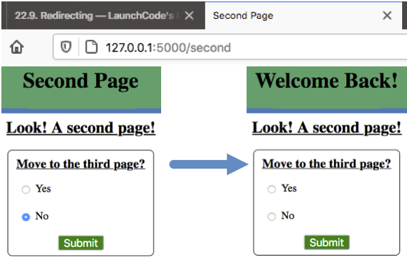
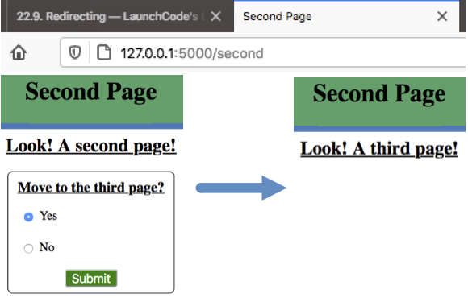

.. _redirect:

Redirecting
===========

.. index:: ! redirect

The term **redirect** means to send a user from one URL to a different one. We
can see a simple example of this with an HTML link element:

.. sourcecode:: html

   <a href="target_URL">Link text</a>

``target_URL`` is the address for the new webpage.

.. admonition:: Example

   For `this link <https://www.python.org/>`__,
   ``href="https://www.python.org/"``.

Sometimes, clicking a link opens a new tab in the browser. Other times, the new
page loads in the current tab. In both cases, users are sent to a different
URL. This can be confirmed by looking at the address bar before and after the
redirect.

We have also set up redirects with the ``action`` attribute in a form.

.. admonition:: Example

   In the :ref:`Forms chapter <send-data-to-server>`, we sent requests to a
   server.

   .. sourcecode:: html
      :linenos:

      <form action="URL_of_server" method="POST">
         <!-- Form code -->
      </form>

   When the user clicks the *Submit* button, an HTTP request is sent to the URL
   assigned to ``action``. This address doesn't have to be the same as the form
   page.
   
   When the server responds to the request, the browser renders a webpage, and
   a new URL appears in the address bar.

Render Template vs. Redirect
----------------------------

Up until now, we've used the ``render_template()`` function to send an HTML
file from the Flask server to the browser. Once the page renders, the URL in
the address bar looks something like ``http://127.0.0.1:5000/path``. For each
page in our website, ``path`` is different.

It is important to recognize that the ``render_template()`` function is NOT the
same thing as a redirect. The best way to see this is with an example.

.. admonition:: Try It!

   The practice website we've built for this chapter, currently has three
   pages. We'll use ``second.html`` and ``third.html`` for this example.

   #. Open ``second.html`` and add a short form after the ``h2``:

      .. sourcecode:: html
         :lineno-start: 4

         <h2>Look! A second page!</h2>
         <section class="centered">
            <form action="/second" method="POST">
               <h3>Move to the third page?</h3>
               <label><input type="radio" name="choice" value="yes"/>Yes</label>
               <label><input type="radio" name="choice" value="no"/>No</label>
               <section class="centered">
                  <button>Submit</button>
               </section>
            </form>
         </section>
   
      The new form asks the user if they want to move to the third page. The
      ``action`` attribute sends the response to the current URL.
   #. Now open ``main.py`` and update the function that controls the second
      page:

      .. sourcecode:: python
         :lineno-start: 25

         @app.route('/second', methods=['GET', 'POST'])
         def second_page():
            tab_title = "Second Page"
            page_title = "Second Page"

            if request.method == 'POST':
               choice = request.form['choice']
               if choice == 'yes':
                  return render_template('third.html', tab_title = tab_title,
                     page_title = page_title, navigation = navigation)
               else:
                  page_title = "Welcome Back!"

            return render_template('second.html', tab_title = tab_title,
               page_title = page_title, navigation = navigation)

   If the user responds ``No`` in the form, line 36 executes, followed by the
   ``render_template()`` function on line 38. The second page reloads, but it
   shows different text in the heading. (TRY IT!)
   
   If the user responds ``Yes`` in the form, line 33 executes. It renders the
   template for the third page. (TRY IT!)

Responding ``No`` in the form keeps us on the second page. Even though some of
the content changes, the browser still renders the ``second.html`` template.

   Even though the heading changes, the template and URL remain the same.

However, notice what happens to the webpage after a ``Yes`` response. The web
address stays the same (``http://127.0.0.1:5000/second``), but the page itself
is different. The URL and heading still indicate the second page, but the
content displayed is for the third.

   ``third.html`` renders at the same URL as ``second.html``.

As written, the Flask application renders both templates at the same URL. *This
is NOT a good result*! To keep our website organized, each Python function
should always render the same template. ``second_page()`` should only deal with
``second.html``.

When we want to render ``third.html``, we need to shift control from
``second_page()`` to a different Python function. We also need to use a new
URL.

Redirect with Flask
-------------------

Each page in our Flask application needs its own template, path, and Python
function. ``render_template()`` should ONLY be used for the HTML file assigned
to the path in ``@app.route()``. To render a different template, we redirect
the program flow to a different function.

The general syntax for a redirect in Flask is:

.. sourcecode:: python

   return redirect('/path_name')

``/path_name`` matches the string from one of the other ``@app.route()``
handlers.

Let's update the ``second_page()`` function to use ``redirect()`` instead of
``render_template()``.

.. admonition:: Try It!

   Return to ``main.py`` in Visual Studio Code.

   #. Add the ``redirect`` function to the top ``import`` statement.

      .. sourcecode:: python
         :linenos:

         from flask import Flask, render_template, request, redirect

   #. Inside the ``second_page()`` function, replace ``render_template()`` on
      line 33 with ``redirect()``.

      .. sourcecode:: python
         :lineno-start: 30

            if request.method == 'POST':
               choice = request.form['choice']
               if choice == 'yes':
                  return redirect('/third')
               else:
                  page_title = "Welcome Back!"

      The argument inside ``redirect()`` might be different in your code. It
      needs to match the path you used in the ``@app.route()`` statement above
      the target function.
   #. Save your work, then reload the page in the browser.
   #. Use the form on the second page to answer ``Yes``. After submitting,
      check the URL, heading text, and other content on the page.

   Ta da! We're now properly on the third page!

   .. figure:: figures/render-vs-redirect-3.png
      :alt: The "Yes" answer renders third.html at a different URL.
      :width: 60%

      ``third.html`` now renders at its own URL.

Notice that besides the path, we didn't include any other arguments inside
``redirect()``. Since it shifts control to a different function, that code
becomes responsible for rendering ``third.html``.

``redirect()`` does NOT directly send any data to the browser. Instead, it
moves control between functions within ``main.py``. 

Difference Summary
------------------

The ``render_template()`` and ``redirect()`` functions Do. Different. Things.

``render_template()``:

#. Deals with displaying a webpage at the current URL.
#. Indicates which file the Flask server sends to the browser.
#. Passes data to the selected template file.
#. The browser renders the file at the path specified in ``@app.route()``.

``redirect()``:

#. Deals with moving the user from one URL to another.
#. Takes a path argument instead of a file name.
#. Shifts control from one Python function to another.
#. Sends no data directly to the browser.

If ``render_template()`` could talk, it would say something like,
*Hey! Look at this cool stuff right here*. On the other hand, ``redirect()``
would say something like, *Hey! Go somewhere else now*.

Redirect Methods
----------------

In the :ref:`HTTP chapter <http-requests>`, we learned about GET and POST
requests. In the :ref:`Forms chapter <send-data-to-server>`, we learned how to
send each type of request using the ``method`` attribute.

The form on the second page sends a ``POST`` request to the path ``/second``.
However, what happens when the ``redirect()`` statement executes? Does it send
a ``GET`` or ``POST`` request? Let's find out!

.. admonition:: Try It!

   In VS Code, open the template for the third webpage.

   #. Add a new element and placeholder below the ``h2``.

      .. sourcecode:: html
         :linenos:

         

         
         <h2>Look! A third page!</h2>
         <h3>{{method_message}}</h3>
         

      We will fill the ``{{method_message}}`` placeholder with different text
      depending on whether we make a ``GET`` or ``POST`` request to reach the
      page.
   #. In ``main.py``, update the function that controls the third page. Note
      that the names you used for the path, function, and template might be
      different than the ones shown below.

      .. sourcecode:: python
         :lineno-start: 41

         @app.route('/third', methods=['GET', 'POST'])
         def third_page():
            if request.method == 'POST':
               method_message = 'You reached this page through a POST request.'
            else:
               method_message = 'You reached this page through a GET request.'

            tab_title = 'Third Page'
            page_title = "Third Page"
            return render_template('third.html', tab_title=tab_title, page_title=page_title,
               navigation=navigation, method_message=method_message)

      When the ``third_page()`` function executes, it checks the method type.
      Depending on the result, ``method_message`` is assigned one of two possible
      string values.
   #. Save your work, then reload the tab. Use the address bar to navigate to
      the third page (``127.0.0.1:5000/third``). Does this action make a
      ``GET`` or a ``POST`` request?
   #. Navigate to a different page in the website. Use the Page Navigation
      links to return to the third page. Does clicking the link make a ``GET``
      or a ``POST`` request?
   #. Finally, return to the second page. Use the form to submit a ``Yes``
      answer to the question. This will trigger the ``redirect()`` statement in
      the ``second_page()`` function. Does the ``redirect`` make a ``GET`` or a
      ``POST`` request?

In the example above, each time we reached ``http://127.0.0.1:5000/third``,
``method_message`` indicated that a ``GET`` request was made. Even though the
form sent a ``POST`` request, ``redirect`` changed it into a ``GET``.

This shows an important point. By default, ``redirect()`` sends a ``GET``
request to the new URL. Many times, this is perfectly fine. However, a form
submission should preserve the ``POST`` request.

Response Codes
^^^^^^^^^^^^^^

To make ``redirect()`` send a ``POST`` request, we need to add another argument
after the path.

.. admonition:: Try It!

   #. In ``main.py``, replace line 33 with:

      .. sourcecode:: python

         return redirect('/third', code=307)

   #. Save, then navigate to the form on the second page. Submit a ``Yes``
      answer and examine the message displayed on the page.

      .. figure:: figures/third-post.png
         :alt: Code 307 preserves the POST request through the redirect.

We learned about response codes in the HTTP chapter, but we aren't going to
dive into any of those details here. A discussion of why code ``307`` works is
beyond the scope of this book. We just need to remember that it preserves a
``POST`` method.

Technical Details (Optional)
^^^^^^^^^^^^^^^^^^^^^^^^^^^^

For those interested in digging deeper into code ``307`` (and others), start
with the following links:

#. `How many redirects are there? <https://www.pmg.com/blog/301-302-303-307-many-redirects/>`__
#. `Redirection messages (MDN Docs) <https://developer.mozilla.org/en-US/docs/Web/HTTP/Status#redirection_messages>`__

.. admonition:: Tip

   As your Flask application runs, keep an eye on the console in VS Code. It
   displays a log of the HTTP responses as you navigate between pages.

Check Your Understanding
------------------------

.. admonition:: Question

   Which function matches a template to a specific URL?

   .. raw:: html

      <ol type="a">
         <li><input type="radio" name="Q1" autocomplete="off" onclick="evaluateMC(name, true)"> <code class="pre">render_template()</code></li>
         <li><input type="radio" name="Q1" autocomplete="off" onclick="evaluateMC(name, false)"> <code class="pre">redirect()</code></li>
      </ol>
      

.. Answer = a

.. admonition:: Question

   Clicking a page navigation link will:

   .. raw:: html

      <ol type="a">
         <li><input type="radio" name="Q2" autocomplete="off" onclick="evaluateMC(name, false)"> render a different HTML file at the current URL</li>
         <li><input type="radio" name="Q2" autocomplete="off" onclick="evaluateMC(name, true)"> redirect the user to a new URL</li>
      </ol>
      

.. Answer = b

.. admonition:: Question

   Which function can change the appearance of the page at the current URL?

   .. raw:: html

      <ol type="a">
         <li><input type="radio" name="Q3" autocomplete="off" onclick="evaluateMC(name, true)"> <code class="pre">render_template()</code></li>
         <li><input type="radio" name="Q3" autocomplete="off" onclick="evaluateMC(name, false)"> <code class="pre">redirect()</code></li>
      </ol>
      

.. Answer = a

.. admonition:: Question

   It's OK to render different templates at the same URL.

   .. raw:: html

      <ol type="a">
         <li><input type="radio" name="Q4" autocomplete="off" onclick="evaluateMC(name, false)"> True</li>
         <li><input type="radio" name="Q4" autocomplete="off" onclick="evaluateMC(name, true)"> False</li>
      </ol>
      

.. Answer = b
