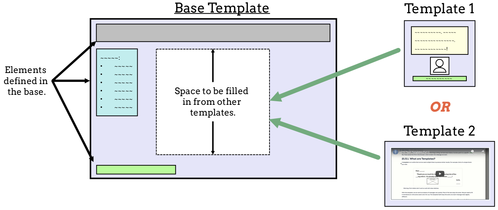

Reusing Content
===============

Since the :ref:`HTML chapter <html-chapter>`, we've often pasted a block of
starter code into an empty ``.html`` file. This *boilerplate code* usually
looks the same:

.. sourcecode:: html
   :linenos:

   <!DOCTYPE html>
   <html>
      <head>
         <meta charset="UTF-8">
         <meta name="viewport" content="width=device-width">
         <title></title>
         <link rel="stylesheet" type="text/css" href="style.css">
      </head>
      <body>

      </body>
   </html>

In Visual Studio Code, typing the ``html:5`` shortcut into a blank document
shortens this task, but the same issue remains.

   We're putting the same blocks of code into most of our HTML files.

We can save ourselves some time, and keep our work DRY, if we keep reusable
HTML code in a single file. On its own, this **base template** renders a
webpage that contains one or more gaps in its layout. The idea is to use the
base as a starting place and fill in the missing details as needed.

The HTML code around the gaps is shared across multiple webpages. However, each
separate page fills in the empty space with its own content.

   A base template defines a common structure. Different webpages use that structure but also add some of their own content. 

The figure shows a key idea. When a browser renders a webpage, the code is
often NOT from a single ``.html`` file. Instead, the server sends multiple
files, and these work together to build the result we see on the screen.

Let's see how this works.

A ``base`` Template
-------------------

.. index::
   single: template; base

When we design a website, we often want the same menu, navigation bar, logos,
etc. to appear on several different pages. By defining a **base template**, we
create a single place to store this shared HTML.

Let's build a base template starting with the boilerplate code above. Once we
do this, we'll learn how to link the base to the ``checkbox_form.html`` file.

.. admonition:: Try It!

   #. In the ``templates`` folder, create a new file called ``base.html``.
   #. Paste in the boilerplate code found at the top of this page, or use the
      ``html:5`` shortcut to do the same thing.
   #. On line 7, use the ``url_for`` function to link to the ``style.css``
      file:

      .. sourcecode:: html

         <link rel="stylesheet" type="text/css" href="{{url_for('static', filename='style.css')}}">
   
   #. Add a placeholder to the ``title`` element:

      .. sourcecode:: html
         :lineno-start: 6

         <title>{{tab_title}}</title>
   
Good. This gets our base template started. Now lets add some code inside
``<body></body>``.

Block Out Space for Other HTML Code
^^^^^^^^^^^^^^^^^^^^^^^^^^^^^^^^^^^

The goal of ``base.html`` is to store the code we want to use across several
webpages. Each of these pages will link to ``base``, and the browser will
render the shared code. However, each page will also include content that is
different from the others.

Inside ``base.html``, we need to separate the shared code from any HTML that
will be added in later. Modify the ``body`` element as follows:

.. sourcecode:: html
   :lineno-start: 9

   <body>
      
      
   </body>

The ```` and ```` statements mark the start
and end points for code that will be inserted later. These work the same way as
placeholders for variables. However, they will be replaced with HTML elements
instead of data values.

The base template is now ready to be used.

.. _extend-base:

Extending From the Base
-----------------------

Now we need to modify ``checkbox_form.html`` to use the base template.

#. Open ``checkbox_form.html`` in Visual Studio Code. On line 1, add the
   statement:

   .. sourcecode:: html
      :linenos:

      

   This tells Flask to send ``base.html`` to the browser *first*. After it
   renders, ``checkbox_form.html`` will get processed.
#. Note that ``checkbox_form`` contains code that is already in ``base``. Your
   next step is to remove this HTML from ``checkbox_form``. Keep anything that
   appears *inside* the ``body`` element, but get rid of:

   a. ``<!DOCTYPE html>``.
   b. The entire ``<head>`` element.
   c. The ``<html></html>`` opening and closing tags.
   d. The ``<body></body>`` opening and closing tags.

#. Clean up the spacing/tabs for the code that remains.
#. When done, ``checkbox_form`` should only have the ``form`` element plus the
   code you used to make the ``Your Choices`` list.

Launch ``main.py`` and open its tab in a browser. You will see a blank page!
Never fear, ``base.html`` *did* render, but so far it only contains the
boilerplate code. It doesn't have any HTML inside its ``body`` element.

The next step is to tell Flask to *insert* code from ``checkbox_form`` into the
``base.html`` template. 

5. Add two more statements just before and after the HTML in ``checkbox_form``:

   .. sourcecode:: html
      :linenos:

      

      

      <form action="/" method="POST">
         <!-- Form code here... -->
      </form>
      
         <section>
            <!-- Your Choices code here... -->
         </section>
      

      

#. ``block content`` and ``endblock`` mark the start and end of the code you
   want to insert into ``base.html``. Note that these two statements match the
   ones you used in ``base.html``. 
#. Save your work, then refresh the page in the browser. Properly done, you
   should see your form. It should behave as it did on the previous page, and
   any CSS styles you defined should be applied.

.. admonition:: Note

   It might look like we made rendering the form more complicated. After all,
   *it does exactly the same thing as before*! In fact, using a base template
   for a single page IS more work.
   
   However, if our goal is to make *more than one* webpage, then creating
   ``base.html`` saves us time and effort. It also makes applying updates
   easier.

Add A Common Header
-------------------

Let's jazz up the ``Checkbox Logic`` title by putting it into a ``header``
element.

#. Return to ``checkbox_form.html`` and remove ``<h1>Checkbox Logic</h1>``.
#. Inside ``base.html``, add the following code:

   .. sourcecode:: html
      :lineno-start: 9

      <body>
         <header class="head-background">
            <h1>{{page_title}}</h1>
         </header>
         
         
      </body>

#. Since the ``header`` element is outside of ``block content/endblock``, it
   will appear on any webpage that extends ``base.html``.
#. The ``<header>`` tag includes a ``class`` attribute. We need to define the
   ``head-background`` CSS rule next.
#. Open ``style.css`` and add the following class selector:

   .. sourcecode:: css
      :linenos:

      .head-background {
         padding: 10px 0;
         text-align: center;
         background-image: radial-gradient(#419f6a 60%, #3c79b8 40%);
      }
   
   What does ``radial-gradient`` do? Eventually, something like this:

   .. figure:: figures/base-header.png
      :alt: A two-color background for the Checkbox Logic heading.

   You can read more details about this CSS property at `W3 Schools <https://www.w3schools.com/css/css3_gradients_radial.asp>`__.

Finishing Touches
^^^^^^^^^^^^^^^^^

You added the ``{{tab_title}}`` and ``{{page_title}}`` placeholders to
``base.html``. The last step is to send them specific values.

#. Open ``main.py`` in VS Code. Add the ``tab_title`` and ``page_title``
   variables to the ``checkbox_form()`` function.
#. Assign string values to the variables, then include them in the
   ``render_template()`` function.

   .. sourcecode:: python
      :lineno-start: 7

      def checkbox_form():
         if request.method == 'POST':
            choices = request.form.getlist('toppings')
         else:
            choices = []

         pizza_toppings = ['pineapple', 'pepperoni', 'black olives', 'green peppers',
            'mushrooms', 'broccoli', 'extra cheese']
         tab_title = 'Template Logic'
         page_title = 'Checkbox Logic'

         return render_template('checkbox_form.html', pizza_toppings = pizza_toppings, choices = choices,
            tab_title = tab_title, page_title = page_title)

#. Save your work, then refresh the page. Make sure the header appears and the
   form still works.
#. Before moving on, take a moment to commit your work.

.. admonition:: Try It!

   Add a ``<footer></footer>`` element to ``base.html``. Design is as you wish,
   but it should appear at the bottom of the webpage.

Extend ``base`` to a Second Page
--------------------------------

Now that ``base.html`` is set up, we can use it as many times as we like.

#. Add another template to the project called ``second.html``. ``extend`` it
   from ``base.html`` as before.
#. Add a small amount of content to the template. Something simple like:

   .. sourcecode:: html

      
      <h2>Look! A second page!</h2>
      

#. In ``main.py``, add a new function to render the template. Be sure to pass
   in values for ``tab_title`` and ``page_title``.
#. Save your work, then navigate to the new page in your browser. You should
   see the header and footer, but now the new content appears between them
   instead of the pizza toppings form.

Multiple Blocks
---------------

In the examples above, ``base.html`` contains only one place where we can
insert different HTML code. It is possible to build a base template with more
of these spaces. However, that discussion is beyond the scope of this course.

If you would like to research this topic on your own, a good place to start is
the `Jinja3 documentation <https://jinja.palletsprojects.com/en/3.0.x/templates/#template-inheritance>`__.

Video Summary
-------------

Here is a walkthrough for creating a base template and then extending it across
two different files. Remember that this demo is meant to support the reading,
not replace it!

.. raw:: html

   <section class="vid_box">
      <iframe class="vid" src="https://www.youtube.com/embed/C2LGhmPNg10" frameborder="1" allow="accelerometer; autoplay; clipboard-write; encrypted-media; gyroscope; picture-in-picture" allowfullscreen></iframe>
   </section>

Check Your Understanding
------------------------

.. admonition:: Question

   Which of the following statements are true? Select ALL that apply.

   .. raw:: html

      <ol type="a">
         <li onclick="revealTrueFalse('resultA', false)">The HTML code from the base template is inserted into another template. </li>
         <li onclick="revealTrueFalse('resultB', true)">The HTML code from another template is inserted into the base template. </li>
         <li onclick="revealTrueFalse('resultC', true)">Browsers often use multiple HTML files to render a single webpage. </li>
         <li onclick="revealTrueFalse('resultD', false)">A base template cannot be rendered by itself in a browser. </li>
         <li onclick="revealTrueFalse('resultE', true)">Making a base template might seem like more work, but it saves time in the long run. </li>
      </ol>

.. True answers = b, c, e.
